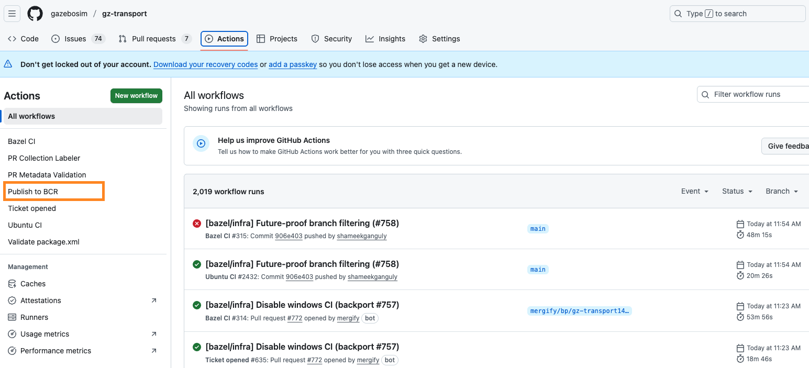

# Bazel Guide for Gazebo Maintainers

The following guide is meant for maintainers of the various Gazebo package repos, which support the Bazel build system. You don't need to be familiar with Bazel to follow this guide. The goal is to equip maintainers with the know-how to resolve Bazel CI failures or ensure that new targets added to the CMake build are also available in the Bazel build.

# 1\. Introduction to Bazel in Gazebo

The Gazebo project has recently introduced support for the Bazel build system alongside the existing CMake infrastructure (since Ionic release).

## 1.1 What is Bazel?

[Bazel](https://bazel.build/) is an open-source build and test tool that supports large-scale, multi-language projects. It provides fast and reliable builds, ensuring that the same build process yields the same result every time. Bazel achieves this through hermeticity (builds are isolated from the environment) and high parallelism.

Build files for Bazel are easily identified by the .bazel or .bzl extensions. These files are authored in the Bazel [Starlark language](https://bazel.build/rules/language) which is syntactically quite similar to Python.

## 1.2 Bazel Implementation in Gazebo

All Gz package repositories leverage centralized build rules defined in the [`rules_gazebo`](https://github.com/gazebosim/rules_gazebo) repository. This approach ensures consistency and simplifies the maintenance of Bazel build specifications across the entire project.

**Commit Conventions for Bazel Changes**

To easily identify changes specific to the Bazel build system (e.g., updates to `BUILD.bazel`, `MODULE.bazel`, `.bzl` files, or other Bazel-specific configuration), Bazel-only commits should be conventionally named using the prefix:

```
[bazel] ...
```

## 1.3 Building Targets with Bazel

Bazel uses a workspace structure. To build a specific target (e.g., a library or executable) within a Gz package, you use the `bazel build` command followed by the target path.

To build a specific library target (e.g., `//:gz-transport`):

```
bazel build //:gz-transport
```

To build and run an executable or test target (e.g., `//tools:example_tool`):

```
bazel run //tools:example_tool
```

To run all tests in the current package:

```
bazel test //...
```

The output of successful builds is placed in the `bazel-bin/` directory within the workspace (this directory is ignored by git).

# 2\. Bazel Target Management and Maintenance

While Bazel generally recommends using highly granular targets, the Gazebo project adopts a strategy to minimize maintenance overhead while ensuring parity with the existing CMake build structure.

## 2.1 Target Name Parity and Independence

We strive to maintain parity in target names between the Bazel build specification and the CMake build specification. However, it is critical to understand that the two build systems are fundamentally independent.

**Maintainer Responsibility:** It is the maintainer's responsibility to ensure that target names, dependencies, and included source/header files do not diverge between the Bazel and CMake configurations over time.

## 2.2 Minimizing Maintenance Overhead

To reduce the need for constant updates to `BUILD.bazel` files when files are added, deleted, or renamed, we utilize globbed file lists and list comprehension.

**Globbed Targets for Libraries:**

For library targets, we use globbed file lists for sources (`srcs`) and headers (`hdrs`). This means simple file additions, deletions, or renames generally do not require updating the `BUILD.bazel` file.

**Generating Test Targets with List Comprehension:**

Similarly, test targets are generated using list comprehension on a globbed list of test files, which simplifies the process of adding new tests.

## 2.3. Deep Dive into `cc_library` Attributes

The `cc_library` rule is fundamental for building C++ libraries within Gazebo. Here is a walkthrough of the key attributes using the `gz-transport` target example (full [BUILD.bazel](https://github.com/gazebosim/gz-transport/blob/gz-transport15/BUILD.bazel) file for reference):

```py
private_headers = glob(["src/*.hh"])

sources = glob(
    ["src/*.cc"],
    exclude = [
        "src/*_TEST.cc",
    ],
)

public_headers = public_headers_no_gen + [
    "include/gz/transport/config.hh",
    "include/gz/transport/Export.hh",
]

cc_library(
    name = "gz-transport",
    srcs = sources + private_headers,
    hdrs = public_headers,
    copts = [
        "-Wno-deprecated-declarations",
    ],
    defines = [
        'GZ_TRANSPORT_DEFAULT_IMPLEMENTATION=\\"zeromq\\"',
    ],
    features = [
        # Layering check fails for clang build due to no module exporting
        # google/protobuf/stubs/common.h. Unfortunately, the bazel target that
        # exports this header in protobuf is private.
        "-layering_check",
    ],
    includes = ["include"],
    visibility = ["//visibility:public"],
    deps = [
        "@com_google_protobuf//:protobuf",
        "@cppzmq",
        "@gz-msgs",
        "@gz-msgs//:gzmsgs_cc_proto",
        "@gz-utils//:SuppressWarning",
        "@libuuid",
        "@libzmq",
    ],
)
```

| Attribute | Description | Example Value |
| :---- | :---- | :---- |
| `name` | The name used to refer to this target (e.g., in dependencies). | `"gz-transport"` |
| `srcs` | List of source files (.cc, .cpp) to be compiled. Uses globbed lists (`sources + private_headers`) to reduce maintenance. | `sources + private_headers` |
| `hdrs` | List of public header files (.h, .hpp) available to dependents. | `public_headers` |
| `copts` | List of additional compiler options passed to the C++ compiler. | `["-Wno-deprecated-declarations"]` |
| `defines` | List of preprocessor defines. Note the necessary escaping for string values within the define. | `['GZ_TRANSPORT_DEFAULT_IMPLEMENTATION=\\"zeromq\\"']` |
| `features` | A list of strings enabling or disabling specific Bazel features, often used for configuration overrides. The example disables layering checks due to protobuf dependency limitations. | `["-layering_check"]` |
| `includes` | List of directory relative paths to be added to the C++ compiler's include path. | `["include"]` |
| `visibility` | Controls which packages can depend on this target. `//visibility:public` allows all other packages in the workspace to depend on it. | `["//visibility:public"]` |
| `deps` | List of other targets that this library depends on. Dependencies start with `@` for external modules (e.g., Bazel Central Registry) or `//` for targets within the workspace. | See full list in example |

You can refer to the [official documentation](https://bazel.build/reference/be/c-cpp) for other common rules, such as `cc_test`.

# 3\. Dependency Management and the Bazel Central Registry (BCR)

Bazel manages external dependencies via its module system, primarily leveraging the Bazel Central Registry (BCR).

## 3.1 The Bazel Central Registry (BCR)

The [BCR](https://registry.bazel.build/) is a centralized repository for Bazel modules, simplifying the consumption of third-party libraries.

**Third-Party Dependencies:**

Most third-party dependencies required by Gazebo packages are available from the BCR and are listed in each package's `MODULE.bazel` file (example: [gz-transport MODULE.bazel](https://github.com/gazebosim/gz-transport/blob/gz-transport15/MODULE.bazel)).

**Uploading Gz Packages to BCR:**

Bazel modules for Gz packages can be uploaded to the Bazel Central Registry. This is achieved by manually triggering the **"Publish to BCR"** GitHub workflow from the GitHub UI, selecting a released tag as the input.



The workflow should result in a PR being opened in [https://github.com/bazelbuild/bazel-central-registry](https://github.com/bazelbuild/bazel-central-registry) to add a new version for the particular gz package. The PR will need to be approved by one of the listed bazel maintainers for that package in `.bcr/metadata.template.json` (e.g. [gz-transport](https://github.com/gazebosim/gz-transport/blob/gz-transport15/.bcr/metadata.template.json)).

## 3.2 Handling Unavailable Dependencies

If a required third-party dependency is not yet available in the BCR, features that rely on it must be temporarily disabled in the Bazel build.

**Example:** DEM heightmap support in `gz-common//geospatial` is [currently disabled](https://github.com/gazebosim/gz-common/blob/gz-common7/geospatial/BUILD.bazel#L53) because the `gdal` dependency is not yet available in the BCR.

## 3.3 Managing Upstream Dependencies (Gz Packages)

Dependency management for inter-package dependencies between Gz repositories is handled differently based on the branch (release vs. main) to support both stable and rapid development environments.

**Release Branches (Stable CI and Local Development):**

Release branches (e.g., [`gz-sim10`](https://github.com/gazebosim/gz-sim/blob/gz-sim10/MODULE.bazel)) use released versions of upstream Gz packages fetched from the Bazel Central Registry (BCR). This ensures stability, similar to the CMake CI environment.

**Main Branches (Latest HEAD for Integration):**

The `main` branches use `archive_override` directives in the Bazel configuration. This directive fetches the latest HEAD on the `main` branch for each upstream Gz package. This setup is crucial for continuous integration and development, as it ensures that new features or fixes added in an upstream package (like `sdformat`) are immediately available downstream (like [`gz-sim`](https://github.com/gazebosim/gz-sim/blob/main/MODULE.bazel#L30)).

# 4\. Platform Support and Current Limitations

Maintainers should be aware of the current platform support status and known limitations of the Bazel build in Gazebo.

## 4.1 Platform Support Status

| Platform | Support Status | Notes |
| :---- | :---- | :---- |
| Ubuntu | Fully supported | Bazel CI on release branches is currently only enabled on Ubuntu. |
| MacOS | Work in progress | Bazel CI on push enabled on main branch. |
| Windows | Not supported | Known failures exist in `gz-utils` when building with Bazel on Windows. |

## 4.2 Current Limitations

The following packages and features are currently not fully supported or implemented in the Bazel build system:

* **`gz-gui`:** The `gz-gui` package is not currently supported in Bazel. Consequently, the Gazebo Sim GUI cannot be built or deployed using Bazel. It must be deployed from a binary install or a source install using CMake.
* **DEM Heightmaps:** Support for DEM heightmaps is not yet available in the Bazel build due to third-party dependency limitations (e.g., `gdal` not being in BCR).
* **Zenoh Backend:** The Zenoh backend for Gz Transport is not yet supported.
* **`gz-tools`:** These packages are not yet supported in Bazel.
* **`gz-rendering`** only supports the ogre2 render engine, and only with OpenGL+EGL backend in Bazel.
* Not all python bindings are available yet in Bazel, this is still work in progress.

# 5\. Local development in Bazel

Install bazelisk (wrapper around Bazel) by following the instructions on their [github page](https://github.com/bazelbuild/bazelisk?tab=readme-ov-file#installation).

Optionally, set up bazel autocompletion with

```shell
bazel help completion bash > bazel-complete.bash && \
  sudo mv bazel-complete.bash /etc/bash_completion.d/ && \
  source  /etc/bash_completion.d/bazel-complete.bash
```

While it is possible to clone any gazebo package repo and build with bazel locally, this can lead to poor cache efficiency and slow builds when multiple repos need local changes. Instead, clone [https://github.com/shameekganguly/gz-bazel-dev](https://github.com/shameekganguly/gz-bazel-dev) and follow the instructions there to build all gazebo package repos in a single “workspace”. Note that some test targets cannot be built or fail spuriously when built from the dev repo \- this is an area of active development.

## 5.1 Linting for Bazel files

Install the [Bazel extension](https://marketplace.visualstudio.com/items?itemName=BazelBuild.vscode-bazel) to enable linting and syntax highlighting for Bazel files. Buildifier is used to enforce linting across all bazel files in gz packages. If you find the **`:buildifier.test`** target to be failing for a package, it indicates a lint error. Some lint errors can be fixed from the terminal automatically by running

```shell
bazel run :buildifier.fix
```

Some lint errors might need to be fixed manually as indicated in the test log.

# FAQs

## Q. Why don’t we use **`@rules_foreign_cc//cmake`** for wrapping existing cmake targets in Gz packages?

The **`@rules_foreign_cc//cmake`** rule executes a cmake build in a sandbox and copies the outputs to the bazel build tree for dependent targets to use. However it is **much slower** than either the cmake build or native Bazel build since it is not able to leverage the caching mechanisms of either system. Besides, **`@rules_foreign_cc//cmake`** has limitations in propagating compilation flags from bazel to cmake. For these reasons, we prefer to use native Bazel build rules at the cost of the maintenance overhead of two build systems.

## Q. What is the difference between the rules\_gazebo and gz\_bazel Github repos?
The [gz\_bazel repo](https://github.com/gazebosim/gz-bazel) was created to add bazel support in the (now deprecated) Workspace method. Most of the required rules from gz\_bazel have been ported to [rules\_gazebo](https://github.com/gazebosim/rules_gazebo), which by itself is a bazel module that other gz package repos depend on. The gz\_bazel repo will be marked as end-of-life once the Harmonic release reaches end-of-life in Sep, 2028\.
