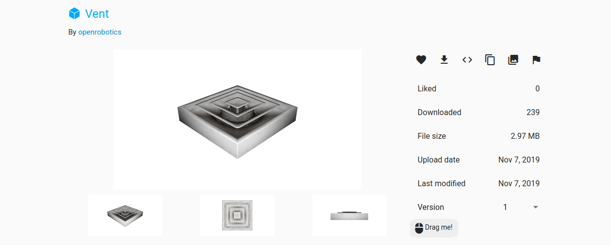
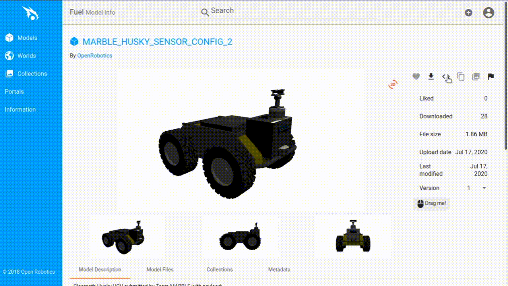

# Model Insertion from Fuel

Ignition Fuel hosts hundreds of models that can easily be added to a world running in the Ignition GUI.


## Prerequisites

Start by getting Ignition up and running with an empty world:

```bash
ign gazebo empty.sdf
```

The previous tutorial, [Manipulating Models](/docs/blueprint/manipulating_models), shows you how to interact with models, which might be helpful once you add some Fuel models to your world.

## Choose a Model

Fuel's model collection is at [app.gazebosim.org/fuel/models](https://app.gazebosim.org/fuel/models).
Head over and browse the available content.


Click on any one of the thumbnails, or use the search bar.
For example, let's find the [Vent](https://app.gazebosim.org/openrobotics/fuel/models/Vent).



Note that some of the model files are quite large and may take some time to download into your world.
Check that the file size on the right is reasonable for your application before moving on.
s
## Spawn a Model

You can spawn models into simulation using the Resource Spawner plugin, or you can simply copy the SDF snippet from the Fuel website using <> button and paste it in your world SDF file.



Now you can add more models, or even load in any one of the plugins you learned about to interact with the model the same way you could with the shapes in the previous tutorial.

If you prefer to add a Fuel model permanently to an `sdf` file, you can just as easily download the code by clicking the download-arrow icon to the right of the model's image.

## Next Up

Stay tuned for new tutorials on the Ignition GUI and more!
