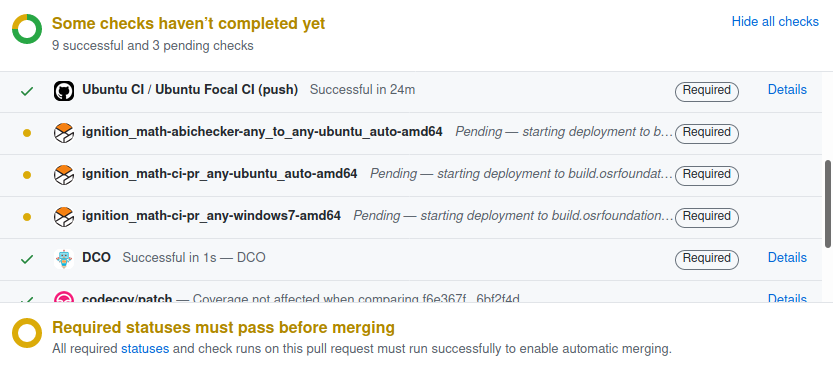

# Gazebo Continuous Integration

When developers push code changes into Gazebo, a series of automated tests
run for various platforms. This process is called Continuous Integration, or CI.
This document covers all the CI jobs that are available for Gazebo and how to
interpret their results.

This documentation assumes you have gone over the
[Contributing guide](contributing) and
therefore are familiar with:

* Opening pull requests
* Automated tests
* Test coverage
* Static code checking
* Branching (stable release branches and `main`)
* Building with cmake or colcon
* Developer Certificate of Origin (DCO) check

It's also helpful to go over our
[Release guide](https://github.com/gazebosim/docs/blob/master/release.md#type-of-releases)
to be familiar with:

* Supported platforms
* Stable, pre-release and nightly releases
* Binary releases like Debian

## Types of checks

The main type of check that is performed by CI is compiling the code and running
all automated tests. Some jobs may also run static checkers, add labels, check DCO
and code coverage.

All checks are visible at the bottom of a pull request, for example:

We use two platforms to run CI ([Jenkins](https://www.jenkins.io/) and
[GitHub Actions](https://docs.github.com/en/actions)),
each of them running different builds.

Our Jenkins server is located at
[https://build.osrfoundation.org/](https://build.osrfoundation.org/).
It runs builds for all supported operating systems. It also runs an
[ABI](https://stackoverflow.com/a/2456882/6451468)
checker for all stable branches.

GitHub actions run on GitHub's servers. Currently, it builds Linux for all
libraries, and macOS for some of them.

Here's a summary of all checks.

Platform | Job name | OS | What does it do? | Where dependencies come from?
--- | --- | --- | --- | ---
Jenkins | `<library>-ci-pr_any-ubuntu-auto-amd64` | Ubuntu | Compile and run tests using CMake and Make | Stable binaries for stable branches, nightlies for `main`
Jenkins | `<library>-ci-pr_any-homebrew-amd64` | macOS | Compile and run tests using CMake and Make | Homebrew binaries bottled from `osrf/simulation` tap
Jenkins | `<library>-ci-pr_any-windows*-amd64` | Windows ([deprecated](https://github.com/gazebo-tooling/release-tools/issues/412)) | Compile and run tests using configure.bat scripts and CMake + Visual Studio directly | External dependencies from custom tarballs
Jenkins | `<library>-pr-win` | Windows | Compile and run tests using [colcon](https://colcon.readthedocs.io/en/released/#) | External dependencies from [vcpkg](https://docs.microsoft.com/en-us/cpp/build/vcpkg?view=msvc-160), Gazebo dependencies built from source with colcon
Jenkins | `<library>-abichecker-any_to_any-ubuntu_auto-amd64` | Ubuntu | Run ABI checker | Stable binaries
Actions | `Ubuntu CI / Ubuntu * CI` | Ubuntu Bionic and Focal | Compile and run tests using CMake and Make, run code checker and upload coverage results | Stable binaries for stable branches, nightlies for `main`
Actions | `DCO` | - | Checks that all commits are signed correctly | -
Actions | `PR Collection Labeler` | - | Adds collection labels (i.e. Blueprint, Citadel...) according to the target branch | -
Actions | `Ticket opened` | - | Adds the pull request to the [Core development board](https://github.com/orgs/gazebosim/projects/3) | -
Actions | `codecov/*` | - | Checks that the test coverage hasn't been reduced | -

Notes:

* The ABI job isn't triggered for the `main` branch, because that's where it's ok to break ABI.
* GitHub Actions jobs can have the `pull_request` or `push` suffix:
    * `pull_request`: Runs when a pull request is open and subsequent pushes
      are made to it.
    * `push`: Runs for every commit pushed to the official repository. These don't
      run for forks. Pull requests from the official repository will have
      both `push` and `pull_request`.
* Only the `Bionic` Action uploads coverage results to Codecov, so we have a
  single coverage result for each branch.
* There's some overlap between Jenkins and Actions jobs for Ubuntu, but they
  have some differences. Some Jenkins jobs run with on GPU machines and
  provides a nice interface to introspect builds. On the other hand, Actions
  runs coverage and codecheck.
* For Linux CI, the choice of stable / pre-release / nightly dependencies on both
  Jenkins and Actions is defined in
  [gzdev's repository.yaml](https://github.com/gazebo-tooling/gzdev/blob/master/plugins/config/repository.yaml).
* For macOS CI, the dependencies and tarball / source branch of each package are
  specified in the [Formula/*.rb](https://github.com/osrf/homebrew-simulation/tree/master/Formula)
  files.
* For Windows CI, the dependencies and source branch of each package are specified
  in `.yaml` files in the [gazebo-tooling/gazebodistro](https://github.com/gazebo-tooling/gazebodistro)
  repository.

## Required checks

Some checks are marked as `Required`. This means the pull request can't
be merged unless that check is green.

Ideally, all checks would be required. But known warnings, test failures and
flaky tests often prevent us from marking them as required, otherwise no pull
requests could be merged. Until these are addressed, some checks will need
to be checked by hand when they fail, to see if those failures are unexpected. See
[this issue](https://github.com/gazebo-tooling/release-tools/issues/398) for
what checks are required for each library.

## Interpreting results

On the GitHub UI, checks can be:

* ✅: Passed, all good!
* 🟡: Pending, results haven't been received yet.
* ❌: Failed, something is wrong.

Depending on the library and on the build queue (from our
[Jenkins server](https://build.osrfoundation.org/)), checks can be in a pending
🟡 state from a couple of minutes up to an entire day. If a build is in this
state for too long, there may be some issue with infrastructure and the
build didn't run or didn't report back.

Failing builds ❌ usually require more investigation:

* If the build is `Required`, something is definitely wrong and must be fixed
  before merging the pull request.
* If the build is not required, investigation is needed to find out if the
  failure is pre-existing or if it is being introduced by the pull request.

Clicking on the `Details` button of a failing build takes you to the build so
that you can inspect it.

Builds can fail for a variety of reasons, for example:

* The code **failed to compile**. This should never be accepted, even in non-required
  checks, and must be fixed.
    * **Jenkins**: When there's a compilation failure, the build is marked red 🔴.
      On the build's page, click on `Console Output` then scroll until you find
      the compilation errors under the `compiling` section.
    * **Actions**: When there's a compilation failure, the build is marked red ❌.
      On the build logs, the compilation failure should be under the `make`
      collapsible.
* There are **test failures**. Test failures that aren't pre-existing must be fixed.
    * **Jenkins**: When there are test failures, the build is marked yellow 🟡.
      On the build's page, the failing tests are listed under `Test Result`.
      Click on a test's name, then on "History" on the left to see if the
      test has failed before. It's often helpful to see the full test logs on
      `Console Output`.
    * **Actions**: When there are test failures, the build is marked red ❌.
      On the build logs, the test failures should be under the `make test`
      collapsible.
    * Check which tests are known failures by searching for the test name on
      issues.
* There are **warnings**. Warnings that aren't pre-existing must be fixed.
    * **Jenkins**: When there are warnings, the build is marked yellow 🟡.
      On the build's page, the warnings are listed under `GNU C Compiler`
      and `CMake`. You can also check the `Console Output` for the full warning
      logs.
    * **Actions**: Does not detect compiler or CMake warnings.
* There are **static checker failures**. All code checker failures must be fixed.
    * **Jenkins**: Does not run static checkers.
    * **Actions**: When there are code check failures, the build is marked red ❌.
      On the build logs, the checker failures should be under the `Code check`
      collapsible.
* There are **infrastructure failures**. Contributors should leave a comment on
    the pull request for maintainers, who will report these to the build farmer.
    * **Jenkins**: When there's an infra failure, the build is marked red 🔴.
      These can manifest in various ways. In general, if the build logs don't
      fall in the categories above, there's a high chance it's an infrastructure
      failure. Common patterns usually have several `java` or `hudson` messages.
    * **Actions**: Infrastructure failures haven't been identified.

## Triggering CI

CI is usually triggered automatically when code is pushed or a pull request is
opened. But often it's necessary to re-trigger CI without making changes to the
code if:

* There were infrastructure failures in a previous build.
* There are fixes upstream, on infra or dependencies, that may make a new build pass.

The following methods can be used by maintainers to re-trigger builds:

* **Jenkins**
    * Make a comment starting with `@osrf-jenkins run tests` on the pull request
      and all Jenkins builds will be re-triggered.
    * To restart just one specific build and avoid re-running builds that aren't
      necessary, go to the failing build and click `Retry` in the Jenkins UI
      after login.
* **Actions**
    * On the top-right of a build inside the 'Actions' tab of GitHub, click
     `Re-run jobs`. Note that this button sometimes mysteriously disappears.

### Testing pull requests with custom tooling branches

As noted above, the [gzdev](https://github.com/gazebo-tooling/gzdev),
[homebrew-simulation](https://github.com/osrf/homebrew-simulation), and
[gazebodistro](https://github.com/gazebo-tooling/gazebodistro) tooling repositories
each contain metadata about dependencies for each package on Ubuntu, macOS,
and Windows, respectively. If you wish to test a pull request with a custom
branch of one of these tooling repositories, you can do this by creating
branches with the same name that starts with `ci_matching_branch/` on both the
tooling repository and the repository to be tested.

#### Example: testing with an additional dependency on macOS

In [gz-math#361](https://github.com/gazebosim/gz-math/pull/361), a fix for
gz-math's python bindings on macOS was proposed, but `pybind11` was not yet
a dependency of the `gz-math` homebrew formulae. To test this pull request
with pybind11 installed in the macOS CI machines,
identical branch names `ci_matching_branch/math_scripting` were used for
[gz-math#361](https://github.com/gazebosim/gz-math/pull/361) and
[homebrew-simulation#1793](https://github.com/osrf/homebrew-simulation/pull/1793)
which allowed the gz-math macOS CI build to include the new dependency.

#### Example: testing with a source build of a custom branch of a dependency on macOS

To determine whether changes in gz-math and sdformat were the cause of gz-sim
test failures documented in
[osrf/buildfarm-tools#67 (comment)](https://github.com/osrf/buildfarm-tools/issues/67#issuecomment-2232120738),
the `gz-math8` and `sdformat15` formulae were modified so that the primary
`url` field contains the URL of their respective git repositories, along with a
`branch` field indicating the branch name to be tested. The `gz-math8` formula
was [modified to use the `scpeters/revert_606` branch](https://github.com/osrf/homebrew-simulation/blob/6bdfaea6c9b5a30fed163c619e1f398b31937514/Formula/gz-math8.rb#L4)
(corresponding to [gz-math#609](https://github.com/gazebosim/gz-math/pull/609)),
and the `sdformat15` formula was [modified to use the `scpeters/revert_1458` branch](https://github.com/osrf/homebrew-simulation/blob/6bdfaea6c9b5a30fed163c619e1f398b31937514/Formula/sdformat15.rb#L4)
(corresponding to [sdformat#1459](https://github.com/gazebosim/sdformat/pull/1459)).
These changes to formulae were commited to the
`ci_matching_branch/revert_math_graph_init` branch (see
[osrf/homebrew-simulation@6bdfaea6](https://github.com/osrf/homebrew-simulation/pull/2701/commits/6bdfaea6c9b5a30fed163c619e1f398b31937514)).
To test gz-sim with these branches of gz-math and sdformat, a trivial change
to the gz-sim README was made in a branch with matching name
`ci_matching_branch/revert_math_graph_init`, and a draft pull request
([gz-sim#2482](https://github.com/gazebosim/gz-sim/pull/2482))
was opened to trigger CI builds. The homebrew build used the matching
branch of homebrew-simulation and built against the intended branches.

### Custom branches

Maintainers can manually trigger builds for custom branches without opening pull
requests, optionally building dependencies from source and changing other
configurations for testing.

One possible reason to trigger CI with custom dependency branches is testing
changes across repositories. For example, if your `ign-gazebo` pull request
needs a change from `ign-physics`, you could build a custom branch of `ign-physics`
from source to check it works with `ign-gazebo` on CI before even opening an
`ign-physics` pull request, or making a release.

#### Actions

By default, builds are run for every commit based on configuration inside the
`.github/ci` directory. So it's possible to change the contents of that
directory and immediately see updated CI results when you push commits.

See the documentation on
[action-gz-ci](https://github.com/gazebo-tooling/action-gz-ci)
to see what can be configured and how.

Be sure to revert these changes before merging the pull request.

#### Jenkins

The `pr_any` jobs can be triggered manually for any branch by maintainers.
Go to the job's page, for example
[gz_launch-ci-pr_any-ubuntu_auto-amd64](https://build.osrfoundation.org/job/ignition_launch-ci-pr_any-ubuntu_auto-amd64/),
click on `Build with Parameters` to trigger a new build (beware of
[this issue](https://github.com/gazebo-tooling/release-tools/issues/242)
and use this carefully).

There are 2 things you'll want to configure before triggering a build:

* `sha1`: this is the custom branch you want to build, prefixed by `origin/`.
* `RTOOLS_BRANCH`: a branch in
[release-tools](https://github.com/gazebo-tooling/release-tools) that contains
custom configuration. For example, see
[this change](https://github.com/gazebo-tooling/release-tools/commit/28fcb9d8ad66ad0a29ad4d2675c4c451d41fba19)
for building a custom `ign-rendering` branch on
[this ign-sensors pull request](https://github.com/gazebosim/gz-rendering/pull/138#issuecomment-692994562).

If you want to share the status of your custom build on a pull request,
click on `Embeddable Build Status` and copy the markdown code into the pull
request.

##### Manually triggered from source jobs

The [CI view in Jenkins](https://build.osrfoundation.org/view/ci/) contains
different jobs generated designed to build all the Gazebo libraries in a
releases from source using the build tools: vcs (tool to grab sources,
mainly with the yaml files at [gazebodistro repository](https://github.com/gazebo-tooling/gazebodistro)
and colcon (build tool).

The [CI view in Jenkins](https://build.osrfoundation.org/view/ci/) contains
different jobs:
 * Separated by ubuntu distro. i.e: `ci__colcon_any-manual_ubuntu_jammy_amd64` or
 `ci__colcon_any-manual_ubuntu_noble_amd64` for jammy and noble.
 * Separated to be run on GPU or not: `ci__colcon_gpu_any-manual_ubuntu_jammy_amd64`
 in gpu or `ci__colcon_any-manual_ubuntu_jammy_amd64` to not use gpu.

**Parameters** in the CI jobs (most important ones):
 * `repos_file_urls`: typically a VCS yaml file defining the sources to be built.
   Default can be modified to build any Gazebo collection or any Gazebo package
   starting from Harmonic. Typical value is one of the raw files at
   [gazebodistro repository](https://github.com/gazebo-tooling/gazebodistro) .

 * `build_tool_args`: [colcon build parameters](https://colcon.readthedocs.io/en/released/reference/verb/build.html)
   to use. Default can be preserve **but**, unless the whole list of packages
   defined in `repos_file_urls` is to be built, a set of packages needs to
   defined. For example, to build all packages needed until gz-tranport8,
   `--packages-up-to gz-transport8` can be added to the default options.

 * `build_tool_test_args`: [colcon test parameters](https://colcon.readthedocs.io/en/released/reference/verb/test.html)
   to use. Default can be preserve **but**, unless the whole list of tests
   of all packages defined in `repos_file_urls` is to be run, a set of
   packages needs to be defined to be the software under test. For example,
   to run only gz-transport8 tests, the `--packages-select gz-transport8` can
   be added to the default options.

## Reproducing CI locally

Some of the Jenkins builds can be reproduced in a local machine:

* `Linux:` all the Jenkins builds export the `Dockerfile` and `build.sh`
artifacts used for the builds. There is no yet an automatic way of
reproducing the build but [there are some instructions and progress tracking
available in an issue](https://github.com/gazebo-tooling/release-tools/issues/923).
* `Brew:` TODO
* `Windows:` there is a Conda local builder for Windows in the release-tools
repository. See the [README.md](https://github.com/gazebo-tooling/release-tools/blob/master/jenkins-scripts/README.md#conda-local-builder-for-windows)
in release-tools to know how to use it.

## Development

All the infrastructure for our CI is in the
[gazebo-tooling](https://github.com/gazebo-tooling) organization.

* Most of the stuff running in Jenkins is in
  [release-tools](https://github.com/gazebo-tooling/release-tools/).
* The GitHub action is in
  [action-gz-ci](https://github.com/gazebo-tooling/action-gz-ci/).
