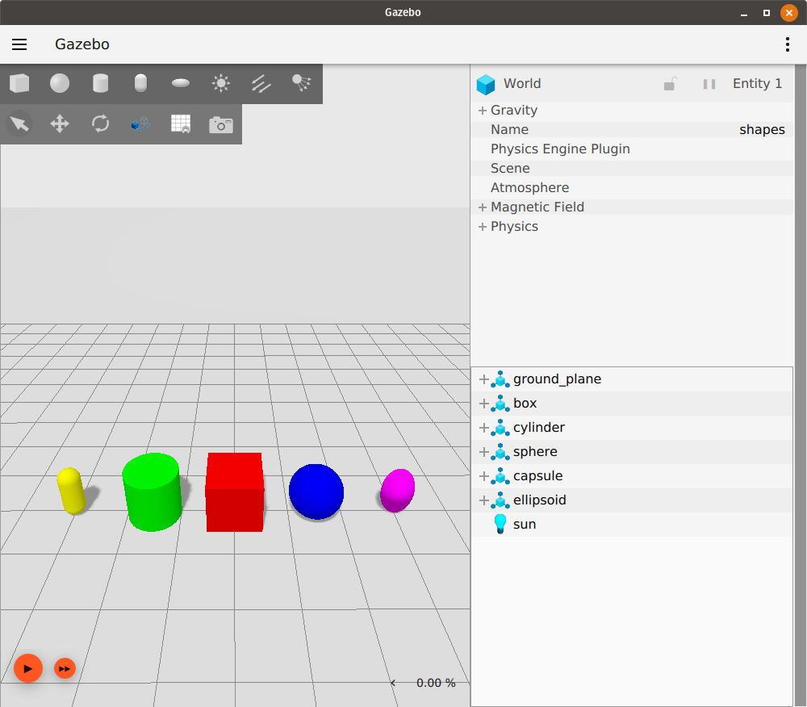
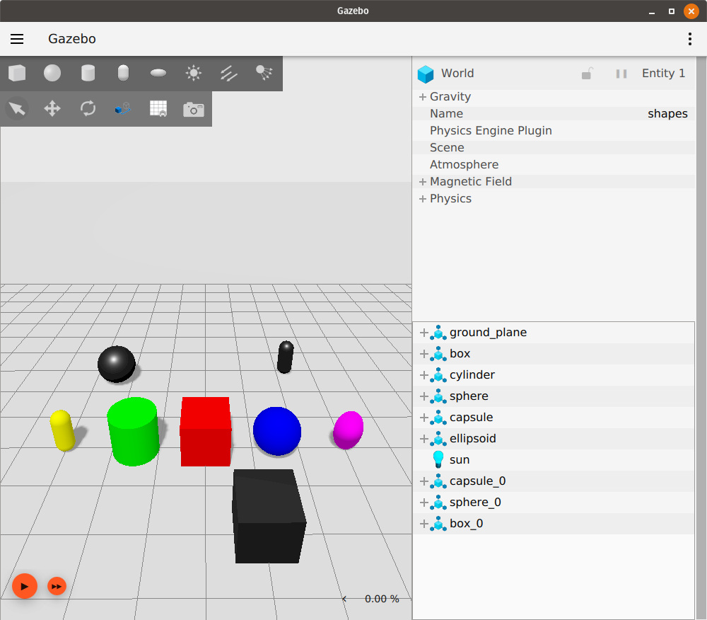
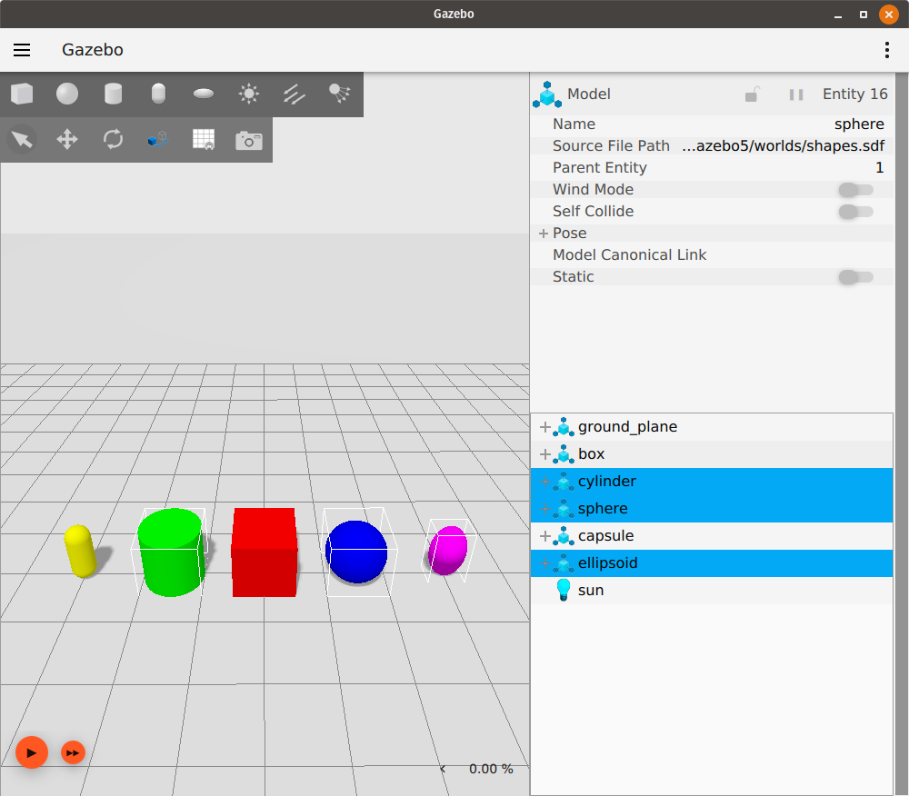
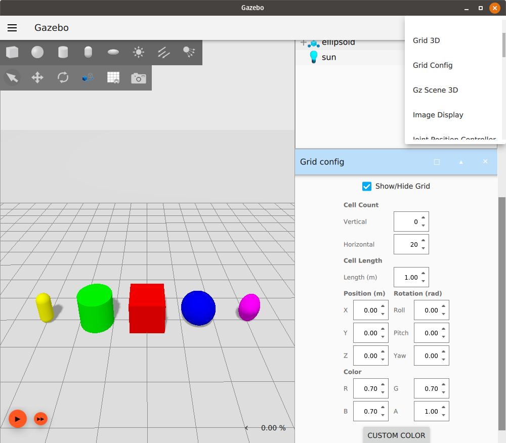
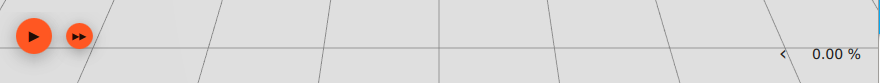

# Understanding the GUI

This guide is an introduction to the Ignition Graphical User Interface (GUI).

## Prerequisites

Before beginning, you should have [Ignition installed](/docs/edifice/install).
If you installed [from source](/docs/edifice/install)
you will need to [source](/docs/edifice/install_ubuntu_src#using-the-workspace) the workspace;
otherwise, you're good to go!

Start by getting Ignition up and running with a sample world:

```bash
ign gazebo shapes.sdf
```

`ign gazebo` will run the latest version of Ignition you have installed.
You can check if you have more than one version of Ignition installed by running `ign gazebo --versions`.
For example, if you have Edifice and Dome installed, `--versions` might return:

```bash
5.0.0
4.0.0
```

To ensure you're working with Edifice, include the `--force-version` directive when starting up:

```bash
ign gazebo --force-version 5.0.0 shapes.sdf
```

## GUI

After running `shapes.sdf`, you should see the following screen:



The interface consists of several sections:

### The Toolbar

The toolbar along the top of the GUI contains two buttons, a file menu button on the left (horizontal stripes), and a plugins button on the right (vertical ellipsis).

The file menu button allows you to save the world to a file, save and load interface configurations and customize interface style settings.
An interface configuration consists of the plugins you have loaded and the style settings in place.

The top left toolbar hanging below the file menu button contains shape buttons (sphere, box, cylinder, capsule and ellipsoid) and transform control (first four buttons on the second row).
To learn more about transform control, go to the "Transform Control" section of [Manipulating Models](manipulating_models) tutorial.
The shape buttons allow you to directly insert a box, sphere, cylinder capsule, or ellipsoid model into the world.
Simply click on the shape you would like to insert, and place it into the world.
The shape will automatically snap onto the ground plane, and its properties will show up on the Entity Tree plugin window.

The following is what it looks like after inserting shapes:



The plugins button lists all the available plugins.
You can scroll down this list to see all the plugins that are available for your version of Ignition.
When you select one, its interface will appear in the right panel.

### The Right Panel

The GUI contains two plugins that you see in the right panel upon starting.
At the top is the Component Inspector, followed by the Entity Tree.

Everything in a simulation is considered an "entity."
In `shapes.sdf`, the entities listed are the ground plane, each of the shape models, and the sun.

Items in the list can be expanded to reveal their links, as well as corresponding visuals and collisions, and joints, if they exist.

You can select entities in the simulation by clicking on their names in the entity tree.
You can also hold `Ctrl` and click to select multiple.



You can also right-click on any plugin to open basic `Settings` or to `Close`.

### The Scene

Within the scene is where you'll interact with your simulated world and objects.

Currently, you can navigate the scene with a mouse in several ways:

* **Left-click**: select entity
* **Right-click**: opens menu with options:
  * *Move to*: center the scene on an entity
  * *Follow*: choose an entity for the view to  stay centered on, whether it moves or you pan around
  * *Remove*: erase the entity from the simulation
  * *View > Collisions*: view collisions of the entity (that are defined in the SDF file)
* **Left-click and drag**: pan around the scene
* **Right-click and drag**: zoom in and out
* **Scroll wheel forward/backward**: zoom in and out
* **Scroll wheel click and drag**: rotate the scene

More complex methods for interacting with the entities within a scene will be explained in-depth in the coming tutorials.

#### Grid Config

The grid visible in the scene can be adjusted by a plugin.
You can adjust features of the world's grid, including cell size, grid position, cell count, and even color.

Open the the Grid Config plugin by selecting it from the plugins button from the toolbar and selecting it from the dropdown list.



#### World Control

Along the bottom edge of the scene, you'll notice several buttons:



From left to right, the options are `Play`, `Steps` and `RTF` (real time factor).

Pressing `Play` will start the simulation.
You can use the same button to pause the simulation as well.

The `Steps` button allows you to step through the simulation at the rate of a step size, or simulation iteration.
You can customize step size by hovering over the button.

At the furthest right end of the scene, you can expand `RTF` to see not only the percentage value that compares real time with sim time, but also those individual values themselves, as well as iteration count.

The function of the World Control options will become clearer once you begin manipulating entities.

## Next Up

Now that you're comfortable with Ignition GUI navigation and terminology, let's start learning about more meaningful model interactions with the [Manipulating Models](manipulating_models) tutorial.
