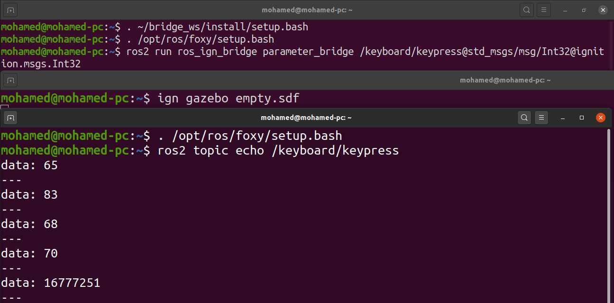

# ROS 2 Integration

In this tutorial we will learn how to Integrate ROS 2 with Ignition. We will establish
communication between them. This can help in many aspects; we can receive data or commands
from ROS and apply it to Ignition and vice versa.

## ros_ign_bridge

`ros_ign_bridge` provides a network bridge which enables the exchange of messages between ROS 2 and Ignition Transport. Its support is limited to only certain message types. Please, check this [README](https://github.com/ignitionrobotics/ros_ign/blob/ros2/ros_gz_bridge/README.md) to verify if your message type is supported by the bridge.

## Requirements

For this tutorial to work correctly make sure you have the following installed:

* [ROS 2 Foxy](https://index.ros.org/doc/ros2/Installation/Foxy/)
* [Ignition Edifice](https://gazebosim.org/docs/edifice)
* [ros_ign_bridge](https://github.com/ignitionrobotics/ros_ign/tree/ros2#from-source)

## Bidirectional communication

We can initialize a bidirectional bridge so we can have ROS as the publisher and Ignition as the subscriber or vice versa.

For example:

```
ros2 run ros_ign_bridge parameter_bridge /TOPIC@ROS_MSG@IGN_MSG
```

The `ros2 run ros_ign_bridge parameter_bridge` command simply runs the `parameter_bridge` code from the `ros_ign_bridge` package. Then, we specify our topic `/TOPIC` over which the messages will be sent. The first `@` symbol delimits the topic name from the message types. Following the first `@` symbol is the ROS message type.

The ROS message type is followed by an `@`, `[`, or `]` symbol where:

* `@`  is a bidirectional bridge.
* `[`  is a bridge from Ignition to ROS.
* `]`  is a bridge from ROS to Ignition.

Have a look at these [examples](https://github.com/ignitionrobotics/ros_ign/blob/ros2/ros_gz_bridge/README.md#example-1a-ignition-transport-talker-and-ros-2-listener)
explaining how to make communication connections from ROS to Ignition and vice versa.

## Publish key strokes to ROS

Let's send messages to ROS using the `Key Publisher` an Ignition plugin.

**Note:** Make sure to have all workspaces you need (ROS, Ignition and, `ros_ign`...) sourced.


First we will start a bridge between ROS and Ignition specifying the topic
at which the `Key Publisher` plugin sends messages and also the type
of the messages as follows:

```
ros2 run ros_ign_bridge parameter_bridge /keyboard/keypress@std_msgs/msg/Int32@ignition.msgs.Int32
```

We started a bridge on `/keyboard/keypress` topic with message of type `Int32`.
For ROS it is `std_msgs/msg/Int32` and for Ignition it is `ignition.msgs.Int32`

In another terminal launch an Gazebo Sim world, for example the `empty.sdf` world:

```
ign gazebo empty.sdf
```

Then add the `Key Publisher` plugin from the dropdown menu on the top right corner.


In another terminal start the ROS listener:

```
ros2 topic echo /keyboard/keypress
```

This command listens to the messages sent over the `/keyboard/keypress` topic.

On the Ignition window, press on the keyboard keys and you should
find data on the listener terminal. This is what the terminals should look like:



Now it's your turn! Try to send data from ROS to Ignition. You can also try different data types and different directions of communication.

## Video walk-through

A video walk-through of this tutorial is available from our YouTube channel: [Ignition tutorials: ROS 2 Foxy integration](https://youtu.be/IpZTNyTp9t8).

<iframe width="560" height="315" src="https://www.youtube.com/embed/IpZTNyTp9t8" frameborder="0" allow="accelerometer; autoplay; encrypted-media; gyroscope; picture-in-picture" allowfullscreen></iframe>
