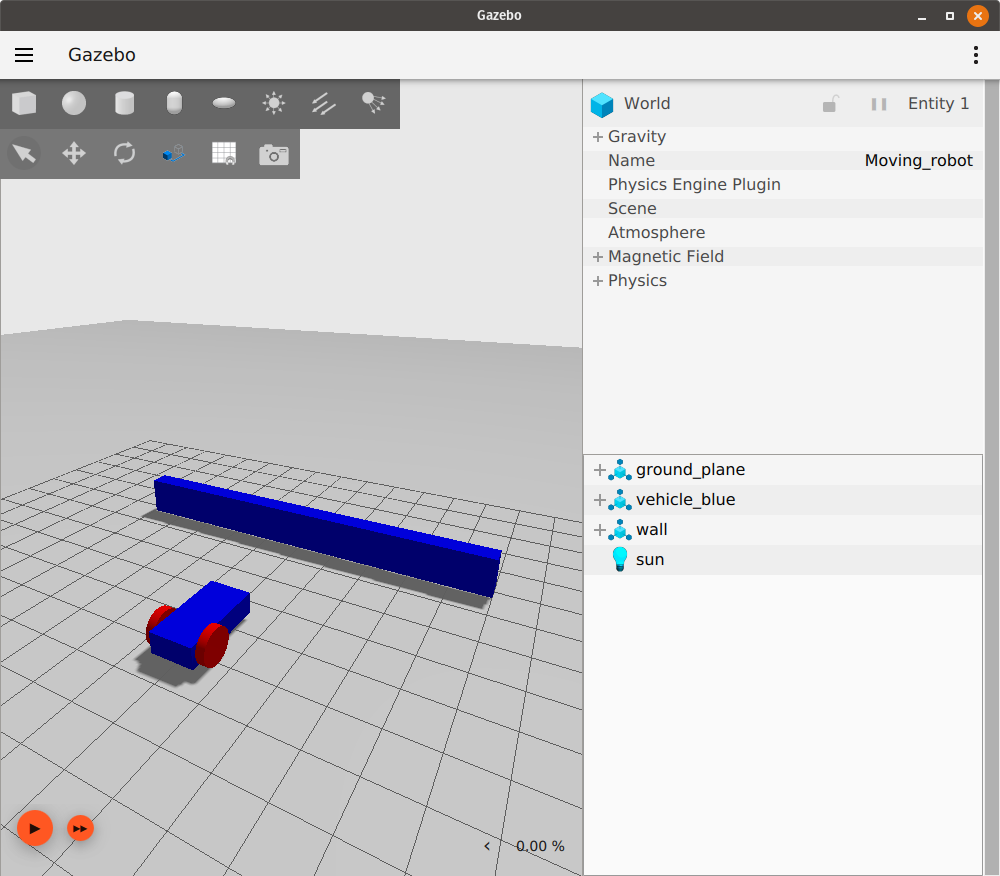

# Sensors

**Note:** This tutorial is a continuation from the
[Moving the robot tutorial](moving_robot).

In this tutorial we will learn how to add sensors to our robot and
to other models in our world. We will use three different sensors:
an IMU sensor, a Contact sensor and a Lidar sensor. We will also
learn how to launch multiple tasks with just one file using `ign_launch`.

You can find the final world of this tutorial [here](https://github.com/ignitionrobotics/docs/blob/master/edifice/tutorials/sensors/sensor_tutorial.sdf)

## IMU sensor

The inertial measurement unit (IMU) outputs the `orientation` of our
robot in quaternions, the `angular_velocity` in the three axes (X, Y, Z),
and the `linear_acceleration` in the three axes. Let's use our
[moving_robot.sdf](https://github.com/ignitionrobotics/docs/blob/master/edifice/tutorials/moving_robot/moving_robot.sdf) world and modify it. Create a new file
`sensor_tutorial.sdf` and add the code from `moving_robot.sdf` to it.
To define the `IMU` sensor add this code under the `<world>` tag:

```xml
<plugin filename="libignition-gazebo-imu-system.so"
        name="ignition::gazebo::systems::Imu">
</plugin>
```

This code defines the `IMU` sensor plugin to be used in our world.
Now we can add the `IMU` sensor to our robot as follows:

```xml
<sensor name="imu_sensor" type="imu">
    <always_on>1</always_on>
    <update_rate>1</update_rate>
    <visualize>true</visualize>
    <topic>imu</topic>
</sensor>
```

The sensor is usually added to one of the links of our model; we added
 it under the `chassis` link.

Let's describe the tags:

 * `<always_on>` if true the sensor will always be updated
 according to the update rate.
 * `<update_rate>` the frequency at which the sensor data is generated.
 * `<visualize>` if true the sensor is visualized in the GUI.
 * `<topic>` name of the topic on which data is published.

**Note:** Not all the tags are supported for all sensors yet.

### Read data from IMU

To read the data from the `IMU`, run the world in one terminal and press the play button:

`ign gazebo sensor_tutorial.sdf`

In another terminal, run:

`ign topic -e -t /imu`

The last command listens to the messages sent over the `/imu` topic. The IMU data are `orientation`, `angular_velocity` and `linear_acceleration` as described above. It should look like this:


Move your robot forward using the keyboard up key. You should see the sensor values changing.

## Contact sensor

Let's introduce a different type of sensor, the `contact` sensor.
You can guess from the name that this sensor gives indication when
it touches (contacts) something else. We will build an obstacle (wall)
and add the contact sensor to it. If the robot hits the obstacle it will
stop, preventing the robot from damaging itself. Let's first build the
obstacle as follows:

```xml
<model name='wall'>
    <static>true</static>
    <pose>5 0 0 0 0 0</pose><!--pose relative to the world-->
    <link name='box'>
        <pose/>
        <visual name='visual'>
            <geometry>
                <box>
                    <size>0.5 10.0 2.0</size>
                </box>
            </geometry>
            <!--let's add color to our link-->
            <material>
                <ambient>0.0 0.0 1.0 1</ambient>
                <diffuse>0.0 0.0 1.0 1</diffuse>
                <specular>0.0 0.0 1.0 1</specular>
            </material>
        </visual>
        <collision name='collision'>
            <geometry>
                <box>
                    <size>0.5 10.0 2.0</size>
                </box>
            </geometry>
        </collision>
    </link>
</model>
```

It is just a simple model with one link of box shape. You can check the [Build your own robot tutorial](building_robot) to learn how to build models.

Now run the world and make sure that the wall appears in the simulation like this:



Let's add the contact sensor to the wall. As with the `IMU` sensor, we should first define the `Contact` sensor by adding the following code:

```xml
<plugin filename="libignition-gazebo-contact-system.so"
        name="ignition::gazebo::systems::Contact">
</plugin>
```

Now we can add the `contact` sensor to the `box` link of the `wall` model:

```xml
<sensor name='sensor_contact' type='contact'>
    <contact>
        <collision>collision</collision>
    </contact>
</sensor>
```

The definition of the `<sensor>` is straight forward, we just define the `name` and the `type` of the sensor. And inside the `collision` we define the box link collision name which is `collision`.

We need also to add the `TouchPlugin` under the `wall` model as follows:

```xml
<plugin filename="libignition-gazebo-touchplugin-system.so"
        name="ignition::gazebo::systems::TouchPlugin">
    <target>vehicle_blue</target>
    <namespace>wall</namespace>
    <time>0.001</time>
    <enabled>true</enabled>
</plugin>
```

The `TouchPlugin` will publish (send) a message when the `wall`
has been touched. The tags of the plugin are as follows:

* `<target>` which will be in contact with our wall, in our case `vehicle_blue`.
* `<namespace>` takes the namespace of our topic, so when our robot hits the wall it will send a message to `/wall/touched` topic.

 Run the world in one terminal:

`ign gazebo sensor_tutorial.sdf`

In another terminal, listen to the `/wall/touched` topic:

`ign topic -e -t /wall/touched`

Drive your robot forward to the wall using the keyboard arrow keys. Make sure to start the simulation by hitting the play button, and enable the Key Publisher plugin as well by clicking on the plugins dropdown list (vertical ellipsis), then selecting "Key Publisher".

When you hit the bump you should see a message `data: true` on the terminal where you ran the `ign topic -e -t /wall/touched`.

Now we can use the `TriggeredPublisher` plugin to make our robot stop when hits the wall as follows:

```xml
<plugin filename="libignition-gazebo-triggered-publisher-system.so"
        name="ignition::gazebo::systems::TriggeredPublisher">
    <input type="ignition.msgs.Boolean" topic="/wall/touched">
        <match>data: true</match>
    </input>
    <output type="ignition.msgs.Twist" topic="/cmd_vel">
        linear: {x: 0.0}, angular: {z: 0.0}
    </output>
</plugin>
```

As explained in the [Moving robot tutorial](moving_robot),
we can publish an output depending on a received input. So when we receive
`data: true` on the `/wall/touched` topic we publish
`linear: {x: 0.0}, angular: {z: 0.0}` to make our robot stop.

## Lidar sensor

We don't want our robot to touch the wall at all because this may cause some damage, so instead of the contact sensor we can use the Lidar. Lidar is an acronym for "light detection and ranging". This sensor can help us detect obstacles around the robot. We will use it to measure the distance between our robot and the wall.

First let's create a frame to fix our lidar to. This should be added inside of the `vehicle_blue` `<model>` tag, since the lidar frame is attached to the robot's `chassis`:

```xml
<frame name="lidar_frame" attached_to='chassis'>
    <pose>0.8 0 0.5 0 0 0</pose>
</frame>
```

Then add this plugin under the `<world>` tag, to be able to use the `lidar` sensor:

```xml
    <plugin
      filename="libignition-gazebo-sensors-system.so"
      name="ignition::gazebo::systems::Sensors">
      <render_engine>ogre2</render_engine>
    </plugin>
```

Under the `chassis` link we can add the `lidar` sensor as follows:

```xml
<sensor name='gpu_lidar' type='gpu_lidar'>"
    <pose relative_to='lidar_frame'>0 0 0 0 0 0</pose>
    <topic>lidar</topic>
    <update_rate>10</update_rate>
    <ray>
        <scan>
            <horizontal>
                <samples>640</samples>
                <resolution>1</resolution>
                <min_angle>-1.396263</min_angle>
                <max_angle>1.396263</max_angle>
            </horizontal>
            <vertical>
                <samples>1</samples>
                <resolution>0.01</resolution>
                <min_angle>0</min_angle>
                <max_angle>0</max_angle>
            </vertical>
        </scan>
        <range>
            <min>0.08</min>
            <max>10.0</max>
            <resolution>0.01</resolution>
        </range>
    </ray>
    <always_on>1</always_on>
    <visualize>true</visualize>
</sensor>
```

* First we defined the `name` and `type` of our sensor, then we defined its
`<pose>` relative to the `lidar_frame`.
* In the `<topic>` we define the topic on which the lidar data will be published.
* `<update_rate>` is the frequency at which the `lidar` data is generated, in
our case `10 Hz` which is equal to `0.1 sec`.
* Under the `<horizontal>` and `<vertical>` tags we define the properties of the
horizontal and vertical laser rays.
* `<samples>` is the number of simulated lidar rays to generate per complete
laser sweep cycle.
* `<resolution>`: this number is multiplied by samples to determine the number
range data points.
* The `<min_angle>` and `<max_angle>` are the angle range of the generated rays.
* Under the `<range>` we define range properties of each simulated ray
    *  `<min>` and `<max>` define the minimum and maximum distance for each lidar ray.
    * The `<resolution>` tag here defines the linear resolution of each lidar ray.
 * `<always_on>`: if true the sensor will always be updated according to the `<update_rate>`.
 * `<visualize>`: if true the sensor is visualized in the GUI.

Now run the world and press the play button in the bottom-left corner:

`ign gazebo sensor_tutorial.sdf`

Look at the lidar messages on the `/lidar` topic, specifically the `ranges` data:

`ign topic -e -t /lidar`

The lidar message has the following attributes:

```
message LaserScan
{
  Header header              = 1;

  string frame               = 2;
  Pose world_pose            = 3;
  double angle_min           = 4;
  double angle_max           = 5;
  double angle_step          = 6;
  double range_min           = 7;
  double range_max           = 8;
  uint32 count               = 9;
  double vertical_angle_min  = 10;
  double vertical_angle_max  = 11;
  double vertical_angle_step = 12;
  uint32 vertical_count      = 13;

  repeated double ranges              = 14;
  repeated double intensities         = 15;
}
```

### Avoid the wall

Now as we have the lidar on our robot, we can use the `ranges` data
and make our robot avoid hitting the wall.
To do that, we'll write a short C++ program that listens to
the sensor data and sends velocity commands to the robot.
This program is called a node. We will build a node that subscribes
to the `/lidar` topic and reads its data.
Have a look at this [tutorial](https://gazebosim.org/api/transport/9.0/messages.html)
to learn how to build a `publisher` and a `subscriber` node.
You can download the finished node for this demo from [here](https://github.com/ignitionrobotics/docs/blob/master/edifice/tutorials/sensors/lidar_node.cc).

#### The lidar_node

```cpp
ignition::transport::Node node;
std::string topic_pub = "/cmd_vel";
ignition::msgs::Twist data;
auto pub = node.Advertise<ignition::msgs::Twist>(topic_pub);
```

We declare a `node` which will publish to `cmd_vel` topic and defined the message type `Twist`. Then advertise our node.

```cpp
void cb(const ignition::msgs::LaserScan &_msg)
{
  bool allMore = true;
  for (int i = 0; i < _msg.ranges_size(); i++)
  {
    if (_msg.ranges(i) < 1.0)
    {
      allMore = false;
      break;
    }
  }
  if (allMore) //if all bigger than one
  {
    data.mutable_linear()->set_x(0.5);
    data.mutable_angular()->set_z(0.0);
  }
  else
  {
    data.mutable_linear()->set_x(0.0);
    data.mutable_angular()->set_z(0.5);
  }
  pub.Publish(data);
}
```

Inside the callback function we check if the range of all rays are bigger than `1.0`.
If so we publish a message to our car to move forward. Otherwise we make the robot rotate.

```cpp
int main(int argc, char **argv)
{
    std::string topic = "/lidar";
    // Subscribe to a topic by registering a callback.
    if (!node.Subscribe(topic, cb))
    {
        std::cerr << "Error subscribing to topic [" << topic << "]" << std::endl;
        return -1;
    }

    // Zzzzzz.
    ignition::transport::waitForShutdown();

    return 0;
}
```

Inside the main we subscribe to the `lidar` topic, and wait until the node is shut down.

#### Build the node

Download the [CMakeLists.txt](https://github.com/ignitionrobotics/docs/blob/master/edifice/tutorials/sensors/CMakeLists.txt), and in the same folder of `lidar_node` create `build/` directory:

```sh
mkdir build
cd build
```

Run cmake and build the code:

```sh
cmake ..
make lidar_node
```

##### Run the node

Run the node from terminal 1:

```sh
./build/lidar_node
```

Run the world from terminal 2:

```sh
ign gazebo sensor_tutorial.sdf
```

Now you can see the robot move forward and as it approaches the wall it starts to turn left until it's clear and moves forward again (be sure to press the play button in the bottom-left corner to make the robot start moving).

## Ignition launch

Instead of running two different tasks from two different terminals we can make a launch file which will run the `sensor_world` and the `lidar_node` at the same time. Open your text editor and add the following code.

```xml
<?xml version='1.0'?>
<ignition version='1.0'>
  <executable name='sensor-world'>
    <command>ign gazebo sensor_tutorial.sdf</command>
  </executable>

  <executable name='lidar_node'>
    <command>./build/lidar_node</command>
  </executable>

</ignition>
```

The launch file is an XML file. We simply define what commands will run under the `<executable>` tag.
The first command is `ign gazebo sensor_tutorial.sdf` which launches the world.
And the second command is `./build/lidar_node` which runs the `lidar_node`.
Save the file as `sensor_launch.ign`, and then run it using the following command:

```sh
ign launch sensor_launch.ign
```

Press the play button to start the simulation. Hurray! Our robot is now moving and avoiding the wall.

To add even more complexity to your simulation, learn how to add actors to a world in the [next tutorial](actors).

## Video walk-through

A video walk-through of this tutorial is available from our YouTube channel: [Ignition tutorials: Sensors](https://youtu.be/WcFyGPEfhHc)

<iframe width="560" height="315" src="https://www.youtube.com/embed/WcFyGPEfhHc" frameborder="0" allow="accelerometer; autoplay; encrypted-media; gyroscope; picture-in-picture" allowfullscreen></iframe>
