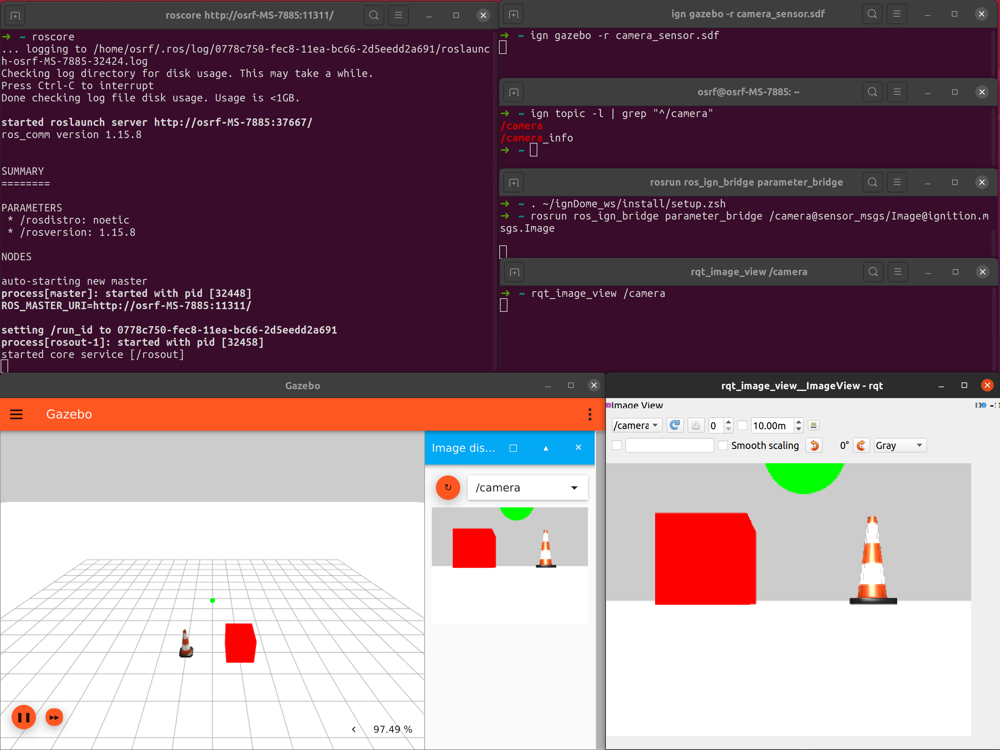

# ROS Integration

Most of the Ignition libraries use [Ignition Transport](https://github.com/gazebosim/gz-transport)
to exchange data between different software components. This tutorial details
how to interface with [ROS](http://www.ros.org/), enabling the ability to use
tools such as [Rviz](http://wiki.ros.org/rviz) for robot or sensor
visualization.

> **Important**: The packages documented here used to have the `ros1_` prefix
> instead of `ros_`. Please update your code accordingly in order to avoid
> adverse effects.

# ros_ign_bridge to the rescue

ros_ign_bridge provides a network bridge which enables the exchange of messages
between ROS 1 and Ignition Transport. Its support is limited to only certain
message types. Please, read this [README](https://github.com/osrf/ros_ign/blob/noetic/ros_ign_bridge/README.md)
to verify if your message type is supported by the bridge.

# How to install ros_ign_bridge

## Binary install

Binaries are not yet supported for Fortress. Check out the [table on ros_ign](https://github.com/ignitionrobotics/ros_ign/tree/noetic) for other combinations.

## Source install

See the [from source](https://github.com/ignitionrobotics/ros_ign/tree/noetic#from-source) of the bridge documentation. This tutorial requires Ubuntu Bionic or newer.

# Run the bridge and exchange images

In this example, we're going to generate Ignition Transport images using Gazebo, that will be converted into ROS 1 images, and visualized with rqt_viewer. It is assumed that you are using ROS Noetic.

First we start a ROS 1 `roscore`:

```bash
# Shell A:
. /opt/ros/noetic/setup.bash
roscore
```

Then we start Gazebo.

```bash
# Shell B:
ign gazebo -r camera_sensor.sdf
# if you don't see the camera image in the Image Display and it stays grey, press the orange refresh button
```

Gazebo should be running and publishing images over the `/camera` topic.
Let's verify it:

```bash
# Shell C:
ign topic -l | grep "^/camera"
```

Then we start the parameter bridge with the previous topic. To run the bridge:

```bash
# Shell D:
. /opt/ros/noetic/setup.bash
# If installed from source, make sure you've sourced the ros-ign packages too
rosrun ros_ign_bridge parameter_bridge /camera@sensor_msgs/Image@ignition.msgs.Image
```

Now we start the ROS 1 GUI:

```bash
# Shell E:
. /opt/ros/noetic/setup.bash
sudo apt-get install ros-noetic-rqt-image-view
rqt_image_view /camera
```

You should see the current images in `rqt_image_view` which are coming from
Gazebo (published as Ignition Msgs over Ignition Transport).

The screenshot shows all the shell windows and their expected content
(it was taken using ROS Noetic and in a Dome workspace but the expected content applies to Fortress):



