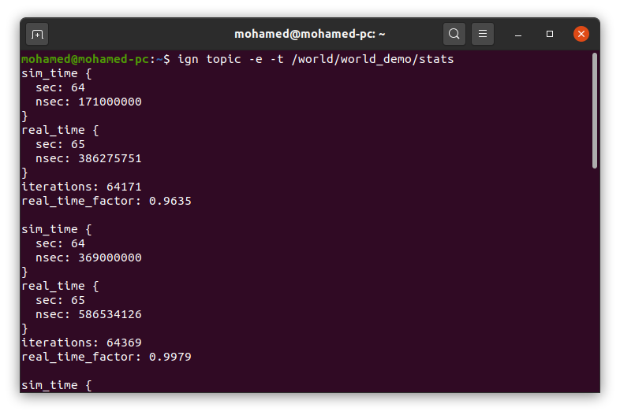
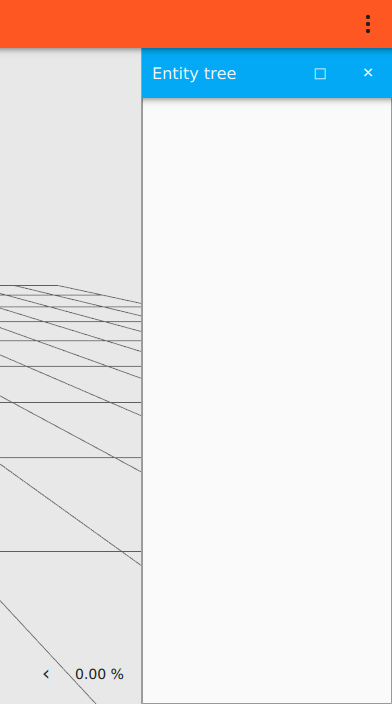

# SDF worlds

In this tutorial we will learn how to build our world using SDF, and how to add models to it. Open your text editor and add code as you follow along with this tutorial. You can also download the finished world for this tutorial from [here](https://github.com/gazebosim/docs/blob/master/garden/tutorials/sdf_worlds/world_demo.sdf).

## Defining a world

Every SDF world starts with these tags.

```xml
<?xml version="1.0" ?>
<sdf version="1.8">
    <world name="world_demo">
    ...
    ...
    </world>
</sdf>
```

The first two tags define the version of the `XML` and the `SDF`. Then we have the `<world> </world>` tags between which everything goes.

## Physics

```xml
<physics name="1ms" type="ignored">
    <max_step_size>0.001</max_step_size>
    <real_time_factor>1.0</real_time_factor>
</physics>
```

The physics tag specifies the type and properties of the dynamic engine. We chose the `name` `1ms` as the step size is 1 millisecond. The `type` is the type of the dynamic engine (physics library). There are options like, Ode, Bullet, Simbody and Dart. We set it to `ignored`, as choosing the type of the physics engine is not done through this tag yet.

`<max_step_size>` is the maximum time at which every system in simulation can interact with the states of the world. The smaller the value, the more accurate your calculations, but more computation power is needed.
`<real_time_factor>` is the ratio of simulation time to real time.

## Plugins

Plugins are a dynamically loaded chunk of code. For example:

```xml
<plugin
    filename="libgz-sim-physics-system.so"
    name="gz::sim::systems::Physics">
</plugin>
```

The `Physics` plugin is very important for simulating the dynamics of the world.

```xml
<plugin
    filename="libgz-sim-user-commands-system.so"
    name="gz::sim::systems::UserCommands">
</plugin>
```

The `UserCommands` plugin is responsible for creating models, moving models, deleting them and many other user commands.

```xml
<plugin
    filename="libgz-sim-scene-broadcaster-system.so"
    name="gz::sim::systems::SceneBroadcaster">
</plugin>
```

`SceneBroadcaster` shows our world scene.

## GUI

Now let's define the GUI. Under the `<gui>` tag we specify anything related to the `GUI` of Gazebo.

```xml
<gui fullscreen="0">
    ...
    ...
</gui>
```

[gazebo-gui](https://github.com/gazebosim/gz-gui/) has a bunch of plugins to choose from. We will add the ones that are necessary to get our world up and running with basic functionality.

### Scene 3D plugin

```xml
<!-- 3D scene -->
<plugin filename="GzScene3D" name="3D View">
    <gz-gui>
        <title>3D View</title>
        <property type="bool" key="showTitleBar">false</property>
        <property type="string" key="state">docked</property>
    </gz-gui>

    <engine>ogre2</engine>
    <scene>scene</scene>
    <ambient_light>1.0 1.0 1.0</ambient_light>
    <background_color>0.8 0.8 0.8</background_color>
    <camera_pose>-6 0 6 0 0.5 0</camera_pose>
</plugin>
```

The `GzScene3D` plugin is responsible for displaying the 3D scene of our world. It has the following properties (most of the GUI plugins have them):

* `showTitleBar` if true it will show the blue title bar over the plugin with the name mentioned in the `<title>` tag.
* `state` is the state of the plugin it can be docked in its place using `docked` or it can be `floating`.

For the rendering engine we can choose `ogre` or `ogre2`. The `<ambient_light>` and the `<background_color>` specify the ambient and the background color of the scene. `<camera_pose>` specifies the `X Y Z` position of the camera followed by its rotation in `Roll Pitch Yaw`.

### World control plugin

```xml
<!-- World control -->
<plugin filename="WorldControl" name="World control">
    <gz-gui>
        <title>World control</title>
        <property type="bool" key="showTitleBar">false</property>
        <property type="bool" key="resizable">false</property>
        <property type="double" key="height">72</property>
        <property type="double" key="width">121</property>
        <property type="double" key="z">1</property>

        <property type="string" key="state">floating</property>
        <anchors target="3D View">
        <line own="left" target="left"/>
        <line own="bottom" target="bottom"/>
        </anchors>
    </gz-gui>

    <play_pause>true</play_pause>
    <step>true</step>
    <start_paused>true</start_paused>
    <service>/world/world_demo/control</service>
    <stats_topic>/world/world_demo/stats</stats_topic>
</plugin>
```

The `World control` plugin is responsible for controlling the world. Some of its properties are the following:

* `<play_pause>` if `true` we will have the play-pause button on the bottom left corner.
* `<stats_topic>` tag specifies the topic at which the world stats like simulation time and real time are published on.
* `<start_paused>` if `true` the simulation will be paused at the start of
Gazebo.

### World stats plugin

```xml
<!-- World statistics -->
<plugin filename="WorldStats" name="World stats">
    <gz-gui>
        <title>World stats</title>
        <property type="bool" key="showTitleBar">false</property>
        <property type="bool" key="resizable">false</property>
        <property type="double" key="height">110</property>
        <property type="double" key="width">290</property>
        <property type="double" key="z">1</property>

        <property type="string" key="state">floating</property>
        <anchors target="3D View">
        <line own="right" target="right"/>
        <line own="bottom" target="bottom"/>
        </anchors>
    </gz-gui>

    <sim_time>true</sim_time>
    <real_time>true</real_time>
    <real_time_factor>true</real_time_factor>
    <iterations>true</iterations>
    <topic>/world/world_demo/stats</topic>

</plugin>
```

The `World stats` plugin is responsible for displaying the world statistics,
`<sim_time>`, `<real_time>`, `<real_time_factor>` and `<iterations>`.

With these tags we can choose what values to display (expand the bottom right corner to see these values). We can choose which `<topic>` these values will be published on. Let's try to run the world and listen to that topic.

Run the world:

`gz sim world_demo.sdf`

Press the play button and in another terminal listen to the messages:

`gz topic -e -t /world/world_demo/stats`

The message should look like this:



### Entity tree

```xml
<!-- Entity tree -->
<plugin filename="EntityTree" name="Entity tree">
</plugin>
```

In this plugin we can see all the entities of our world (everything in simulation is considered an "entity"). We can see the different models, sun and also their links, visuals and collisions.



It is blank because we didn't add anything to our world yet.

There are a bunch of useful gz-gui plugins like the `Transform control` plugin that allows us to manipulate different components of our world, and translate and rotate the entities. Check out this [tutorial](manipulating_models) explaining how to manipulate models.

The plugins can also be added from the GUI using the plugin drop-down menu in the top right corner of Gazebo. Now that we are done with the GUI, let's add different elements to our world. **Don't** forget to add the closing tag `</gui>`.

## Light

```xml
<light type="directional" name="sun">
    <cast_shadows>true</cast_shadows>
    <pose>0 0 10 0 0 0</pose>
    <diffuse>0.8 0.8 0.8 1</diffuse>
    <specular>0.2 0.2 0.2 1</specular>
    <attenuation>
        <range>1000</range>
        <constant>0.9</constant>
        <linear>0.01</linear>
        <quadratic>0.001</quadratic>
    </attenuation>
    <direction>-0.5 0.1 -0.9</direction>
</light>
```

* `<light>` specifies the light source in the world. The `<type>` of the light can be `point`, `directional` or `spot`.
* `<pose>` is the position (x,y,z) and orientation (roll, pitch, yaw) of the light element with respect to the frame mentioned in the `relative_to attribute`; in our case (`relative_to` attribute is ignored) it is relative to the world.
* `<cast_shadows>` when true the light will cast shadows. `<diffuse>` and `<specular>` are the diffuse and specular light color.
* `<attenuation>` specifies the light attenuation properties, which are:

  * `<range>` is range of light.
  * `<constant>` is the constant attenuation factor, `1` never attenuate and `0` complete attenuation.
  * `<linear>` is the linear attenuation factor, `1` means attenuate evenly over the distance.
  * `<quadratic>` is the quadratic attenuation factor. It adds curvature to the attenuation.
  * `<direction>` is direction of the light, only applicable to spot and directional light.

## Adding models

Instead of building our own models we can use already built ones. [Gazebo Fuel](https://app.gazebosim.org/fuel) hosts hundreds of models that can easily be added to an Gazebo world. Models can be added as follows.

### Spawning a model

For adding various models from fuel to your world chekout this [tutorial](fuel_insert).

### Include the model URI

Another way of adding the model to your world is to use the model link. Visit the [Gazebo Fuel website](https://app.gazebosim.org/fuel). Choose the model you like and click on the `<>` icon on the model description page. This will copy an SDF snippet to your clipboard, then paste it in your world right above the closing `</world>` tag, like this:

```xml
<include>
    <uri>
    https://fuel.gazebosim.org/1.0/OpenRobotics/models/Coke
    </uri>
</include>
```

### Download the model

The previous methods download your model on run time. For saving the model permanently you can download the model from fuel, and then refer to it like this:

```xml
<include>
    <uri>
    model://Coke
    </uri>
</include>
```

We need to set `GZ_SIM_RESOURCE_PATH` environment variable to the parent folder of our model. For example, if our directory looks like this:

```
world_tutorial<br/>
├── Coke <br/>
└── world_demo.sdf
```

Then we have to set it to the `world_tutorial` directory, like this:

`export GZ_SIM_RESOURCE_PATH="$HOME/world_tutorial"`

Run your world:

`gz sim world_demo.sdf`

You should see the model in the origin of the world. 


You can also set its coordinates using the `<pose>` tag.
If you want to spawn multiple instances of the same model you must give them different names with the `<name>` tag. 

```
    <include>
        <name>Coke0</name>
        <pose>0 0 0 0 0 0</pose>
        <uri>https://fuel.gazebosim.org/1.0/OpenRobotics/models/Coke</uri>
    </include>
    <include>
        <name>Coke1</name>
        <pose>0 0.1 0 0 0 0</pose>
        <uri>https://fuel.gazebosim.org/1.0/OpenRobotics/models/Coke</uri>
    </include>
```


Now that you have a custom world, the [next tutorial](sensors) will teach you how to add sensors to a robot to allow it to interact with the world around it.

## Video walk-through

A video walk-through of this tutorial is available from our YouTube channel: [Gazebo tutorials: Creating worlds](https://youtu.be/48TX-XJ14Gs).

<iframe width="560" height="315" src="https://www.youtube.com/embed/48TX-XJ14Gs" frameborder="0" allow="accelerometer; autoplay; encrypted-media; gyroscope; picture-in-picture" allowfullscreen></iframe>
