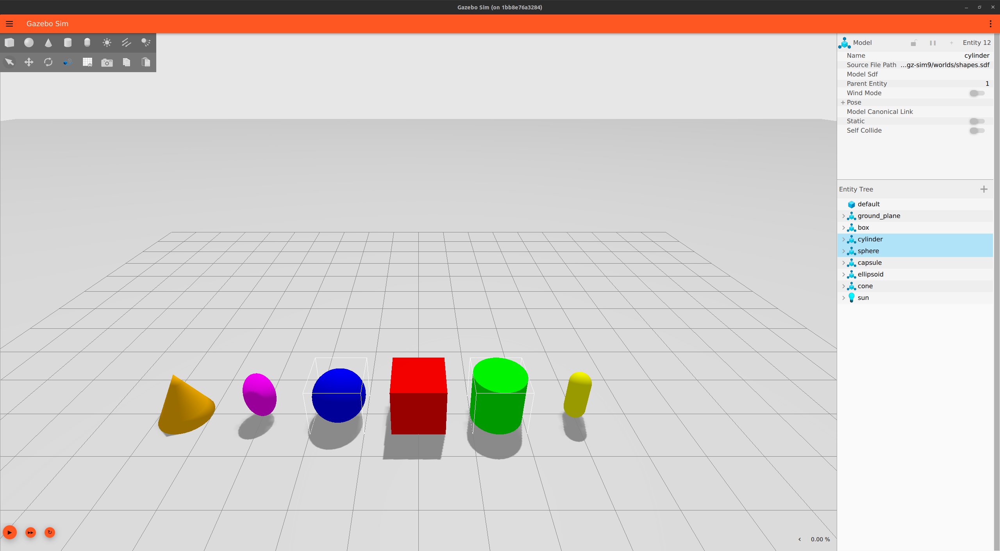
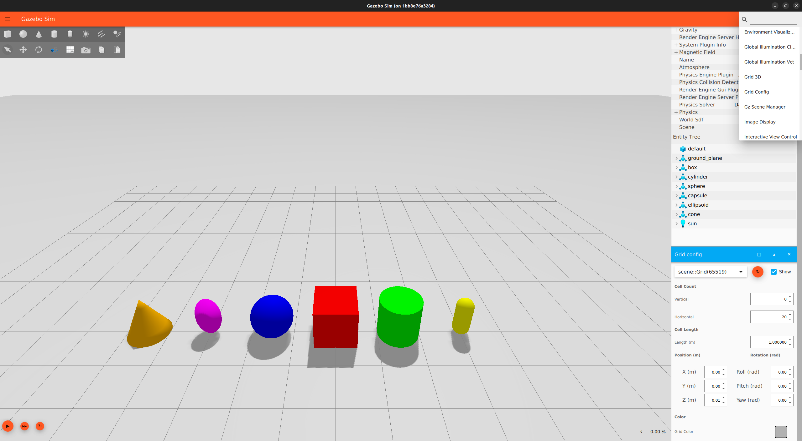

# Understanding the GUI

This guide is an introduction to the Gazebo Graphical User Interface (GUI).

## Prerequisites

Before beginning, you should have [Harmonic installed](/docs/harmonic/install).
If you installed [from source](/docs/harmonic/install)
you will need to [source](/docs/harmonic/install_ubuntu_src#using-the-workspace) the workspace;
otherwise, you're good to go!

Start by getting Gazebo up and running with a sample world:

```bash
gz sim shapes.sdf
```

`gz sim` will run the latest version of Gazebo you have installed.
You can check if you have more than one version of Gazebo installed by running `gz sim --versions`.
For example, if you have Harmonic (7.x.x), Fortress (6.x.x) and Edifice (5.x.x) installed, `--versions` might return:

```bash
7.0.0
6.0.0
5.0.0
```

To ensure you're working with Harmonic, include the `--force-version` directive when starting up:

```bash
gz sim --force-version 7.0.0 shapes.sdf
```

## GUI

After running `shapes.sdf`, you should see the following screen:


The interface consists of several sections:

### The Toolbars

The toolbar along the top of the GUI contains two buttons, a file menu button () on the left, and a plugins button () on the right.
The file menu button allows you to save the world to a file, save and load interface configurations and customize interface style settings.
An interface configuration consists of the plugins you have loaded and the style settings in place.


The top left toolbar hanging below the file menu button contains shape buttons (sphere, box, cylinder, capsule and ellipsoid) as well as lighting controls (point, directional and spot). 
The shape buttons allow you to directly insert a box, sphere, cylinder capsule, or ellipsoid model into the world.
Simply click on the shape you would like to insert, and place it into the world.
The shape will automatically snap onto the ground plane, and its properties will show up on the Entity Tree plugin window.

The following image shows the scene and the Entity Tree after adding three shapes (`box_0`, `sphere_0` and `capsule_0`):


The first five buttons on the second row are for `Transform Control`. 
To learn more about this plugin, go to the `Transform Control` section of [Manipulating Models](manipulating_models) tutorial.

The plugins button lists all the available plugins.
You can scroll down this list to see all the plugins that are available for your version of Gazebo.
When you select one, its interface will appear in the right panel.

### The Right Panel

The GUI contains two plugins that you see in the right panel upon starting.
At the top is the Component Inspector, followed by the Entity Tree.

Everything in a simulation is considered an "entity."
In `shapes.sdf`, the entities listed are the ground plane, each of the shape models, and the sun.

Entities in the Entity Tree can be expanded to reveal their links, as well as corresponding visuals and collisions, and joints, if they exist.

You can select entities in the simulation by clicking on their names in the Entity Tree (or by clicking directly on the entity in the scene).
You can also hold `Ctrl` and click to select multiple.



You can right-click on any plugin to open basic `Settings` or to `Close`.
You can (re)open plugins through the plugin menu. 

### The Scene

Within the scene is where you'll interact with your simulated world and objects.

Currently, you can navigate the scene with a mouse in several ways:

* **Left-click**: select entity
* **Right-click**: opens menu with options:
  * *Move to*: center the scene on an entity
  * *Follow*: choose an entity for the view to  stay centered on, whether it moves or you pan around
  * *Remove*: erase the entity from the simulation
  * *Copy*: copy the entity to the virtual clipboard
  * *Paste*: paste the entity from the virtual clipboard creating a duplicate
  * *View*: open a submenu with different options to visualize the simulation aspects of the entity like the collisions, the centre of mass, etc.
* **Left-click and drag**: pan around the scene
* **Right-click and drag**: zoom in and out
* **Scroll wheel forward/backward**: zoom in and out
* **Scroll wheel click and drag**: rotate the scene
  * Or use **Shift key + left-click and drag**

More complex methods for interacting with the entities within a scene will be explained in-depth in the coming tutorials.

#### Grid Config

The grid visibility in the scene can be adjusted by a plugin.
You can adjust features of the world's grid, including cell size, grid position, cell count, and even color.

Open the Grid Config plugin by selecting it from the plugins button from the toolbar and selecting it from the dropdown list. 
The plugin will now show up in the right panel (below the Entity Tree, scroll down if your screen did not display it).



#### World Control

Along the bottom edge of the scene, you'll notice several buttons:


From left to right, the options are `Play`, `Steps` and `RTF` (real time factor).

Pressing `Play` will start the simulation.
You can use the same button to pause the simulation as well.

The `Steps` button allows you to step through the simulation at the rate of a step size, or simulation iteration.
You can customize step size by hovering over the button.


At the furthest right end of the scene, you can expand `RTF` to see not only the percentage value that compares real time with sim time, but also those individual values themselves, as well as iteration count.


The function of the World Control options will become clearer once you begin manipulating entities.

## Next Up

Now that you're comfortable with Gazebo GUI navigation and terminology, let's start learning about more meaningful model interactions with the [Manipulating Models](manipulating_models) tutorial.
