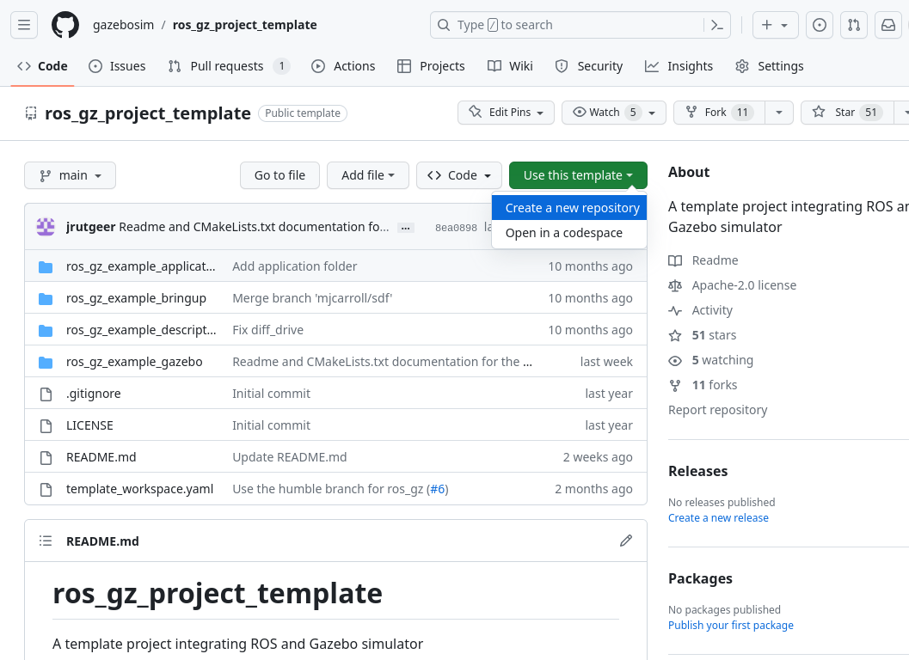

# Guide to `ros_gz_project_template` for ROS 2 and Gazebo Development

In this guide, you will learn how to use the `ros_gz_project_template` to create a (recommended) structured workspace or improve your existing workspace for your ROS 2 and Gazebo projects. This template offers a consistent layout, automated build process, and integration with both ROS 2 and Gazebo, enabling you to focus on developing your robotics applications.

## Installation Steps

1. If you are starting a project, create a new workspace or go to your existing project's source directory:

   ```bash
    mkdir -p ~/project_ws/src
    cd ~/project_ws/src
    ```

2. Directly use the [`ros_gz_project_template` template](https://github.com/gazebosim/ros_gz_project_template) and create your project repository on GitHub.

   

   Or start by cloning the template repository:

   ```bash
    wget https://raw.githubusercontent.com/gazebosim/ros_gz_project_template/main/template_workspace.yaml
    vcs import < template_workspace.yaml
   ```

3. Rename the cloned repository folder to your desired project name:

   ```bash
   mv ros_gz_project_template your_project_name
   ```

## Package structure

At this point you'll have the following packages in your project:

* `ros_gz_example_description` - holds the SDF description of the simulated system and any other simulation assets. 
Simulation assets means your models or robot descriptions in URDF or SDF, meshes and materials files to help visualize different parts of the robot and finally compiling all these elements in a simulated world SDF. Existing assets can be used by installing the models directory and exporting the paths to your environment. 
Setting up paths can be also automated using colcon environment hooks with a [DSV file](https://colcon.readthedocs.io/en/released/developer/environment.html?highlight=dsv#dsv-files) prepending the model share path to Gazebo resource path.

* `ros_gz_example_gazebo` - holds Gazebo specific code and configurations. Namely this is where user-defined worlds and custom system plugins end up.

* `ros_gz_example_application` - holds ROS 2 specific code and configurations. Namely where control, planning or any high level algoritms reside.

* `ros_gz_example_bringup` - holds launch files and high level utilities, communication bridge between ROS and Gazebo. Any robot or hardware specific configurations go here.

## Development

1. Choose a ROS and Gazebo combination  https://gazebosim.org/docs/harmonic/ros_installation
   Note: If you're using a specific and unsupported Gazebo version with ROS 2, you might need to set the `GZ_VERSION` environment variable, for example:

    ```bash
    export GZ_VERSION=harmonic
    ```

2. Install dependencies

    ```bash
    cd ~/project_ws
    source /opt/ros/<ROS_DISTRO>/setup.bash
    sudo rosdep init
    rosdep update
    rosdep install --from-paths src --ignore-src -r -i -y --rosdistro <ROS_DISTRO>
    ```

3. Modify

   Explore the `src/your_project_name` directory to add/modify the packages associated with your project.
   There are two primary mechanisms to integrate ROS 2 and Gazebo depending on your application:
    1. Use [ros_gz_bridge](https://github.com/gazebosim/ros_gz) to dynamically connect topics between ROS 2 and Gazebo (which is demonstrated as an example in this template)
    2. Embed ROS 2 directly in a Gazebo system plugin

    The main consideration is in choosing the depth of integration is required between ROS and Gazebo. Using the bridge keeps dependencies separate and Gazebo systems don't have to know about ROS. By embedding ROS 2 nodes directly allows accessing the [EntityComponentManager]
    (https://gazebosim.org/api/sim/8/classgz_1_1sim_1_1EntityComponentManager.html) within a Gazebo plugin.

4. Build

    ```bash
    cd ~/project_ws
    colcon build --cmake-args -DBUILD_TESTING=ON
    ```

## Usage

1. Source the workspace

    `. ~/project_ws/install/setup.sh`

2. Launch the simulation and visualize in RViz:
    
    To visualize your robot model and the data generated by your ROS 2 nodes, open a new terminal and launch:

   ```bash
   ros2 launch ros_gz_example_bringup diff_drive.launch.py
   ```

## ROSCon 2022
Check out a ROSCon 2022 talk titled [ROS 2 and Gazebo Integration Best Practices](https://vimeo.com/showcase/9954564/video/767127300), to learn more about best practices of integrating simulation with ROS 2, drawn from accumulated experience and successful deployments. The talk will additionally cover tips and techniques to ease migration to the latest versions.
