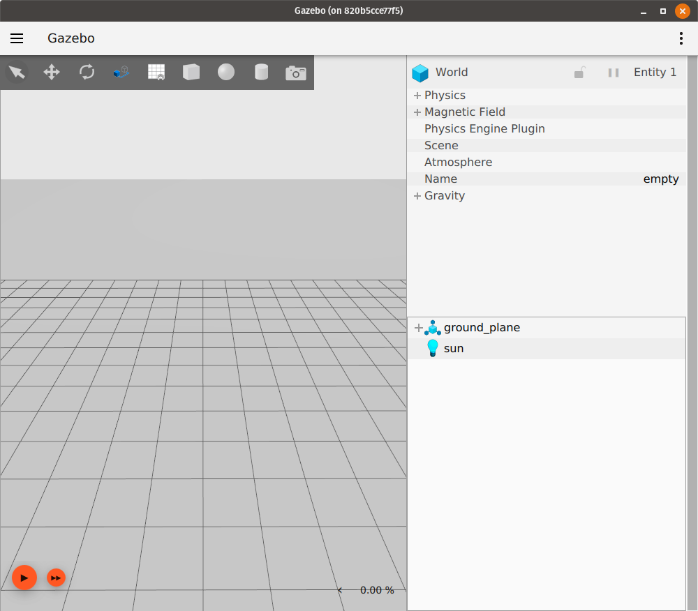
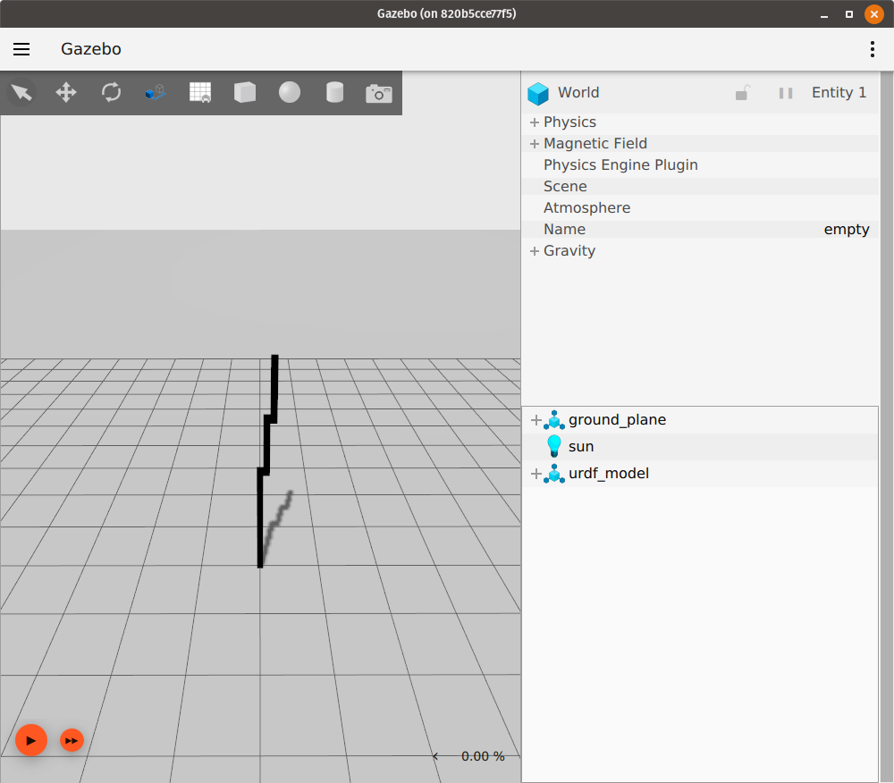

# Spawn URDF

This tutorial will cover how to spawn a URDF model in Gazebo Sim.
URDF files are often used in ROS to represent robot models.
While SDF can describe a world with multiple robot models, URDF can only describe one robot model.
More information about URDF can be found at [https://wiki.ros.org/urdf](https://wiki.ros.org/urdf).

## Obtaining a URDF file

This tutorial assumes that the reader already has a URDF file that they'd like to load into Gazebo Sim.
If you are looking for a URDF file to use, you can use the [`rrbot.urdf`](https://github.com/gazebosim/docs/blob/master/harmonic/tutorials/spawn_urdf/rrbot.urdf) that was preprocessed for you. The `rrbot` robot model is from the [`gazebo_ros_demos`](https://github.com/ros-simulation/gazebo_ros_demos) package. You could also use one of the examples listed at [https://wiki.ros.org/urdf/Examples](https://wiki.ros.org/urdf/Examples).

If you have a `xacro` representation of a robot model, you can turn the `xacro` file into a `URDF` file using the [`xacro`](https://index.ros.org/p/xacro/) package: see [this tutorial](https://docs.ros.org/en/humble/Tutorials/Intermediate/URDF/Using-Xacro-to-Clean-Up-a-URDF-File.html) for more information.

## Spawning the URDF

To spawn a URDF model in Gazebo Sim, we will start a world and make use of the world's `create` service, which uses the [EntityFactory](https://gazebosim.org/api/msgs/9/entity__factory_8pb_8h.html) message type.

Start by launching an empty world in Gazebo Sim:
```bash
gz sim empty.sdf
```

You should see a window that looks like this:



In another terminal, get the list of available services by running `gz service -l`.
Look for a `create` service.
You should see this service in the list:
```
/world/empty/create
```

We can double-check that this is the service we want to use by running `gz service -is /world/empty/create`.
This will show us the service's request and response message types:
```
gz.msgs.EntityFactory, gz.msgs.Boolean
```

Now that we have found the service that has an `EntityFactory` request type, we can call this service and pass the URDF file to the service's request so that the robot represented by this URDF file is spawned in the Gazebo Sim world.
We do this by setting the desired URDF file to the `sdf_file_name` field of the `EntityFactory` request message.
The [libsdformat](https://gazebosim.org/libs/sdformat) library will then internally convert the URDF file to an SDF representation, and load this into the running world.

The following command spawns the URDF file `model.urdf` into the Gazebo Sim world as a model named `urdf_model`:
```bash
gz service -s /world/empty/create --reqtype gz.msgs.EntityFactory --reptype gz.msgs.Boolean --timeout 1000 --req 'sdf_filename: "/path/to/model.urdf", name: "urdf_model"'
```

If `model.urdf` is the URDF representation of [rrbot.xacro](https://github.com/ros-simulation/gazebo_ros_demos/blob/kinetic-devel/rrbot_description/urdf/rrbot.xacro) in the `gazebo_ros_demos` package, executing the service call above should result in a simulation that now looks like this:



We can now play the simulation to make sure that the loaded URDF model behaves as expected:


