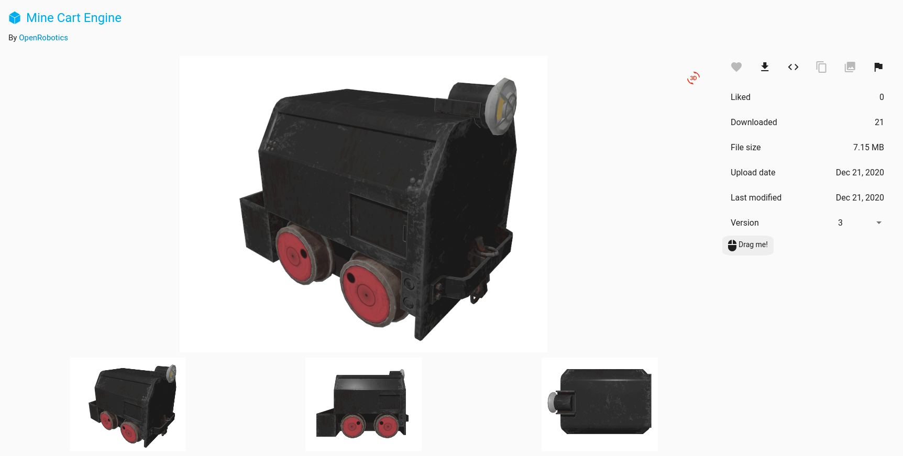
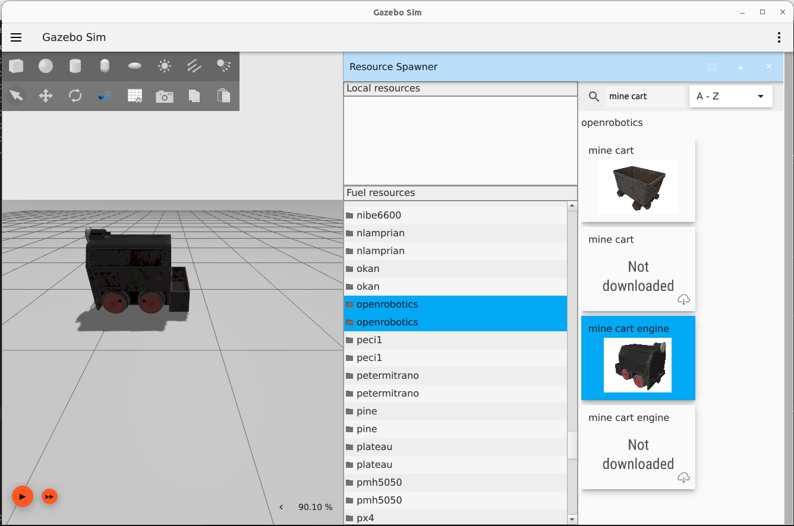

# Model Insertion from Fuel

Gazebo Fuel hosts hundreds of models that can easily be added to a world running in the Gazebo GUI.


## Prerequisites

Start by getting Gazebo up and running with an empty world:

```bash
gz sim empty.sdf
```

The previous tutorial, [Manipulating Models](Manipulating_models.md), shows you how to interact with models, which might be helpful once you add some Fuel models to your world.

## Choose a Model

Fuel's model collection is at [app.gazebosim.org/fuel/models](https://app.gazebosim.org/fuel/models).
Head over and browse the available content.


Click on any one of the thumbnails, or use the search bar.
For example, let's find the [Mine Cart Engine](https://app.gazebosim.org/OpenRobotics/fuel/models/Mine%20Cart%20Engine).



Note that some of the model files are quite large and may take some time to download into your world.
Check that the file size on the right is reasonable for your application before moving on.

## Spawn a Model

There are a few different ways to spawn a model into the simulation. 

1. **Spawn from 'Fuel Resource' using the Resource Spawner plugin.**

    Select the Resource Spawner plugin from the plugin menu (top right corner).
    The plugin will appear in the right panel, you might need to scroll down to be able to see the plugin. 
    Wait until the resource are loaded under the 'Fuel Resource' panel. 
    Select a resource owner (e.g. openrobotics), you can now search for the model name in the right panel. 
    Click on the cloud icon to download the model. 
    When the model has been downloaded, you can click on the model and insert it into your simulation scene. 

    


2. **Download model files from Fuel and spawn from local sources using the Resource Spawner plugin.**

    - Download the model files from [app.gazebosim.org/fuel/models](https://app.gazebosim.org/fuel/models).
    - Extract the files and places them under your local model directory (e.g. `~/my-local-models/model-name`). 
    The folder should contain `materials`, `meshes` as well as the `model.config` and the `model.sdf` files. 
    - Add your model directory as a resource with `export GZ_SIM_RESOURCE_PATH=~/my-local/models/`
    - Open the Gazebo Simulator and add the Resource Spawner Plugin, the model should now show up under your local resources. 

    

3. **Copying the SDF snippet and adding it to your custom world SDF file.**

    With the `<>` button you can directly copy a SDF snippet to paste into your world SDF file. 
    The SDF snippet will look something like this: 

    ```
    <include>
      <uri>
        https://fuel.gazebosim.org/1.0/OpenRobotics/models/Mine Cart Engine
      </uri>
    </include>
    ```

    You can then add that snippet to a world SDF file as shown in the animation below. 
    More information on how to build your own world SDF files can be found in the tutorial on [SDF Worlds](sdf_worlds).
    
    

4. **Downloading the code to permanently add a Fuel model to your custum SDF file.**

    If you prefer to add a Fuel model permanently to an `sdf` file, you can just as easily download the code by clicking the download-arrow icon to the right of the model's image.
    Kook at the tutorial on [SDF Worlds](sdf_worlds) for more information on how to construct a custom world SDF file.

Now you can add more models, or even load in any one of the plugins you learned about to interact with the model the same way you could with the shapes in the previous tutorial.

## Next Up

Now that you know how to add models hosted on Gazebo Fuel, it is time to learn how to [Build Your Own Robot](building_robot).
