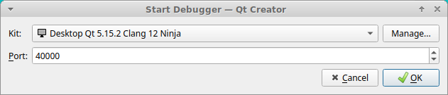

# Source Installation on Ubuntu

These instructions apply to Ubuntu Jammy (22.04) and Ubuntu Noble (24.04).

## Install tools

The use of some additional tools is recommended to help with the source compilation,
although other ways of correctly getting and building the sources are also possible.

The easiest way to get the sources of all libraries is to use
[vcstool](https://github.com/dirk-thomas/vcstool).

To compile all the different libraries and gz-sim in the right order
[colcon](https://colcon.readthedocs.io/en/released/) is recommended.
The colcon tool is available on all platforms using pip (or pip3, if pip fails).

Some tools require Python 3.5 (or higher) which is not the default option on some
platforms (like Ubuntu Focal). The Python
[virtualenv](https://virtualenv.pypa.io/en/latest/) could be a useful solution in
cases where the default option cannot be easily changed.

## Generic tools

Install tools needed by this tutorial:

```bash
sudo apt install python3-pip python3-venv lsb-release gnupg curl
```

## vcstool and colcon from pip

PIP is available on all platforms. Using a PIP workspace to install the tools:

```bash
python3 -m venv $HOME/vcs_colcon_installation
. $HOME/vcs_colcon_installation/bin/activate
pip3 install vcstool colcon-common-extensions
```

`vcs` and `colcon` are now available from the PIP workspace in the current
terminal. For using them in other terminals run the `activate` script as
done above.

## vcstool and colcon from apt

An alternative method is to use the `.deb` packages available on Debian or Ubuntu:

```bash
sudo sh -c 'echo "deb http://packages.ros.org/ros2/ubuntu $(lsb_release -sc) main" > /etc/apt/sources.list.d/ros2-latest.list'
curl -s https://raw.githubusercontent.com/ros/rosdistro/master/ros.asc | sudo apt-key add -
sudo apt-get update
sudo apt-get install python3-vcstool python3-colcon-common-extensions
```

## Git

Gazebo libraries use `git` for version control, so it must be available
in the system for `vcstool` to work properly.

```bash
sudo apt-get install git
```

## Getting the sources

The instructions below use some UNIX commands to manage directories but the
equivalent alternatives on Windows should provide the same result.

The first step is to create a developer workspace in which `vcstool` and
`colcon` can work:

```bash
mkdir -p ~/workspace/src
cd ~/workspace/src
```

All the sources of gazebo-ionic are declared in a yaml file. Download
it to the workspace:

```bash
curl -O https://raw.githubusercontent.com/gazebo-tooling/gazebodistro/master/collection-ionic.yaml
```

Use `vcstool` to automatically retrieve all the Gazebo libraries sources from
their repositories:

```bash
vcs import < collection-ionic.yaml
```

The src subdirectory should contain all the sources ready to be built.

## Install dependencies

Before compiling it is necessary to install all the dependencies of the different
packages that compose the Ionic collection. Every platform has a different
method to install software dependencies.

Add `packages.osrfoundation.org` to the apt sources list:

```bash
sudo curl https://packages.osrfoundation.org/gazebo.gpg --output /usr/share/keyrings/pkgs-osrf-archive-keyring.gpg
echo "deb [arch=$(dpkg --print-architecture) signed-by=/usr/share/keyrings/pkgs-osrf-archive-keyring.gpg] http://packages.osrfoundation.org/gazebo/ubuntu-stable $(lsb_release -cs) main" | sudo tee /etc/apt/sources.list.d/gazebo-stable.list > /dev/null
sudo apt-get update
```

The command below must be run from a workspace with the Gazebo source code and will install all dependencies in Ubuntu:

```bash
cd ~/workspace/src
sudo apt -y install \
  $(sort -u $(find . -iname 'packages-'`lsb_release -cs`'.apt' -o -iname 'packages.apt' | grep -v '/\.git/') | sed '/gz\|sdf/d' | tr '\n' ' ')
```

Alternatively, if you want to install dependencies using
[rosdep](https://docs.ros.org/en/humble/Tutorials/Intermediate/Rosdep.html),
ensure that [rosdep is installed](https://docs.ros.org/en/humble/Tutorials/Intermediate/Rosdep.html#how-do-i-use-the-rosdep-tool)
and use the following command:

```bash
cd ~/workspace/src
rosdep install -i --from-path . -y \
    --skip-keys "gz-cmake3 DART libogre-dev libogre-next-2.3-dev"
```

The `rosdep` command attempts to install dependencies listed in `package.xml`
files, but when problems arise the `--skip-keys` argument is used. Explanations
for its use in the previous line are given below:

* `gz-cmake3`: `gz-tools2` can build from source against
  [both `gz-cmake3` and `gz-cmake4`](https://github.com/gazebosim/gz-tools/pull/128),
  and this workspace only contains `gz-cmake4`. The `gz-tools2` `package.xml`
  file only [depends on gz-cmake3](https://github.com/gazebosim/gz-tools/blob/2b228e5b956/package.xml#L13)
  and since that package is not present, use `--skip-keys gz-cmake3`.
* `DART`: `gz-physics8` can build against [dartsim](http://dartsim.github.io),
  which is listed as DART in the [gz-physics package.xml file](https://github.com/gazebosim/gz-physics/blob/gz-physics8_8.0.0/package.xml#L16).
  This package is not in the workspace, so `DART` is added to the `--skip-keys`
  string.
  See the discussion in [gz-physics#608](https://github.com/gazebosim/gz-physics/pull/608#discussion_r1589512231)
  for more background on the package name used for `DART`.
* `libogre-dev` and `libogre-next-2.3-dev`: `gz-rendering9` can build against
  ogre 1.9 and ogre-next 2.3. The debian package names are listed as
  dependencies in the [gz-rendering package.xml](https://github.com/gazebosim/gz-rendering/blob/gz-rendering9_9.0.0/package.xml#L22-L23)
  but they are not available on all Linux versions, so work around with
  `--skip-keys "libogre-dev libogre-next-2.3-dev"`.

## Building the Gazebo Libraries

Once the compiler and all the sources are in place it is time to compile them.
Start the procedure by changing into the workspace and listing the packages
recognized by `colcon`:

```bash
cd ~/workspace/
colcon graph
```

`colcon graph` should list the Gazebo libraries with an
[interdependency diagram](https://colcon.readthedocs.io/en/released/reference/verb/graph.html#example-output).
If that is the case, then you are ready
to build the whole set of libraries:

:::{warning}

Compilation can take up to 16Gb of RAM memory. Use MAKEFLAGS with
colcon as detailed in its instructions to reduce the number of
compilation threads if needed.

:::


```bash
colcon build --merge-install
```

To speed up the build process, you could also disable tests by using

```bash
colcon build --cmake-args ' -DBUILD_TESTING=OFF' --merge-install
```

To use debuggers activate debug symbols. Gazebo will run slower, but you'll be able to use GDB:

```bash
colcon build --cmake-args ' -DBUILD_TESTING=OFF' ' -DCMAKE_BUILD_TYPE=Debug' --merge-install
```

To build a specific package with all its dependent packages:

```bash
colcon build --merge-install --packages-up-to PACKAGE_NAME
```

To build a single package:

```bash
colcon build --packages-select PACKAGE_NAME
```

Visit [colcon documentation](https://colcon.readthedocs.io/en/released/#) to view more `colcon` build and test options.

If there are no errors, all the binaries should be ready to use. You can check the [Troubleshooting](troubleshooting.md#ubuntu) section for errors.

## Using the workspace

The workspace needs to be sourced every time a new terminal is used.

Run the following command to source the workspace in bash:

```bash
. ~/workspace/install/setup.bash
```

Or in zsh:

```zsh
. ~/workspace/install/setup.zsh
```

This is the end of the source install instructions; head back to the [Getting started](getstarted)
page to start using Gazebo!

## Uninstalling source-based install

A source-based install can be "uninstalled" using several methods, depending on
the results you want:

  1. If you installed your workspace with `colcon` as instructed above, "uninstalling"
     could be just a matter of opening a new terminal and not sourcing the
     workspace's `setup.sh`. This way, your environment will behave as though
     Gazebo is not installed on your system.

  2. If, in addition to not wanting to use the libraries, you're also trying to
     free up space, you can delete the entire workspace directory with:

     ```bash
     rm -rf ~/workspace
     ```

  3. If you want to keep the source code, you can remove the
     `install` / `build` / `log` directories as desired, leaving the `src` directory.

## Troubleshooting

See [Troubleshooting](troubleshooting.md#ubuntu)

## QML Debugging

To perform QML debugging you'll need:

 - Add `--cmake-args -DDQT_QML_DEBUG` flag to colcon
 - QtCreator

You will need to build Gazebo with:

```bash
colcon build --cmake-args ' -DQT_QML_DEBUG' --merge-install
```

> **Note:** Advanced users may note that only the `gz-sim` project needs this flag.

After that's done, launching `gz sim -g` will result in the following message:

```
QML debugging is enabled. Only use this in a safe environment.
QML Debugger: Waiting for connection on port 40000...
```

After that you can just head to
`QtCreator -> Debug -> Start Debugging -> Attach to QML Port...`
and enter the QML port


Once you click there, set the port number to 40000 and hit ok



We're working to improve QtCreator integration so that it works out of the box.

The ruby `gz` script doesn't yet pass the necessary command line arguments to the application.

Note that because all instances will try to use port 40000, only one instance
can use it. If you shutdown the process and restart it immediately too quickly,
the OS may still claim the port is in use and hence the 2nd (re)launch will not
listen to QML debugger attach requests.

### Avoid QML stall waiting for debugger on startup

During development, you may find troublesome that `gz sim -g` won't actually start until
QtCreator hooks to the QML Debugging port.

If that's a problem, you can edit the C++ file `gz-sim/src/gz.cc` and remove `block`
from it. E.g.

```c++
// The following:
const_cast<char *>(
      "-qmljsdebugger=port:40000,block,services:DebugMessages,QmlDebugger,"
      "V8Debugger,QmlInspector,DebugTranslation")

// Must become the following
const_cast<char *>(
      "-qmljsdebugger=port:40000,services:DebugMessages,QmlDebugger,"
      "V8Debugger,QmlInspector,DebugTranslation")
```
