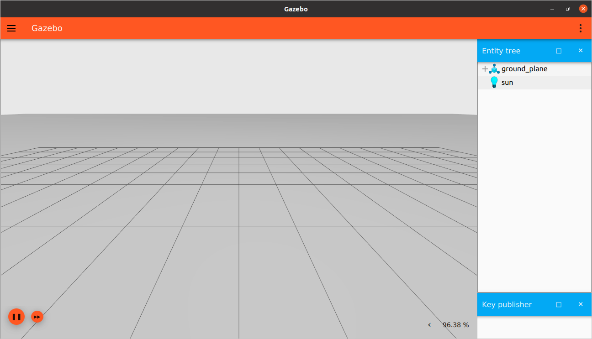

# ROS 2 Integration

In this tutorial we will learn how to Integrate ROS 2 with Gazebo. We will establish
communication between them. This can help in many aspects; we can receive data (like joint states, TFs) or commands
from ROS and apply it to Gazebo and vice versa. This can also help to enable RViz to visualize a robot model
simulatenously simulated by a Gazebo world.

## ros_gz_bridge

[`ros_gz_bridge`](https://github.com/gazebosim/ros_gz) provides a network bridge which enables the exchange of messages between ROS 2 and [Gazebo Transport](https://github.com/gazebosim/gz-transport). Its support is limited to only certain message types. Please, check this [README](https://github.com/gazebosim/ros_gz/blob/ros2/ros_gz_bridge/README.md) to verify if your message type is supported by the bridge.

Example uses of the bridge can be found in [`ros_gz_sim_demos`](https://github.com/gazebosim/ros_gz/tree/ros2/ros_gz_sim_demos), including demo launch files with bridging of all major actuation and sensor types.

## Requirements

Please follow the [Install Gazebo and ROS document](/docs/latest/ros_installation)
before starting this tutorial. A working installation of ROS 2 and Gazebo is
required to go further.

## Bidirectional communication

We can initialize a bidirectional bridge so we can have ROS as the publisher and Gazebo as the subscriber or vice versa. The syntax is `/TOPIC@ROS_MSG@GZ_MSG`, such that `TOPIC` is the Gazebo internal topic, `ROS_MSG` is the ROS message type for this topic, and `GZ_MSG` is the Gazebo message type.

For example:

```
ros2 run ros_gz_bridge parameter_bridge /scan@sensor_msgs/msg/LaserScan@gz.msgs.LaserScan
```

The `ros2 run ros_gz_bridge parameter_bridge` command simply runs the `parameter_bridge` code from the `ros_gz_bridge` package. Then, we specify our topic `/TOPIC` over which the messages will be sent. The first `@` symbol delimits the topic name from the message types. Following the first `@` symbol is the ROS message type.

The ROS message type is followed by an `@`, `[`, or `]` symbol where:

* `@`  is a bidirectional bridge.
* `[`  is a bridge from Gazebo to ROS.
* `]`  is a bridge from ROS to Gazebo.

Have a look at these [examples]( https://github.com/gazebosim/ros_gz/blob/ros2/ros_gz_bridge/README.md#example-1a-gazebo-transport-talker-and-ros-2-listener)
explaining how to make communication connections from ROS to Gazebo and vice versa.

It is also possible to use ROS Launch with the `ros_gz_bridge` and represent the topics in yaml format to be given to the bridge at launch time.

```
- ros_topic_name: "scan"
  gz_topic_name: "/scan"
  ros_type_name: "sensor_msgs/msg/LaserScan"
  gz_type_name: "gz.msgs.LaserScan"
  direction: GZ_TO_ROS  # BIDIRECTIONAL or ROS_TO_GZ
```

## Publish key strokes to ROS

Let's send messages to ROS using the `Key Publisher` an Gazebo plugin.

**Note:** Make sure to have all workspaces you need (ROS, Gazebo and, `ros_gz`...) sourced.


First we will start a bridge between ROS and Gazebo specifying the topic
at which the `Key Publisher` plugin sends messages and also the type
of the messages as follows:

```
ros2 run ros_gz_bridge parameter_bridge /keyboard/keypress@std_msgs/msg/Int32@gz.msgs.Int32
```

We started a bridge on `/keyboard/keypress` topic with message of type `Int32`.
For ROS it is `std_msgs/msg/Int32` and for Gazebo it is `gz.msgs.Int32`

In another terminal launch an Gazebo Sim world, for example the `empty.sdf` world:

```
gz sim empty.sdf
```

Then add the `Key Publisher` plugin from the dropdown menu on the top right corner.



In another terminal start the ROS listener:

```
ros2 topic echo /keyboard/keypress
```

This command listens to the messages sent over the `/keyboard/keypress` topic.

On the Gazebo window, press on the keyboard keys and you should
find data on the listener terminal.

Now it's your turn! Try to send data from ROS to Gazebo. You can also try different data types and different directions of communication.

## Video walk-through

A video walk-through of this tutorial is available from our YouTube channel: [Gazebo tutorials: ROS 2 Foxy integration](https://youtu.be/IpZTNyTp9t8).

<iframe width="560" height="315" src="https://www.youtube.com/embed/IpZTNyTp9t8" frameborder="0" allow="accelerometer; autoplay; encrypted-media; gyroscope; picture-in-picture" allowfullscreen></iframe>

## Visualize in RViz

Take a step further and try out demos from [`ros_gz_sim_demos`](https://github.com/gazebosim/ros_gz/tree/ros2/ros_gz_sim_demos).

For the `sdf_parser` demo, install [`ros_gz`](https://github.com/gazebosim/ros_gz/tree/ros2) and the parser plugin `sdformat_urdf` from source in a colcon workspace.
Read more about `sdformat_urdf` [here](https://github.com/ros/sdformat_urdf/blob/ros2/sdformat_urdf/README.md).

Run the demo launch file with the rviz launch argument set:

```bash
ros2 launch ros_gz_sim_demos sdf_parser.launch.py rviz:=True
```

Start the simulation in Gazebo and wait a few seconds for TFs to be published.

In another terminal, send either ROS or Gazebo commands for the vehicle to move in circles:

```bash
gz topic -t "/model/vehicle/cmd_vel" -m gz.msgs.Twist -p "linear: {x: 1.0}, angular: {z: -0.1}"
ros2 topic pub /model/vehicle/cmd_vel geometry_msgs/msg/Twist "{linear: {x: 5.0, y: 0.0, z: 0.0}, angular: {x: 0.0, y: 0.0, z: -0.1}}
```

And verify the vehicle matching its trajectory in Gazebo and RViz.


For more details on implementation of this demo see [ROS 2 Interoperability](ros2_interop).
