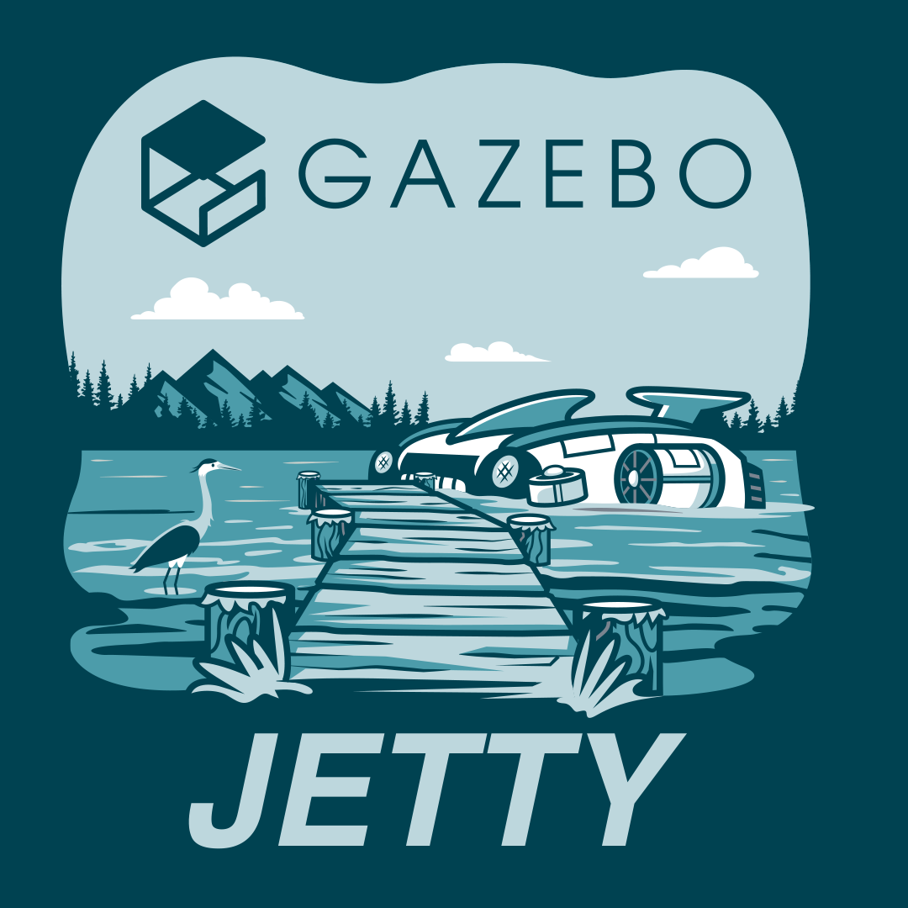
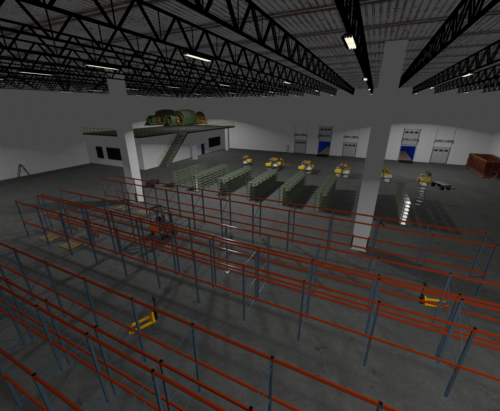
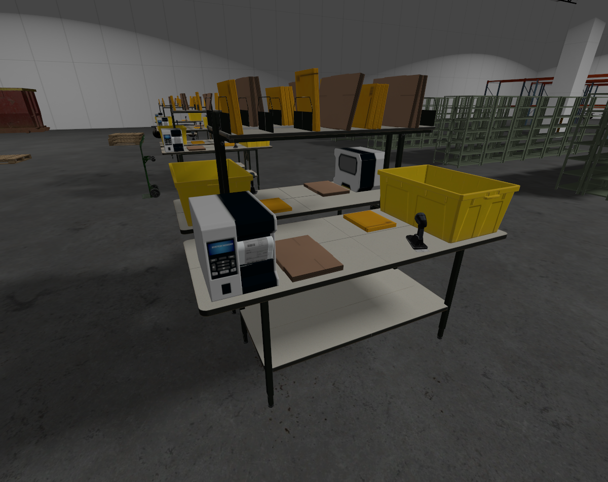
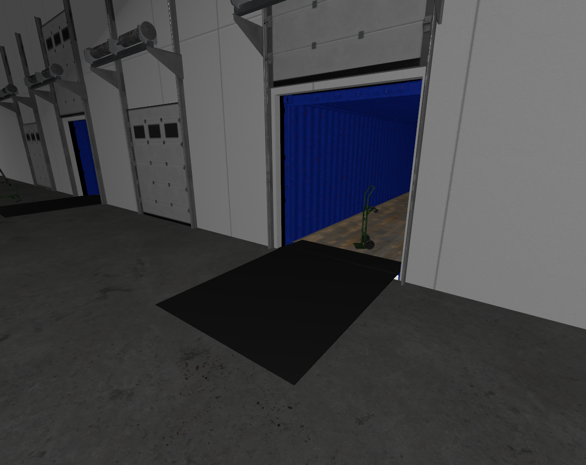
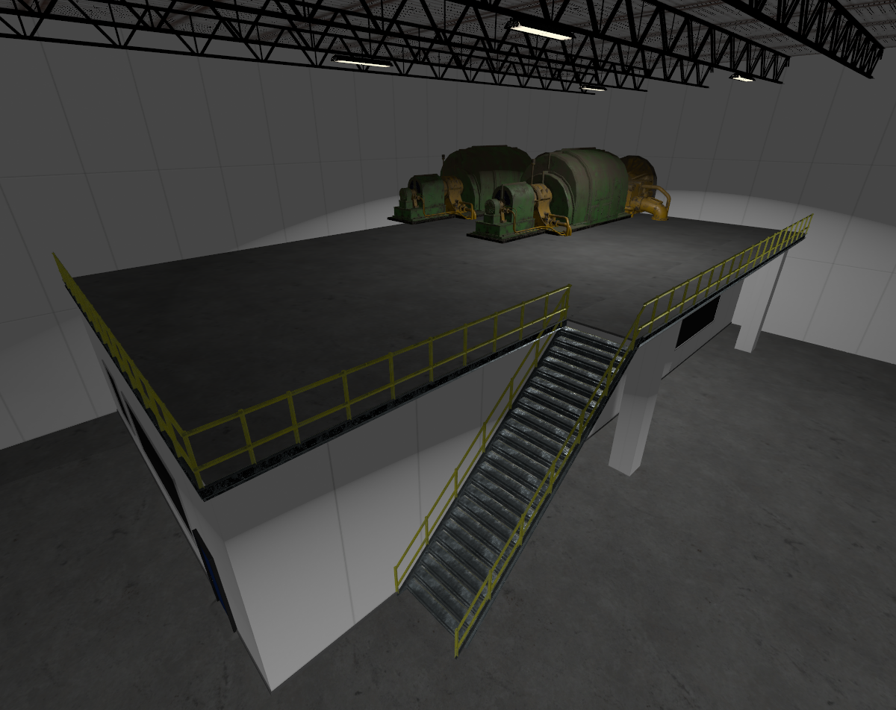

{#release-notes}

# Release Notes

{w=500px h=500px}

The Gazebo team is happy to announce the 10th major release of Gazebo, code
named Jetty\! Jetty is a long term support (LTS) release, meaning it has a
longer support lifetime, September 2030 to be exact.

## Highlights

Here’s a brief summary of all the new features in Gazebo Jetty:

### A new [Jetty Demo World](https://github.com/gazebosim/jetty_demo)

We created a realistic warehouse environment designed to highlight the latest
Jetty features. This free, downloadable demo includes shelving and an autonomous
forklift for loading and unloading. As an added bonus, it also features an
[Open-RMF](https://www.open-rmf.org/) demonstration.

::::{grid} 1 2 2 2
:::{grid-item}

:::
:::{grid-item}

:::

:::{grid-item}

:::
:::{grid-item}

:::
::::

### [Zenoh transport support, working towards improved ROS integration](https://github.com/gazebosim/gz-transport/issues/559)

Up until Ionic, Gazebo used ZeroMQ (0MQ) as its primary message transport
protocol. Gazebo now supports [Zenoh](https://zenoh.io/) as an alternative
transport implementation, offering improved discovery, interoperability, and
performance. To enable Zenoh, set the environment variable
`` `export GZ_TRANSPORT_IMPLEMENTATION=zenoh` ``. This allows Gazebo to leverage
Zenoh's features and potentially integrate more seamlessly with ROS 2 Jazzy and
other systems utilizing Zenoh.

### [New reinforcement learning demo code and tutorials](https://github.com/gazebosim/gz-sim/pull/2667)

Based on community feedback we’ve added a full tutorial on performing
reinforcement learning using Gazebo Jetty and the
[Stable Baselines3 Python library](https://stable-baselines3.readthedocs.io/en/master/).
These tutorials walk you through using reinforcement learning to build a
controller for an inverted pole mounted on a robot cart. StableBaselines3 is
just the beginning, and more advanced developers can use the tutorial as a
starting point for integrating other reinforcement learning frameworks into
Gazebo.

```{figure} img/rel_notes/rl.gif
:scale: 30 %
Demo of a classic cartpole trained to balance itself
```

### [ROS Standard Sim Interface](https://github.com/gazebosim/ros_gz/pull/790)

Members of the ROS community have
[built a standard simulation interface](https://github.com/ros-simulation/simulation_interfaces)
to improve the portability of robot code between simulators. This new standard
interface should allow ROS developers to quickly and easily switch between
simulators based on their development needs.

```{figure} img/rel_notes/sim_ifaces.gif
Simple demo showing conveyor belt based test setup using Simulation Interfaces
```

### [New occupancy grid export functionality](https://github.com/gazebosim/gz-sim/pull/2958)

Occupancy grids are simple 2D maps that robots use for path planning. Open
source navigation frameworks
[like Nav2](https://docs.nav2.org/tutorials/docs/navigation2_with_slam.html) use
these maps to guide robots safely to their destination. You can now easily
export these occupancy grid maps from Gazebo using the `/scan_image` topic and
running the following command:  
`gz topic -t /start_exploration -m gz.msgs.Boolean -p 'data: true'`

```{figure} img/rel_notes/occupancy.gif
New occupancy grid export functionality
```

### [New auto-inertia calculation makes adding objects easier](https://github.com/gazebosim/sdformat/pull/1513)

Previously, the `inertial/@auto` attribute in SDFormat required you to specify
an object’s density to automatically compute its inertial properties. Now you
can specify an object’s mass in SDFormat and Gazebo will automatically compute
its density and inertial parameters\!

```{figure} img/rel_notes/auto_inertia_mass.gif
:scale: 75 %
From left to right: drills using default, auto, manually computed inertias
```

### [A new and improved Qt6 interface\!](https://github.com/gazebosim/gz-gui/issues/586)

Qt is the cross-platform GUI subsystem used by Gazebo and we recently upgraded
to the latest version, Qt6. Qt version 5 went end of life on May 26th, 2025
forcing us to upgrade to version 6\. This upgrade was no small feat, as it
required updating hundreds of files across the Gazebo project. \_Gazebo plugin
developers will need to update their Gazebo GUI plugins to QT6 to maintain
compatibility.
[We’ve created a Gazebo plugin QT migration guide to help developers update their plugins.](https://gazebosim.org/api/gui/10/migration_qt6.html)

```{figure} img/rel_notes/qt6.jpg
:scale: 50 %
Things might look slightly different in Qt6
```

### [Dynamically adjust wheel slip / friction](https://github.com/gazebosim/gz-sim/pull/3003)

We’ve added a new LookupWheelSlip system to gz-sim that uses an 8bit RGB lookup
map to dynamically change a materials friction parameters. This new feature
allows users to map specific colors in a texture image to specific friction
values. Want to add an oil slick to the floor of your simulation? Simply draw
the oil patch on the texture image and set the desired friction value\!
```{figure} img/rel_notes/wheelslip.gif
:scale: 75 %
Dynamically adjust wheel slip / friction
```

### [New Gazebo standalone executables](https://github.com/gazebosim/docs/pull/611/files#:~:text=https%3A//github.com/gazebosim/gz%2Dsim/pull/2849)

We’ve modified how the \`gz\` tool works to make debugging your application
easier and to improve cross-platform support for Windows and MacOS. To do this
we’ve moved away from the Ruby-based CLI loading libraries back to loading
standalone applications.

### [Better downloading of simulation models and faster start times](https://github.com/gazebosim/gz-sim/pull/2992)

We’ve changed how Gazebo downloads models from
[Fuel, our online model repository](https://app.gazebosim.org/fuel/models).
Models now download in parallel and in the background, making Gazebo simulations
start faster and download assets more efficiently.

### [Refactored package names to remove major versions](https://discourse.openrobotics.org/t/version-numbers-removed-from-package-names-in-gazebo-jetty/48391)

Including major versions in package names was done to allow side-by-side
installation of two different Gazebo versions. While helpful for some users,
this approach caused major headaches for developers who had to regularly update
these version numbers. We’ve ended the practice to make Gazebo simpler to
maintain and easier to use for package developers.

### Bazel Module Migration

We have migrated `gz` packages from the legacy Bazel workspace-based setup to
the new Bazel module system (Bzlmod). As part of this effort, key third-party
dependencies including DARTSim, Bullet, FreeImage, Assimp and more were packaged
and published to the Bazel Central Registry (BCR). All Jetty and Ionic versions
of the libraries have been uploaded to BCR.

```{figure} img/rel_notes/bazel.gif
:scale: 30 %
Demo showing Bazel based client program using gz-transport
```

## Contributors and Supporters

We’d like to give a special thanks to the community members who helped us make
this Gazebo release happen by reviewing tutorials during our Jetty Test and
Tutorial Party. The results from our
[Jetty Test and Tutorial Party](https://discourse.openrobotics.org/t/gazebo-jetty-test-and-tutorial-party-instructions/49779)
were quite impressive and we were so happy to see so many new contributors\! Our
tutorial party went incredibly well\! We had 25 participants help us with
testing the Jetty release which allowed us to:

- Close 388 Issues, **68% of our total issues**
  - Close **148** out of 148 Ubuntu tickets (**100%**)
  - Close **65** out of 83 MacOS tickets **(44%**)
  - Close **47** out of 147 Windows tickets (**32%**)
  - Close 128 out of 128 all platform tickets (**100%**)
- Create 74 PRs fixing the issues that were found\!

Our top twenty contributors to the T\&T Party are:


| **Place** | **User** | **Points** |
| :-------: | :------- | :------: |
| 1 | &emsp;**akky20** | 719.2 |
| 2 | &emsp;**Creator-1705** | 410.6 |
| 3 | &emsp;**nikodemj9** | 310.0 |
| 4 | &emsp;**saiaravind19** | 273.6 |
| 5 | &emsp;**jmackay2** | 269.0 |
| 6 | &emsp;**Physic69** | 234.0 |
| 7 | &emsp;**srmainwaring** | 187.2 |
| 8 | &emsp;**jasmeet0915** | 165.6 |
| 9 | &emsp;**avanmalleghem** | 114.0 |
| 10 | &emsp;**Narashima1808** | 111.0 |
| 11 | &emsp;**AronLapp** | 100.0 |
| 12 | &emsp;**matosinho** | 84.4 |
| 13 | &emsp;**mukul2020** | 79.2 |
| 14 | &emsp;**SuperGops7** | 76.0 |
| 15 | &emsp;**pratik-adhikari** | 75.0 |
| 16 | &emsp;**mohamedsayed18** | 66.0 |
| 17 | &emsp;**shreya-ramesh** | 53.0 |
| 18 | &emsp;**CursedRock17** | 45.0 |
| 19 | &emsp;**s0um0r0y** | 40.0 |
| 20 | &emsp;**chen-harrison** | 40.0 |


**We would also like to thank everyone that contributed to Jetty:**

:::{dropdown} List of Contributors
:open:
- Aarav Gupta ([Amronos](https://github.com/Amronos))
- Aaron Chong ([aaronchongth](https://github.com/aaronchongth))
- Abhiroop ([akky20](https://github.com/akky20))
- Addisu Z. Taddese ([azeey](https://github.com/azeey))
- Afereti Pama ([retinfai](https://github.com/retinfai))
- Alejandro Hernández Cordero ([ahcorde](https://github.com/ahcorde))
- Alessandro Sofia ([alesof](https://github.com/alesof))
- Alex Faxå ([faximan](https://github.com/faximan))
- Alexis Tsogias ([Zyrin](https://github.com/Zyrin))
- Alon Nusem ([4lon](https://github.com/4lon))
- amaldev ([AmalDevHaridevan](https://github.com/AmalDevHaridevan))
- Ansh Chablani ([anshium](https://github.com/anshium))
- Antoine Van Malleghem ([avanmalleghem](https://github.com/avanmalleghem))
- Arjo Chakravarty ([arjo129](https://github.com/arjo129))
- Benjamin Perseghetti ([bperseghetti](https://github.com/bperseghetti))
- bill ([bill997](https://github.com/bill997))
- Carlos Agüero ([caguero](https://github.com/caguero))
- chcaya ([chcaya](https://github.com/chcaya))
- ChenYing Kuo (CY) ([evshary](https://github.com/evshary))
- Ching-Hsiang Wu ([TigerWuu](https://github.com/TigerWuu))
- Chris ([PimpMyPizza](https://github.com/PimpMyPizza))
- Clara Berendsen ([claraberendsen](https://github.com/claraberendsen))
- Cristóbal Arroyo ([Crola1702](https://github.com/Crola1702))
- Daisuke Nishimatsu ([wep21](https://github.com/wep21))
- David Dorf ([david-dorf](https://github.com/david-dorf))
- David Morilla Cabello ([dvdmc](https://github.com/dvdmc))
- Dheeraj Deevi ([dheerubhai-101](https://github.com/dheerubhai-101))
- Dyst-0 ([Dyst-0](https://github.com/Dyst-0))
- efferre79 ([efferre79](https://github.com/efferre79))
- Emmanuel M ([EmmanuelMess](https://github.com/EmmanuelMess))
- erling ([erlingrj](https://github.com/erlingrj))
- Ethan Holter ([ethanholter](https://github.com/ethanholter))
- Fabrice Larribe ([teyssieuman](https://github.com/teyssieuman))
- Federico Vichachi ([Federico-Vichachi](https://github.com/Federico-Vichachi))
- FmJarecki ([FmJarecki](https://github.com/FmJarecki))
- Gabriel Augusto ([gabrielaugz](https://github.com/gabrielaugz))
- Gabriel Pacheco ([gabrielfpacheco](https://github.com/gabrielfpacheco))
- Gaurav Kumar ([GauravKumar9920](https://github.com/GauravKumar9920))
- Gilbert Tanner ([TannerGilbert](https://github.com/TannerGilbert))
- Gopikrishnan K ([SuperGops7](https://github.com/SuperGops7))
- Griffin Tabor ([gftabor](https://github.com/gftabor))
- Guilhem Saurel ([nim65s](https://github.com/nim65s))
- Gwenn Le Bihan ([gwennlbh](https://github.com/gwennlbh))
- Harrison Chen ([chen-harrison](https://github.com/chen-harrison))
- Ian Chen ([iche033](https://github.com/iche033))
- Ignacio Vizzo ([nachovizzo](https://github.com/nachovizzo))
- Jasper van Brakel ([SuperJappie08](https://github.com/SuperJappie08))
- Jenn Nguyen ([jennuine](https://github.com/jennuine))
- Jeremy Nimmer ([jwnimmer-tri](https://github.com/jwnimmer-tri))
- jmackay2 ([jmackay2](https://github.com/jmackay2))
- Jorge J. Perez ([Blast545](https://github.com/Blast545))
- Jose Luis Rivero ([j-rivero](https://github.com/j-rivero))
- Josh Newans ([joshnewans](https://github.com/joshnewans))
- Joshua J. Damanik ([damanikjosh](https://github.com/damanikjosh))
- Júlia Marsal Perendreu
  ([roboticswithjulia](https://github.com/roboticswithjulia))
- Kai Pastor ([dg0yt](https://github.com/dg0yt))
- Khaled Gabr ([khaledgabr77](https://github.com/khaledgabr77))
- Kostubh Khandelwal ([exMachina316](https://github.com/exMachina316))
- Leander Stephen D'Souza ([leander-dsouza](https://github.com/leander-dsouza))
- Leo Lin ([LeoLin6](https://github.com/LeoLin6))
- Luca Della Vedova ([luca-della-vedova](https://github.com/luca-della-vedova))
- Maksim Derbasov ([ntfshard](https://github.com/ntfshard))
- Marcel Jacobse ([mjacobse](https://github.com/mjacobse))
- Martin Pecka ([peci1](https://github.com/peci1))
- Michael Carlstrom ([InvincibleRMC](https://github.com/InvincibleRMC))
- Michael Carroll ([mjcarroll](https://github.com/mjcarroll))
- Mohamed Hassan ([mohamedsayed18](https://github.com/mohamedsayed18))
- mosfet80 ([mosfet80](https://github.com/mosfet80))
- muttistefano ([muttistefano](https://github.com/muttistefano))
- Nate Koenig ([nkoenig](https://github.com/nkoenig))
- Nathan Rogers ([torn8to](https://github.com/torn8to))
- Nguyễn Tấn Anh Khoa ([kitare17](https://github.com/kitare17))
- Nikodem ([nikodemj9](https://github.com/nikodemj9))
- Nizam Gifary ([ngifary](https://github.com/ngifary))
- Noa Thouard ([Noa-Thouard-Nexxis](https://github.com/Noa-Thouard-Nexxis))
- Oscmoar07 ([XINJIANGMO](https://github.com/XINJIANGMO))
- Patrick Roncagliolo ([roncapat](https://github.com/roncapat))
- Pravin Dangol ([Pravin-Dangol](https://github.com/Pravin-Dangol))
- Qingyou Zhao ([qingyouzhao](https://github.com/qingyouzhao))
- Rahul K.A ([Rahul-K-A](https://github.com/Rahul-K-A))
- Ramir Sultanov ([sumir0](https://github.com/sumir0))
- Rhys Mainwaring ([srmainwaring](https://github.com/srmainwaring))
- Rnishu ([Rnishu](https://github.com/Rnishu))
- Rômulo Cerqueira ([romulogcerqueira](https://github.com/romulogcerqueira))
- Sai Aravind ([saiaravind19](https://github.com/saiaravind19))
- Saurabh Kamat ([sauk2](https://github.com/sauk2))
- Shady Gmira ([shadygm](https://github.com/shadygm))
- Shameek Ganguly ([shameekganguly](https://github.com/shameekganguly))
- Shashank ([shashank1300](https://github.com/shashank1300))
- Shyam Ganatra ([ganatrask](https://github.com/ganatrask))
- Sikiru O. Salau ([siksal](https://github.com/siksal))
- Silvio Traversaro ([traversaro](https://github.com/traversaro))
- Steve Peters ([scpeters](https://github.com/scpeters))
- Tatsuro Sakaguchi ([Tacha-S](https://github.com/Tacha-S))
- Trushant Adeshara ([trushant05](https://github.com/trushant05))
- Udaya Prakash ([udaya2899](https://github.com/udaya2899))
- Utkarsh Yenurkar ([BA-Utkarsh](https://github.com/BA-Utkarsh))
- Vasily Kiniv ([v-kiniv](https://github.com/v-kiniv))
- Vedant Randive ([Vedant87](https://github.com/Vedant87))
- VM (Vicky) Brasseur ([vmbrasseur](https://github.com/vmbrasseur))
- WangWeiLin-MV ([WangWeiLin-MV](https://github.com/WangWeiLin-MV))
- Wiktor Bajor ([Wiktor-99](https://github.com/Wiktor-99))
- Xiaochuan Ye ([XueSongTap](https://github.com/XueSongTap))
- Yaswanth ([yaswanth1701](https://github.com/yaswanth1701))
- Øystein Sture ([oysstu](https://github.com/oysstu))
:::
