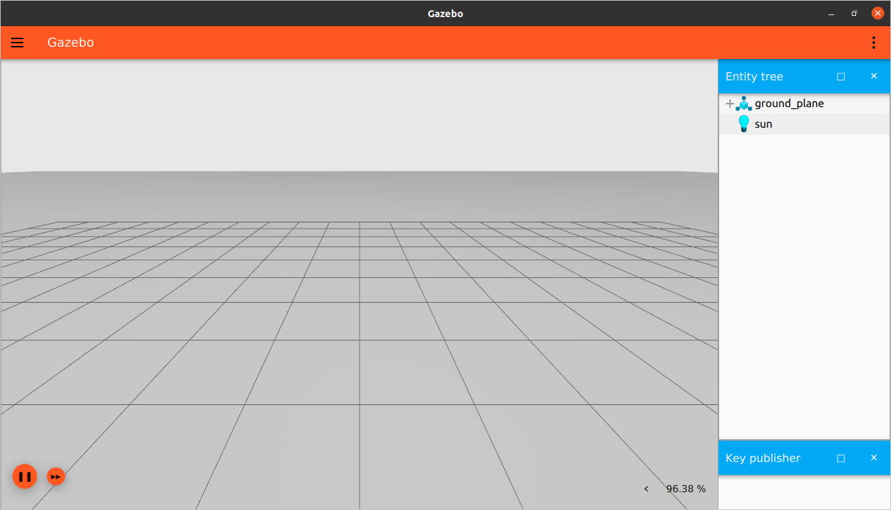

# Use ROS 2 to interact with Gazebo

In this tutorial we will learn how to use ROS 2 to communicate with Gazebo. 
This can help in many aspects; we can receive data (like joint states, TFs) or commands
from ROS and apply it to Gazebo and vice versa. This can also help to enable RViz to visualize a robot model
simulatenously simulated by a Gazebo world.

## ros_gz_bridge

[`ros_gz_bridge`](https://github.com/gazebosim/ros_gz) provides a network bridge which enables the exchange of messages between ROS 2 and [Gazebo Transport](https://github.com/gazebosim/gz-transport). Its support is limited to only certain message types. Please, check this [README](https://github.com/gazebosim/ros_gz/blob/ros2/ros_gz_bridge/README.md) to verify if your message type is supported by the bridge.

Example uses of the bridge can be found in [`ros_gz_sim_demos`](https://github.com/gazebosim/ros_gz/tree/ros2/ros_gz_sim_demos), including demo launch files with bridging of all major actuation and sensor types.

## Launching the bridge manually

We can initialize a bidirectional bridge so we can have ROS as the publisher and Gazebo as the subscriber or vice versa. The syntax is `/TOPIC@ROS_MSG@GZ_MSG`, such that `TOPIC` is the Gazebo internal topic, `ROS_MSG` is the ROS message type for this topic, and `GZ_MSG` is the Gazebo message type.

For example:

```
ros2 run ros_gz_bridge parameter_bridge /scan@sensor_msgs/msg/LaserScan@gz.msgs.LaserScan
```

The `ros2 run ros_gz_bridge parameter_bridge` command simply runs the `parameter_bridge` code from the `ros_gz_bridge` package. Then, we specify our topic `/TOPIC` over which the messages will be sent. The first `@` symbol delimits the topic name from the message types. Following the first `@` symbol is the ROS message type.

The ROS message type is followed by an `@`, `[`, or `]` symbol where:

* `@`  is a bidirectional bridge.
* `[`  is a bridge from Gazebo to ROS.
* `]`  is a bridge from ROS to Gazebo.

Have a look at these [examples]( https://github.com/gazebosim/ros_gz/blob/ros2/ros_gz_bridge/README.md#example-1a-gazebo-transport-talker-and-ros-2-listener)
explaining how to make communication connections from ROS to Gazebo and vice versa.

It is also possible to use ROS Launch with the `ros_gz_bridge` and represent the topics in yaml format to be given to the bridge at launch time.

```
- ros_topic_name: "scan"
  gz_topic_name: "/scan"
  ros_type_name: "sensor_msgs/msg/LaserScan"
  gz_type_name: "gz.msgs.LaserScan"
  direction: GZ_TO_ROS  # BIDIRECTIONAL or ROS_TO_GZ
```

The configuration file is a YAML file that contains the mapping between the ROS
and Gazebo topics to be bridged. For each pair of topics to be bridged, the
following parameters are accepted:

* `ros_topic_name`: The topic name on the ROS side.
* `gz_topic_name`: The corresponding topic name on the Gazebo side.
* `ros_type_name`: The type of this ROS topic.
* `gz_type_name`: The type of this Gazebo topic.
* `subscriber_queue`: The size of the ROS subscriber queue.
* `publisher_queue`: The size of the ROS publisher queue.
* `lazy`: Whether there's a lazy subscriber or not. If there's no real
subscribers the bridge won't create the internal subscribers either. This should
speedup performance.
* `direction`: It's possible to specify `GZ_TO_ROS`, `ROS_TO_GZ` and
`BIDIRECTIONAL`.

See [this example](https://github.com/gazebosim/ros_gz/blob/ros2/ros_gz_bridge/test/config/full.yaml)
for a valid configuration file.

## Launching the bridge using the launch files included in `ros_gz_bridge` package.

The package `ros_gz_bridge` contains a launch file named
`ros_gz_bridge.launch.py`. You can use it to start a ROS 2 and Gazebo bridge.

Here's an example:
```bash
ros2 launch ros_gz_bridge ros_gz_bridge.launch.py bridge_name:=ros_gz_bridge config_file:=<path_to_your_YAML_file>
```

Launching with composition:
```bash
ros2 launch ros_gz_bridge ros_gz_bridge.launch.py bridge_name:=ros_gz_bridge config_file:=<path_to_your_YAML_file> use_composition:=True create_own_container:=True
```
Alternatively, if an existing container is already running, you can pass its name
when launching the bridge using the `container_name` parameter. More info about composition can be viewed [here](ros2_overview.md#composition)

Check [this block](https://github.com/gazebosim/ros_gz/blob/jazzy/ros_gz_bridge/launch/ros_gz_bridge.launch.py#L25-L68)
from the source code to know all the different parameters accepted by this
launch file.

QOS Overrides:

QOS overrides can be passed as extra parameters to the bridge using the `bridge_params` argument of the launch file. An example of this:
```bash
ros2 launch ros_gz_bridge ros_gz_bridge.launch.py bridge_name:=ros_gz_bridge config_file:=<path_to_your_YAML_file> bridge_params:={'qos_overrides./topic_name.publisher.durability': 'transient_local', 'qos_overrides./another_topic_name.publisher.durability': 'transient_local'}
```
You can omit the following from what you pass to `bridge_params`: `{}`, ` `, `"`, `'`.

More info about using QOS overrides can be found [here](https://docs.ros.org/en/jazzy/How-To-Guides/Overriding-QoS-Policies-For-Recording-And-Playback.html#using-qos-overrides)

## Launching the bridge from a custom launch file in XML.

It's also possible to trigger the bridge from your custom launch file. For that
purpose we have created the `<ros_gz_bridge/>` tag that can be used from you
XML or YAML launch file. In this case, the arguments are passed as attributes
within this tag. Here's a simplified example, a more comprehensive example can be viewed [here](https://github.com/gazebosim/ros_gz/blob/ros2/ros_gz_bridge/launch/ros_gz_bridge.launch):

```xml
<launch>
  <arg name="bridge_name" />
  <arg name="config_file" />
  <ros_gz_bridge
    bridge_name="$(var bridge_name)"
    config_file="$(var config_file)">
  </ros_gz_bridge>
</launch>
```

In this case the `<ros_gz_bridge>` parameters are read from the command line.
That's an option but not strictly necessary as you could decide to hardcode some
of the values or not even use all the parameters.

## Launching the bridge from a custom launch file in Python.

Here's a simplified example of a Python launch file used to load a bridge from
Python, a more comprehensive example can be viewed [here](https://github.com/gazebosim/ros_gz/blob/ros2/ros_gz_bridge/launch/ros_gz_bridge.launch.py):
```python
from launch import LaunchDescription
from launch.actions import DeclareLaunchArgument
from launch.substitutions import LaunchConfiguration, TextSubstitution
from ros_gz_bridge.actions import RosGzBridge


def generate_launch_description():

    bridge_name = LaunchConfiguration('bridge_name')
    config_file = LaunchConfiguration('config_file')

    declare_bridge_name_cmd = DeclareLaunchArgument(
        'bridge_name', description='Name of ros_gz_bridge node'
    )

    declare_config_file_cmd = DeclareLaunchArgument(
        'config_file', description='YAML config file'
    )

    # Create the launch description and populate
    ld = LaunchDescription([
        RosGzBridge(
            bridge_name=LaunchConfiguration('bridge_name'),
            config_file=LaunchConfiguration('config_file'),
        ),
    ])

    # Declare the launch options
    ld.add_action(declare_bridge_name_cmd)
    ld.add_action(declare_config_file_cmd)

    return ld
```

## Publish key strokes to ROS

Let's send messages to ROS using the `Key Publisher` an Gazebo plugin.

**Note:** Make sure to have all workspaces you need (ROS, Gazebo and, `ros_gz`...) sourced.


First we will start a bridge between ROS and Gazebo specifying the topic
at which the `Key Publisher` plugin sends messages and also the type
of the messages as follows:

```
ros2 run ros_gz_bridge parameter_bridge /keyboard/keypress@std_msgs/msg/Int32@gz.msgs.Int32
```

We started a bridge on `/keyboard/keypress` topic with message of type `Int32`.
For ROS it is `std_msgs/msg/Int32` and for Gazebo it is `gz.msgs.Int32`

In another terminal launch an Gazebo Sim world, for example the `empty.sdf` world:

```
gz sim empty.sdf
```

Then add the `Key Publisher` plugin from the dropdown menu on the top right corner.



In another terminal start the ROS listener:

```
ros2 topic echo /keyboard/keypress
```

This command listens to the messages sent over the `/keyboard/keypress` topic.

On the Gazebo window, press on the keyboard keys and you should
find data on the listener terminal.

Now it's your turn! Try to send data from ROS to Gazebo. You can also try different data types and different directions of communication.

## Video walk-through

A video walk-through of this tutorial is available from our YouTube channel: [Gazebo tutorials: ROS 2 Foxy integration](https://youtu.be/IpZTNyTp9t8).

<iframe width="560" height="315" src="https://www.youtube.com/embed/IpZTNyTp9t8" frameborder="0" allow="accelerometer; autoplay; encrypted-media; gyroscope; picture-in-picture" allowfullscreen></iframe>

## Visualize in RViz

Take a step further and try out demos from [`ros_gz_sim_demos`](https://github.com/gazebosim/ros_gz/tree/ros2/ros_gz_sim_demos).

For the `sdf_parser` demo, install [`ros_gz`](https://github.com/gazebosim/ros_gz/tree/ros2) and the parser plugin `sdformat_urdf` from source in a colcon workspace.
Read more about `sdformat_urdf` [here](https://github.com/ros/sdformat_urdf/blob/ros2/sdformat_urdf/README.md).

Run the demo launch file with the rviz launch argument set:

```bash
ros2 launch ros_gz_sim_demos sdf_parser.launch.py rviz:=True
```

Start the simulation in Gazebo and wait a few seconds for TFs to be published.

In another terminal, send either ROS or Gazebo commands for the vehicle to move in circles:

```bash
gz topic -t "/model/vehicle/cmd_vel" -m gz.msgs.Twist -p "linear: {x: 1.0}, angular: {z: -0.1}"
ros2 topic pub /model/vehicle/cmd_vel geometry_msgs/msg/Twist "{linear: {x: 5.0, y: 0.0, z: 0.0}, angular: {x: 0.0, y: 0.0, z: -0.1}}
```

And verify the vehicle matching its trajectory in Gazebo and RViz.


For more details on implementation of this demo see [ROS 2 Interoperability](ros2_interop).

## Using ROS 2 Simulation Interfaces

The [ROS 2 Simulation Interfaces](https://github.com/ros-simulation/simulation_interfaces)
define a standard set of ROS 2 service, message and action definitions or controlling and
interacting with simulation environments. These interfaces are simulator-agnostic and aim to
provide a unified way to control and observe simulation using ROS 2.

Gazebo has implemented these interfaces, enabling tasks like spawning entities, stepping
simulation, querying world state, etc. through standard ROS 2 calls. In this tutorial we
will learn how to interact with a running Gazebo simulation.

### Simulation Control

The following services and actions are available to control the flow of simulation time.

| Interface Name | Topic Name | Type | Description |
|----------------|------------|------|-------------|
| `ResetSimulation` | `/reset_simulaiton` | Service | Reset the simulation to its initial state |
| `StepSimulation` | `/step_simulation` | Service | Step the simulation forward by a specified number of steps |
| `GetSimulationState` | `/get_simulation_state` | Service | Get the current simulation state (playing/paused/stopped) |
| `SetSimulationState` | `/set_simulation_state` | Service | Set the simulation state (play/pause/stop) |
| `SimulateSteps` | `/simulate_steps` | Action | Step the simulation forward by a specified number of steps with feedback and cancellation support | 

**ResetSimulation Service**

Reset the simulation to its initial state.

```bash
ros2 service call /reset_simulation simulation_interfaces/srv/ResetSimulation "{}"
```

**StepSimulation Service**

Step the simulation forward by a specified number of steps.

```bash
ros2 service call /step_simulation simulation_interfaces/srv/StepSimulation "{steps: 10}"
```

**GetSimulationState Service**

Get the current simulation state (playing/paused/stopped).

```bash
ros2 service call /get_simulation_state simulation_interfaces/srv/GetSimulationState "{}"
```

**SetSimulationState Service**

Set the simulation state (play/pause/stop).

- Set simulation state to stop.

  ```bash
  ros2 service call /set_simulation_state simulation_interfaces/srv/SetSimulationState "{state: {state: 0}}"
  ```

- Set simulation state to playing.

  ```bash
  ros2 service call /set_simulation_state simulation_interfaces/srv/SetSimulationState "{state: {state: 1}}"
  ```

- Set simulation state to paused.

  ```bash
  ros2 service call /set_simulation_state simulation_interfaces/srv/SetSimulationState "{state: {state: 2}}"
  ```

- Set simulation state to quitting.

  ```bash
  ros2 service call /set_simulation_state simulation_interfaces/srv/SetSimulationState "{state: {state: 3}}"
  ```

**SimulateSteps Action**

Step the simulation forward by a specified number of steps with feedback and cancellation support.

```bash
ros2 action send_goal /simulate_steps simulation_interfaces/action/SimulateSteps "{steps: 10}" --feedback
```

### Entity Management

The following interfaces are used to create or remove entities in the simulation at runtime.

| Interface Name | Topic Name | Type | Description |
|----------------|------------|------|-------------|
| `SpawnEntity` | `/spawn_entity` | Service | Spawn a new entity in the simulation at a specific location |
| `DeleteEntity` | `/delete_entity` | Service | Delete an existing entity by name |

**SpawnEntity Service**

Spawn a new entity in the simulation at a specific location.

```bash
ros2 service call /spawn_entity simulation_interfaces/srv/SpawnEntity "{
  name: 'my_model',
  uri: '/path/to/model.sdf',
  allow_renaming: false,
  initial_pose: {
    pose: {
      position: {x: 0.0, y: 0.0, z: 0.0},
      orientation: {w: 1.0, x: 0.0, y: 0.0, z: 0.0}
    }
  }
}"
```

**DeleteEntity Service**

Delete an existing entity by name.

```bash
ros2 service call /delete_entity simulation_interfaces/srv/DeleteEntity "{entity: 'my_model'}"
```

### State Queries

The following interfaces are used to introspect simulation world and entity state.

| Interface Name | Topic Name | Type | Description |
|----------------|------------|------|-------------|
| `GetEntityState` | `/get_entity_state` | Service | Get the pose and twist of a specific entity |
| `GetEntitiesStates` | `/get_entities_states` | Service | Get the state for multiple entities (optionally filtered) |
| `GetEntities` | `/get_entities` | Service | Get a list of entities (optionally filtered) |

**GetEntityState Service**

Get the pose and twist of a specific entity.

```bash
ros2 service call /get_entity_state simulation_interfaces/srv/GetEntityState "{entity: 'my_model'}"
```

**GetEntitiesStates Service**

Get the state of multiple entities (optionally filtered).

```bash
ros2 service call /get_entities_states simulation_interfaces/srv/GetEntitiesStates "{filters: {filter: ''}}"
```

**GetEntites Service**

Get the list of entities (optionally filtered).

```bash
ros2 service call /get_entities simulation_interfaces/src/GetEntities "{filters: {filter: ''}}"
```

### Simulator Information

Some simulators may only support a subset of interfaces. The following services can be used to inspect
supported features.

| Interface Name | Topic Name | Type | Description |
|----------------|------------|------|-------------|
| `GetSimulatorFeatures` | `/get_simulator_features` | Service | Query which interface features are supported |

**GetSimulatorFeatures Service**

Query which interface features are supported.

```bash
ros2 service call /get_simulator_features simulation_interfaces/srv/GetSimulationFeatures "{}"
```
