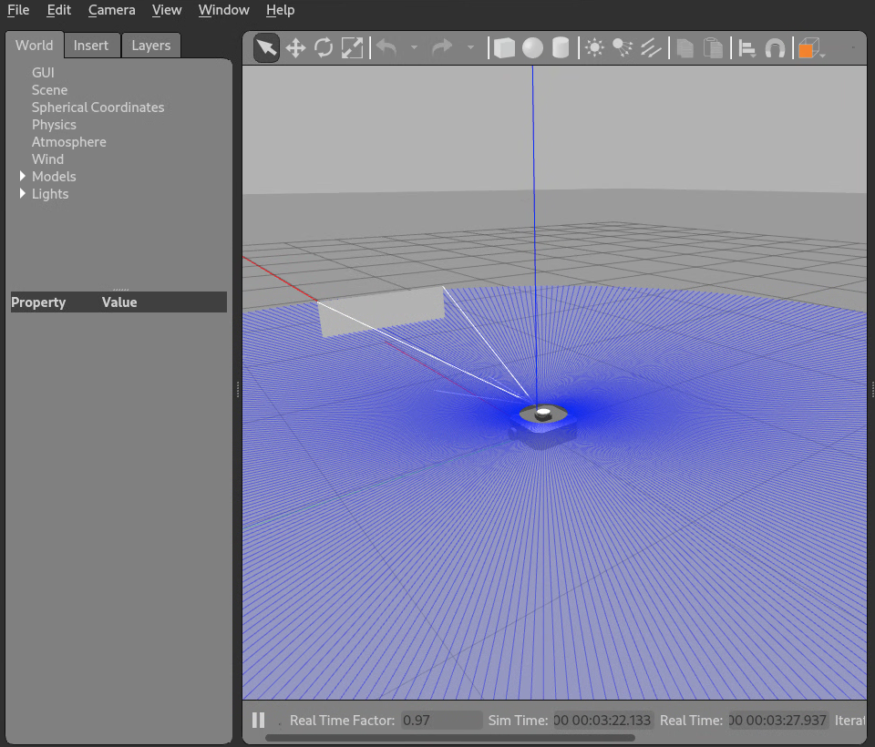
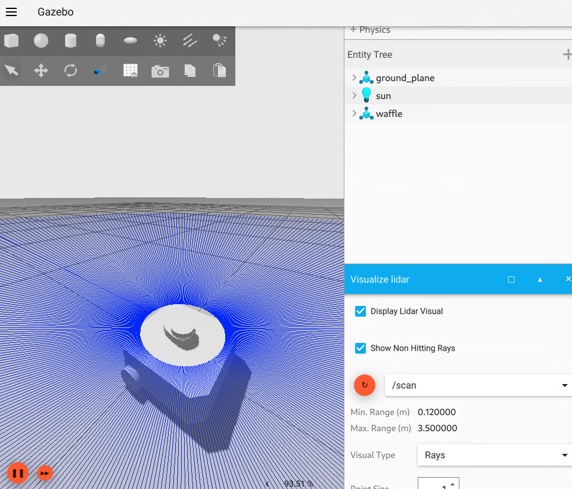

# Migrating ROS 2 packages that use Gazebo Classic

The Gazebo simulator has its roots in the Gazebo Classic project, but it has a
few significant differences that affect how a ROS 2 project uses the simulator.
One difference is that ROS 2 projects now use the
[ros_gz](https://github.com/gazebosim/ros_gz) package instead of
[gazebo_ros_pkgs](https://github.com/ros-simulation/gazebo_ros_pkgs) as the
source of launch files and other useful utilities. Another major difference is
that while [gazebo_ros_pkgs](https://github.com/ros-simulation/gazebo_ros_pkgs)
provided a set of plugins that directly get loaded by Gazebo Classic and run as
part of the simulation to provide an interface between ROS and Gazebo Classic,
[ros_gz](https://github.com/gazebosim/ros_gz) is primarily used as a bridge
between ROS and gz-transport topics. Knowing these conceptual differences is
important in making the transition.

**Note:** Since the name of the project has gone through two major changes, we
highly recommend you read the [history](https://gazebosim.org/about) of the
project to have a better understanding of the terminology used in this tutorial
and elsewhere. As a convention we refer to older versions of Gazebo, those with
release numbers like Gazebo 9 and Gazebo 11 as "Gazebo Classic." Newer versions
of Gazebo, formerly called "Ignition", with lettered releases names like
Harmonic, are referred to as just "Gazebo" in this document. This tutorial will
show how to migrate an existing ROS 2 package that uses the `gazebo_ros_pkgs`
package to the new `ros_gz`. We will use the
[turtlebot3_simulations](https://github.com/ROBOTIS-GIT/turtlebot3_simulations/)
package as an example. The complete, migrated version of
`turtlebot3_simulations` covered in this tutorial, can be found in
[this fork](https://github.com/azeey/turtlebot3_simulations/tree/new_gazebo).

We'll start by following the
[PC Setup](https://emanual.robotis.com/docs/en/platform/turtlebot3/quick-start/)
guide to install the necessary prerequisites for simulating Turtlebot3. This
will install additional packages, such as
[Nav2](https://github.com/ros-planning/navigation2) and
[Cartographer](https://github.com/cartographer-project/cartographer), which we
will be using later on in this tutorial, so make sure to not skip this step.

The next step is to clone the `turtlebot3_simulation` package. We'll use the
`humble-devel` branch, which at the time of writing had a SHA of `d16cdbe`

```bash
source /opt/ros/humble/setup.bash
mkdir -p ~/turtlebot3_ws/src
cd ~/turtlebot3_ws/src
git clone -b d16cdbe https://github.com/ROBOTIS-GIT/turtlebot3_simulations/
```

Install dependencies using `rosdep`

```bash
sudo rosdep init # only needed if  using rosdep
rosdep install --from-paths . -i -y
```

Finally, build the project and check that the Gazebo classic simulation works.
(See the
[Gazebo Simulation guide](https://emanual.robotis.com/docs/en/platform/turtlebot3/simulation/#gazebo-simulation))

```bash
cd ~/turtlebot3_ws
colcon build --symlink-install
source ~/turtlebot3_ws/install/setup.bash

export TURTLEBOT3_MODEL=waffle
ros2 launch turtlebot3_gazebo empty_world.launch.py
```

Here's a screenshot of Turtlebot3 running in Gazebo Classic obtained by
launching `empty_world.launch.py`.



Once, we're sure that the Gazebo classic simulation is running properly, we
create a new branch in which we'll make the changes to migrate to the new
Gazebo.

```bash
git checkout -b new_gazebo
```

The changes we need to make are:

1. Modify `package.xml` and `CMakeLists.txt` files replacing `gazebo`,
   `gazebo_ros_pkgs`, etc with packages from `ros_gz`.
1. Edit launch files that start Gazebo (e.g. `empty_world.launch.py`)
1. Update the world SDFormat file.
1. Edit launch files that spawn models.
1. Edit model SDFormat files.
1. Bridge ROS topics.

## Update package dependencies

The turtlebot 3 package depends on `gazebo_ros_pkgs`, which is the package that
provides launch files, plugins, and other utilities for using Gazebo classic
with ROS 2. The equivalent for the new Gazebo is `ros_gz`, but `ros_gz` is
actually a meta-package that contains a few packages. It's okay to replace
`gazebo_ros_pkgs` with `ros_gz` here, but using just the subset of packages
needed for your project will reduce the number of dependencies. For the
`turtlebot3_simulation` package, we will only need `ros_gz_bridge`,
`ros_gz_image`, and `ros_gz_sim` for now. `ros_gz_bridge` and `ros_gz_image`
provide topic bridges between Gazebo and ROS while `ros_gz_sim` provides launch
files and other utilities that help with starting Gazebo and spawning models.

After making the change, lines 17-21 of `package.xml` will look like this:

```xml
...
  <depend>geometry_msgs</depend>
  <depend>nav_msgs</depend>
  <depend>rclcpp</depend>
  <depend>ros_gz_bridge</depend>
  <depend>ros_gz_image</depend>
  <depend>ros_gz_sim</depend>
  <depend>sensor_msgs</depend>
  <depend>tf2</depend>
...
```

You can find the
[Gazebo Classic package XML file here](https://github.com/ROBOTIS-GIT/turtlebot3_simulations/blob/d16cdbe7ecd601ccad48f87f77b6d89079ec5ac1/turtlebot3_gazebo/package.xml),
and the
[updated Gazebo package XML file here](https://github.com/azeey/turtlebot3_simulations/blob/new_gazebo/turtlebot3_gazebo/package.xml).

After making the change, we'll need to install the new dependencies. The
following command will automatically install the necessary Gazebo version.

```bash
rosdep install --from-paths . -i -y
```

This tutorial assumes you are using Gazebo Fortress as it is the version of
Gazebo officially paired with ROS 2 Humble. While it is possible to use newer
versions of Gazebo with ROS 2 Humble, it requires extra work and is not
recommend for most users. See
[Installing Gazebo with ROS](https://gazebosim.org/docs/latest/ros_installation)
to learn more. If you intend to switch back and forth between the new Gazebo and
Gazebo Classic, it's best to use Gazebo Fortress since the newer versions will
automatically uninstall Gazebo Classic. With that being said, the concepts
covered by the tutorial should work with newer versions of ROS 2 and Gazebo.

## Launch the world

We now need to edit `turtlebot3_gazebo/launch/empty_world.launch.py` and replace
any use of `gazebo_ros_pkgs`. You can find the
[Gazebo Classic empty world launch file before editing here](https://github.com/ROBOTIS-GIT/turtlebot3_simulations/blob/d16cdbe7ecd601ccad48f87f77b6d89079ec5ac1/turtlebot3_gazebo/launch/empty_world.launch.py),
and the
[updated Gazebo empty world launch file here](https://github.com/azeey/turtlebot3_simulations/blob/new_gazebo/turtlebot3_gazebo/launch/empty_world.launch.py).
First replace the call to `get_package_share_directory` to find `ros_gz_sim`.
The code will change from:

```python
pkg_gazebo_ros = get_package_share_directory('gazebo_ros')
```

to:

```python
ros_gz_sim = get_package_share_directory('ros_gz_sim')
```

Next, change `gzserver_cmd` to use `ros_gz_sim`

```python
gzserver_cmd = IncludeLaunchDescription(
    PythonLaunchDescriptionSource(
        os.path.join(ros_gz_sim, 'launch', 'gz_sim.launch.py')
    ),
    launch_arguments={'gz_args': ['-r -s -v4 ', world], 'on_exit_shutdown': 'true'}.items()
)
```

This uses the `gz_sim.launch.py` launch file from the `ros_gz_sim` package. The
launch file takes the `gz_args` argument which is a list of command line flags
that will be passed to `ign gazebo` (`gz sim` in Garden and later). `-s` causes
only the Gazebo server to run without the GUI client and `-r` tells Gazebo to
start running simulation immediately. Lastly, we are using the `-v4` flag which
sets the verbosity level of Gazebo's console output.

**Note:** The list assigned to `gz_args` is concatenated into a string with code
equivalent to `''.join(gz_args)`, so it's important to keep whitespace where
necessary. Note the space after 4 in `'-v4 '`.

The `world` argument will be substituted by `launch` before running Gazebo. In
this launch file, `world` is a python variable, so it is possible to use python
string formatting: `gz_args: f'-s -r -v4 {world}'`. But if we wanted to use a
`LaunchConfiguration` variable for `world`, we will need to use a list so that
`launch` will make the substitution for us.

The `on_exit_shutdown` argument ensures that if the Gazebo server exits for any
reason, the rest of the nodes in the launch file are shutdown

The GUI client is launched in a similar way, but we change `gz_args` to `-g` to
run just the GUI client.

```python
gzclient_cmd = IncludeLaunchDescription(
    PythonLaunchDescriptionSource(
        os.path.join(ros_gz_sim, 'launch', 'gz_sim.launch.py')
    ),
    launch_arguments={'gz_args': '-g -v4 '}.items()
)

```

<!-- This env variable section might not be needed if
https://github.com/gazebosim/ros_gz/pull/492 gets merged -->

Finally, we need to set the environment variable `GZ_SIM_RESOURCE_PATH` so
Gazebo can know where to find models. See the
[Finding resource](https://gazebosim.org/api/sim/8/resources.html) document to
learn more about this environment variable. This was not needed for
`gazebo_ros_pkgs` because it used the `<export>` tag in `package.xml` to
populate a similar environment variable for Gazebo (`GAZEBO_MODEL_PATH`).

First, import `AppendEnvironmentVariable`

```python
from launch.actions import AppendEnvironmentVariable
```

and create a `launch` action that appends the environment variable with the
location of the `models` directory in `turtlebot3_gazebo`.

```python

set_env_vars_resources = AppendEnvironmentVariable(
        'GZ_SIM_RESOURCE_PATH',
        os.path.join(get_package_share_directory('turtlebot3_gazebo'),
                     'models'))

```

We'll then need to add the action to `ld`, the `LaunchDescription` variable
returned by `generate_launch_description`.

```python
ld.add_action(set_env_vars_resources)
```

<!-- end env variable section -->

We are now ready to test the launch file. Comment out
`ld.add_action(spawn_turtlebot_cmd)` and run:

```bash
ros2 launch turtlebot3_gazebo empty_world.launch.py
```

**More than likely, this will fail** because Gazebo could not find models
referenced in the world SDFormat file. The next step is to fix that.

**Note:** Due to a bug in the GUI client, there might be a lingering
`ign gazebo -g` or `gz sim -g` process after terminating the launch. You can
kill it using `pkill -f -9 'ign gazebo'`

## Edit world SDFormat file

The file we will be editing is `turtlebot3_gazebo/worlds/empty_world.world`.
This file references the models `sun` and `ground_plane`. In Gazebo Classic,
these models were either shipped with the simulator or downloaded from the
gazebo [model repository](https://github.com/osrf/gazebo_models). The new Gazebo
does not ship these models, instead we can use models from Fuel or add the
models directly to the world file.

To use fuel models, replace the `include` tags for `sun` and `ground_place` with

```xml
<include>
  <uri>
    https://fuel.gazebosim.org/1.0/OpenRobotics/models/Ground Plane
  </uri>
</include>

<include>
  <uri>
    https://fuel.gazebosim.org/1.0/OpenRobotics/models/Sun
  </uri>
</include>
```

For reference, you can find the
[Gazebo Classic empty world here](https://github.com/ROBOTIS-GIT/turtlebot3_simulations/blob/d16cdbe7ecd601ccad48f87f77b6d89079ec5ac1/turtlebot3_gazebo/worlds/empty_world.world),
and the
[updated new Gazebo empty world here](https://github.com/azeey/turtlebot3_simulations/blob/new_gazebo/turtlebot3_gazebo/worlds/empty_world.world).
Relaunching `empty_world.launch.py` should now start the simulator successfully.

## Spawn model

In this step, we will modify
`turtlebot3_gazebo/launch/spawn_turtlebot3.launch.py`. Again, we need to change
`gazebo_ros` to `ros_gz_sim`. We'll also need to change `spawn_entity.py` to
`create`, which is the node in `ros_gz_sim` that provides model spawning
functionality. From the argument list, `-entity` needs to be replaced with
`-name`. You can run `ros2 run ros_gz_sim create --helpshort` to see more
options.

The resulting `Node` should look like:

```python
start_gazebo_ros_spawner_cmd = Node(
    package='ros_gz_sim',
    executable='create',
    arguments=[
        '-name', TURTLEBOT3_MODEL,
        '-file', urdf_path,
        '-x', x_pose,
        '-y', y_pose,
        '-z', '0.01'
    ],
    output='screen',
)
```

If you uncomment `ld.add_action(spawn_turtlebot_cmd)` in `empty_world.launch.py`
and run the launch file, you'll notice errors related to unrecognized plugins.
These are coming from the model SDFormat file, which we will modify next.

## Modify the model

We will be using the `waffle` robot for this tutorial, so we'll edit the file
[`turtlebot3_gazebo/models/turtlebot3_waffle/model.sdf`](https://github.com/ROBOTIS-GIT/turtlebot3_simulations/blob/d16cdbe7ecd601ccad48f87f77b6d89079ec5ac1/turtlebot3_gazebo/models/turtlebot3_waffle/model.sdf).
The changes we need to make are mostly related to plugins and their parameters.
You can reference the Waffle
[model SDF file before editing here](https://github.com/ROBOTIS-GIT/turtlebot3_simulations/blob/d16cdbe7ecd601ccad48f87f77b6d89079ec5ac1/turtlebot3_gazebo/models/turtlebot3_waffle/model.sdf),
and
[after editing here](https://github.com/azeey/turtlebot3_simulations/blob/new_gazebo/turtlebot3_gazebo/models/turtlebot3_waffle/model.sdf).
For each `<plugin>` in the original model, The following is a list of all the
plugins in the original model. For each plugin, we will either remove the plugin
if it's no longer necessary, or use the equivalent plugin from the new Gazebo.
You can use the Feature comparison page
([Fortress](https://gazebosim.org/docs/fortress/comparison),
[Harmonic](https://gazebosim.org/docs/harmonic/comparison)) to find out of a
Gazebo Classic feature (e.g. a Sensor type) is available in Gazebo. If an
equivalent plugin is used, we will update the SDF parameters of the plugin to
match the parameters of the new plugin. See the list of systems
([Fortress](https://gazebosim.org/api/gazebo/6/namespaceignition_1_1gazebo_1_1systems.html),
[Harmonic](https://gazebosim.org/api/sim/8/namespacegz_1_1sim_1_1systems.html))
to find equivalent plugins and their parameters.

### libgazebo_ros_imu_sensor.so

> [Plugin in the original model](https://github.com/ROBOTIS-GIT/turtlebot3_simulations/blob/d16cdbe7ecd601ccad48f87f77b6d89079ec5ac1/turtlebot3_gazebo/models/turtlebot3_waffle/model.sdf#L89-L94)

This plugin can be removed since there is a generic IMU plugin that handles all
IMU sensors. We will add this to the world later. We will set the `<topic>` tag
inside `<sensor>` to a short topic name to make it easier when creating a ROS
bridge later. The entire `<sensor>` tag should now look like:

```xml
<link name="imu_link">
  <sensor name="tb3_imu" type="imu">
    <always_on>true</always_on>
    <update_rate>200</update_rate>
    <topic>imu</topic>
    <imu>
      ... <!-- all the content of <imu> -->
    </imu>
  </sensor>
</link>
```

### libgazebo_ros_ray_sensor.so

> [Plugin in the original model](https://github.com/ROBOTIS-GIT/turtlebot3_simulations//blob/d16cdbe7ecd601ccad48f87f77b6d89079ec5ac1/turtlebot3_gazebo/models/turtlebot3_waffle/model.sdf#L157-L164)

Similar to the IMU, we will use a generic plugin loaded into the world for
handling all rendering sensors, which includes Lidar sensors. Currently the
`ray` sensor type, which meant to use the physics engine for generator the
sensor data, is not supported in the new Gazebo, we will need to update it to
`gpu_lidar`. We'll also need to change the `<ray>` tag inside `<sensor>` to
`<lidar>`. The `frame_name` parameter of the plugin will be handled by setting
the `gz_frame_id` parameter in `<sensor>`. Lastly, we'll set the `<topic>`
parameter similar to the IMU sensor. The final `<sensor>` tag for the Lidar
should look like:

```xml
<sensor name="hls_lfcd_lds" type="gpu_lidar">
  <always_on>true</always_on>
  <visualize>true</visualize>
  <pose>-0.064 0 0.121 0 0 0</pose>
  <update_rate>5</update_rate>
  <topic>scan</topic>
  <gz_frame_id>base_scan</gz_frame_id>
  <lidar>
    ... <!-- same content as <ray> in the original -->
  </lidar>
</sensor>
```

### libgazebo_ros_camera.so

> [Plugin in the original model](https://github.com/ROBOTIS-GIT/turtlebot3_simulations//blob/d16cdbe7ecd601ccad48f87f77b6d89079ec5ac1/turtlebot3_gazebo/models/turtlebot3_waffle/model.sdf#L393-L402)

The Camera sensor will also use a generic plugin that handles all rendering
sensors loaded into the world. In the SDF file, we will set the `<topic>` and
tag inside `<sensor>`, and the `<camera_info_topic>` inside `<camera>`, both of
which will be used in the ROS bridge later. We will also set the `<gz_frame_id>`
since the default frame id used by the generic plugin in the new Gazebo is
different from the default used by `libgazebo_ros_camera` in Gazebo Classic. The
final `<sensor>` tag should look like:

```xml
<sensor name="camera" type="camera">
  <always_on>true</always_on>
  <visualize>true</visualize>
  <update_rate>30</update_rate>
  <topic>camera/image_raw</topic>
  <gz_frame_id>camera_rgb_frame</gz_frame_id>
  <camera name="intel_realsense_r200">
    <camera_info_topic>camera/camera_info</camera_info_topic>
    ... <!-- all the content of <camera> from the original -->
  </camera>
</sensor>
```

### libgazebo_ros_diff_drive.so

> [Plugin in the original model](https://github.com/ROBOTIS-GIT/turtlebot3_simulations//blob/d16cdbe7ecd601ccad48f87f77b6d89079ec5ac1/turtlebot3_gazebo/models/turtlebot3_waffle/model.sdf#L476-L507)

Since this is a model specific plugin, we will replace it with the `DiffDrive`
plugin. We will match the parameters of `libgazebo_ros_diff_drive` as much as
possible, but exact match may not be possible. For example, the original plugin
has a `max_wheel_acceleration`, but `gz-sim-diff-drive-system` has
`max_linear_acceleration` instead, which are not equivalent; the latter is a
limit on the whole vehicle's linear acceleration. We can approximate the value
by multiplying the wheel acceleration limit by the radius of the wheel. Refer to
the
[DiffDrive class reference](https://gazebosim.org/api/gazebo/6/classignition_1_1gazebo_1_1systems_1_1DiffDrive.html)
for details on each parameter. Here's the full `<plugin>` tag with comments
describing the mapping from the original plugin.

```xml
<plugin filename="gz-sim-diff-drive-system" name="gz::sim::systems::DiffDrive">
  <!-- Remove <ros> tag. -->

  <!-- wheels -->
  <left_joint>wheel_left_joint</left_joint>
  <right_joint>wheel_right_joint</right_joint>

  <!-- kinematics -->
  <wheel_separation>0.287</wheel_separation>
  <wheel_radius>0.033</wheel_radius> <!-- computed from <wheel_diameter> in the original plugin-->

  <!-- limits -->
  <max_linear_acceleration>0.033</max_linear_acceleration> <!-- computed from <max_linear_acceleration> in the original plugin-->

  <topic>cmd_vel</topic> <!-- from <commant_topic> -->

  <odom_topic>odom</odom_topic> <!-- from <odometry_topic> -->
  <frame_id>odom</frame_id> <!-- from <odometry_frame> -->
  <child_frame_id>base_footprint</child_frame_id> <!-- from <robot_base_frame> -->
  <odom_publisher_frequency>30</odom_publisher_frequency> <!-- from <update_rate>-->

  <tf_topic>/tf</tf_topic> <!-- Short topic name for tf output -->

</plugin>

```

The `<wheel_torque>` parameter can be realized by setting effort limits on each
`<joint>`. For example:

```xml
<joint name="wheel_right_joint" type="revolute">
  <parent>base_link</parent>
  <child>wheel_right_link</child>
  <pose>0.0 -0.144 0.023 -1.57 0 0</pose>
  <axis>
    <xyz>0 0 1</xyz>
    <limit>
      <effort>20</effort> <!-- from <wheel_torque> in libgazebo_ros_diff_drive.so.-->
    </limit>
  </axis>
</joint>
```

### libgazebo_ros_joint_state_publisher.so

> [Plugin in the original model](https://github.com/ROBOTIS-GIT/turtlebot3_simulations//blob/d16cdbe7ecd601ccad48f87f77b6d89079ec5ac1/turtlebot3_gazebo/models/turtlebot3_waffle/model.sdf#L509-L517)

We will replace this plugin as well with
[`JointStatePublisher`](https://gazebosim.org/api/gazebo/6/classignition_1_1gazebo_1_1systems_1_1JointStatePublisher.html).
The parameters are mostly similar, however, the `<update_rate>` parameter is not
supported. Here's the full `<plugin>` tag with comments describing the mapping
from the original plugin.

```xml
<plugin filename="gz-sim-joint-state-publisher-system"
  name="gz::sim::systems::JointStatePublisher">
  <topic>joint_states</topic> <!--from <ros><remapping> -->
  <joint_name>wheel_left_joint</joint_name>
  <joint_name>wheel_right_joint</joint_name>
</plugin>
```

### World plugins

As mentioned earlier, sensors are handled by generic world level plugins.

<div class="warning">
  By default, if there are no world plugins specified, Gazebo adds the Physics,
  SceneBroadcaster, and UserCommands plugins. However, if we specify any
  plugins at all, Gazebo will assume we want to override the defaults, so will not
  add any default plugins.
</div>

Therefore, we have to add the additional plugins for IMU and Lidar sensors as
well as the ones that would have been added by default. We will once again edit
`turtlebot3_gazebo/worlds/empty_world.world` add the following right after
`<world name="default">`.

```xml
<plugin
  filename="gz-sim-physics-system"
  name="gz::sim::systems::Physics">
</plugin>
<plugin
  filename="gz-sim-user-commands-system"
  name="gz::sim::systems::UserCommands">
</plugin>
<plugin
  filename="gz-sim-scene-broadcaster-system"
  name="gz::sim::systems::SceneBroadcaster">
</plugin>
<plugin
  filename="gz-sim-sensors-system"
  name="gz::sim::systems::Sensors">
  <render_engine>ogre2</render_engine>
</plugin>
<plugin
  filename="gz-sim-imu-system"
  name="gz::sim::systems::Imu">
</plugin>
```

## Bridge ROS topics

In Gazebo Classic, communication with ROS is enabled by plugins in
`gazebo_ros_pkgs` that directly interface with the simulator. In contrast, in
the new Gazebo, communication with ROS is mainly done through topic bridges
provided by `ros_gz`. The bridge node is a generic node that bridges topics
between `gz-transport` and ROS 2.

To create the bridge, we'll use a `yaml` file that contains the topic names and
their mappings. We'll add a new directory `params` in `turtlebot3_gazebo` and
create `turtlebot3_waffle_bridge.yaml` with the following content:

```yaml
# gz topic published by the simulator core
- ros_topic_name: "clock"
  gz_topic_name: "clock"
  ros_type_name: "rosgraph_msgs/msg/Clock"
  gz_type_name: "gz.msgs.Clock"
  direction: GZ_TO_ROS

# gz topic published by JointState plugin
- ros_topic_name: "joint_states"
  gz_topic_name: "joint_states"
  ros_type_name: "sensor_msgs/msg/JointState"
  gz_type_name: "gz.msgs.Model"
  direction: GZ_TO_ROS

# gz topic published by DiffDrive plugin
- ros_topic_name: "odom"
  gz_topic_name: "odom"
  ros_type_name: "nav_msgs/msg/Odometry"
  gz_type_name: "gz.msgs.Odometry"
  direction: GZ_TO_ROS

# gz topic published by DiffDrive plugin
- ros_topic_name: "tf"
  gz_topic_name: "tf"
  ros_type_name: "tf2_msgs/msg/TFMessage"
  gz_type_name: "gz.msgs.Pose_V"
  direction: GZ_TO_ROS

# gz topic subscribed to by DiffDrive plugin
- ros_topic_name: "cmd_vel"
  gz_topic_name: "cmd_vel"
  ros_type_name: "geometry_msgs/msg/Twist"
  gz_type_name: "gz.msgs.Twist"
  direction: ROS_TO_GZ

# gz topic published by IMU plugin
- ros_topic_name: "imu"
  gz_topic_name: "imu"
  ros_type_name: "sensor_msgs/msg/Imu"
  gz_type_name: "gz.msgs.IMU"
  direction: GZ_TO_ROS

# gz topic published by Sensors plugin
- ros_topic_name: "scan"
  gz_topic_name: "scan"
  ros_type_name: "sensor_msgs/msg/LaserScan"
  gz_type_name: "gz.msgs.LaserScan"
  direction: GZ_TO_ROS

# gz topic published by Sensors plugin (Camera)
- ros_topic_name: "camera/camera_info"
  gz_topic_name: "camera/camera_info"
  ros_type_name: "sensor_msgs/msg/CameraInfo"
  gz_type_name: "gz.msgs.CameraInfo"
  direction: GZ_TO_ROS
```

[The completed yaml file can be found here.](https://github.com/azeey/turtlebot3_simulations/blob/new_gazebo/turtlebot3_gazebo/params/turtlebot3_waffle_bridge.yaml)
Each entry in the yaml file has a ROS topic name, a Gazebo topic name, a ROS
data/message type, and a direction which indicates which way messages flow. We
will need to update the
[`CMakeLists.txt`](https://github.com/azeey/turtlebot3_simulations/blob/ccb2385fd478e79c898d290d80fa41f35b1bbb83/turtlebot3_gazebo/CMakeLists.txt#L72)
file to install the new `params` directory we created. The CMake `install`
command should look like

```cmake
install(DIRECTORY launch models params rviz urdf worlds
  DESTINATION share/${PROJECT_NAME}/
)
```

Finally, we will edit
[`turtlebot3_gazebo/launch/spawn_turtlebot3.launch.py`](https://github.com/ROBOTIS-GIT/turtlebot3_simulations//blob/d16cdbe7ecd601ccad48f87f77b6d89079ec5ac1/turtlebot3_gazebo/launch/spawn_turtlebot3.launch.py),
to create the bridge node:

```python
bridge_params = os.path.join(
    get_package_share_directory('turtlebot3_gazebo'),
    'params',
    'turtlebot3_waffle_bridge.yaml'
)

start_gazebo_ros_bridge_cmd = Node(
    package='ros_gz_bridge',
    executable='parameter_bridge',
    arguments=[
        '--ros-args',
        '-p',
        f'config_file:={bridge_params}',
    ],
    output='screen',
)
```

You might have noticed that in the bridge parameters, we did not include the
`camera/image_raw` topic. While it is possible to bridge the image topic in a
similar manner as all the other topics, we will make use of a specialized bridge
node,
[`ros_gz_image`](https://github.com/gazebosim/ros_gz/tree/ros2/ros_gz_image),
which provides a much more efficient bridge for image topics. We'll add the
following snippet to `turtlebot3_gazebo/launch/spawn_turtlebot3.launch.py`:

```python
start_gazebo_ros_image_bridge_cmd = Node(
    package='ros_gz_image',
    executable='image_bridge',
    arguments=['/camera/image_raw'],
    output='screen',
)
```

Finally, we will add all new the actions to the list of `LaunchDescription`s
returned by the `generate_launch_description` function

```python
# ...

# Add the action to `ld` toward the end of the file

ld.add_action(start_gazebo_ros_bridge_cmd)
ld.add_action(start_gazebo_ros_image_bridge_cmd)

```

You can find the
[Gazebo Classic `spawn_turtlebot3.launch.py` file here](https://github.com/ROBOTIS-GIT/turtlebot3_simulations/blob/d16cdbe7ecd601ccad48f87f77b6d89079ec5ac1/turtlebot3_gazebo/launch/spawn_turtlebot3.launch.py),
and the
[updated Gazebo `spawn_turtlebot3.launch.py` file here](https://github.com/azeey/turtlebot3_simulations/blob/new_gazebo/turtlebot3_gazebo/launch/spawn_turtlebot3.launch.py).

We are now ready to launch the empty world which spawns the waffle robot and
sets up the bridge so that we can communicate with it from ROS 2.

```bash
export TURTLEBOT3_MODEL=waffle
ros2 launch turtlebot3_gazebo empty_world.launch.py
```

Here's a screenshot of Turtlebot3 running in Gazebo obtained by launching
`empty_world.launch.py`. The Lidar visualization is enabled by adding the
"Visualize Lidar" GUI plugin (see
[tutorial](https://gazebosim.org/docs/fortress/gui) on how to add GUI plugins).



It is also now possible to do the
[SLAM](https://emanual.robotis.com/docs/en/platform/turtlebot3/slam_simulation/)
and
[Navigation](https://emanual.robotis.com/docs/en/platform/turtlebot3/nav_simulation/)
tutorials from the Turtlebot3 manual (make sure to select the Humble tab).
However, it requires updating `turtlebot3_world.world` and
`turtlebot3_world.launch.py` files according what we've discussed in this
tutorial. For reference, those files have also been migrated in
[this fork](https://github.com/azeey/turtlebot3_simulations/tree/new_gazebo).

## Migrating other files in turtlebot3_gazebo

This tutorial does not cover all aspects of migrating models and launch files
from Gazebo classic. The following is a list of useful resources that cover
other aspects, such as migrating Gazebo Classic plugins, materials and textures.

- Migration from Gazebo Classic: Plugins -
  [Fortress](https://gazebosim.org/api/gazebo/6/migrationplugins.html) |
  [Harmonic](https://gazebosim.org/api/sim/8/migrationplugins.html)
- Migration from Gazebo classic: SDF -
  [Fortress](https://gazebosim.org/api/gazebo/6/migrationsdf.html) |
  [Harmonic](https://gazebosim.org/api/sim/8/migrationsdf.html)
- Case study: migrating the ArduPilot ModelPlugin from Gazebo classic to
  Gazebo - [Fortress](https://gazebosim.org/api/gazebo/6/ardupilot.html) |
  [Harmonic](https://gazebosim.org/api/sim/8/ardupilot.html)
- [Basic description of SDF worlds](https://gazebosim.org/docs/latest/sdf_worlds)
- [Feature Comparison with Gazebo Classic](https://gazebosim.org/docs/latest/comparison)
- [Documentation for ros_gz](https://gazebosim.org/docs/latest/ros2_integration)
- List of Systems (plugins):
  [Fortress](https://gazebosim.org/api/gazebo/6/namespaceignition_1_1gazebo_1_1systems.html)
  |
  [Harmonic](https://gazebosim.org/api/sim/8/namespacegz_1_1sim_1_1systems.html)
