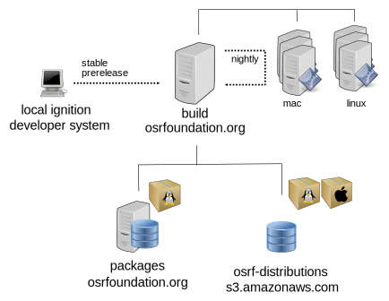

# Gazebo Release Process

This documentation covers the releasing process done by the members of the
Gazebo team. It offers a general overview and documentation of the
procedures and tools used, and provides a step by step guide to do releases.

## General overview

Gazebo development supports different ways of installing the software in the
user system. This document covers the process of creating binaries for different
distributions starting from a local copy of source code together with
descriptions and explanations of preparing, creating and releasing
new software versions.



### Releasing platforms supported

The Gazebo software supports a large variety of platforms where it can be
built from source. A small subgroup of them are selected to be officially
supported for binary distribution:

 * **Linux:** .deb packages are being created for different Ubuntu and Debian
   releases. Ubuntu LTS and Debian stable are officially supported.
   Architectures supported are typically `amd64`, `arm64` and `armhf` but that
   combination may not be available for all Ubuntu/Debian/Gazebo releases.

 * **macOS:** binaries for all active releases of macOS are usually created by
   the Gazebo development team under the support of
   [Homebrew package manager](https://brew.sh/). Binary packages for Brew are
   called `bottles`.

 * **Windows:** currently *there is no binary distribution for Windows* that covers
   all Gazebo libraries, although there is an ongoing effort for getting
   binary packages inside
   [conda-forge](https://github.com/conda-forge/staged-recipes/issues/13551).

### Infrastructure

The Gazebo team uses different pieces of infrastructure to execute the
releasing process:

 * **[build.osrfoundation.org](https://build.osrfoundation.org/)**: main Jenkins server to orchestrate the whole
   releasing process. It receives requests from Gazebo developers to start the
   release process, schedule nightly builds, build the binary packages,
   upload releasing artifacts to repositories, etc.

 * **[packages.osrfoundation.org](http://packages.osrfoundation.org/)**: Debian/Ubuntu .deb repositories. The URLs
   are ready to be used by the APT packages system.

 * **osrf-distributions S3**: [cloud storage](http://classic.gazebosim.org/distributions/bottles-simulation/)
   space to save the different artifacts produced during the release process. The
   S3 space is no more than an archive of artifacts that need to be manually
   downloaded (i.e: to get an old version of a .deb package) or handled by other
   packaging systems (i.e: brew downloads the bottles from S3, the buildfarm uses
   the tarballs stored in S3 when building .deb packages).

### Type of releases

The Gazebo development uses three different types of releases depending on the
stability of the software:

 * **stable**: stable releases are designed to be generally consumed by users
   that do not expect to solve severe issues or regressions.
   * Linux stable binaries (right distribution must be selected from {ubuntu/debian}):
     http://packages.osrfoundation.org/gazebo/{ubuntu/debian}-stable
   * macOS stable binaries:
     http://classic.gazebosim.org/distributions/bottles-simulation/

 * **prerelease**: prereleases are designed to be tested as candidates to
   stable.
   * Linux prerelease binaries (right distribution must be selected from {ubuntu/debian}):
     http://packages.osrfoundation.org/gazebo/{ubuntu/debian}-prerelease
   * macOS prerelease binaries (they are stored in the same place as stable releases):
     http://classic.gazebosim.org/distributions/bottles-simulation/

 * **nightly**: automatically generated releases used in continuous integration
   systems reflecting the latest changes in the repositories.
   * Linux nightly binaries (right distribution must be selected from {ubuntu/debian}):
     http://packages.osrfoundation.org/gazebo/{ubuntu/debian}-nightly
   * macOS nightly binaries:
     Nightly binaries are not currently supported. Any installation of an unreleased
     package will build the `main` branch from source
     (see [the homebrew-simulation issue](https://github.com/osrf/homebrew-simulation/issues/1314)
     for more information).

### Metadata for Releasing

All package managers need to define different data fields in order to provide
the features needed to install and remove packages. In the case of Gazebo
Libraries supported packages:

 * **deb packages**: debian packaging metadata for Debian/Ubuntu packages is
     stored in a custom way inside the `$LIBRARY-release` repositories. At the moment of
     building packages the metadata will be injected in the Jenkins server
     together with software sources.

     Gazebo projects store the Debian/Ubuntu metadata in individual
     repositories hosted at: https://github.com/gazebo-release/. There is a
     repository for each major version of every Gazebo package.


 * **brew**: Brew uses custom ruby files to declare software metadata called
     `Formulae`. Brew Formulae for Gazebo libraries can be found at:
     https://github.com/osrf/homebrew-simulation/tree/master/Formula


### Versioning

A fundamental part of releasing software or binaries is tagging a snapshot of code
with a given version. There are different types of versions; this section covers
the ones involved in the Gazebo release process.

#### Versions in software code (upstream versions)

The development team of any software product usually declares a version each
time they want to explicitly let users know that a product is ready to be
used. This version is called `upstream version` (where upstream is the
development team or authors).

The current upstream version of Gazebo libraries can be found in the repository's
`CMakeLists.txt` file following the CMake `project` declaration:

```cmake
  project(gz-fooX VERSION X.Y.Z)
```

The Gazebo version numbers follows the [Semantic
Versioning](https://semver.org/) scheme, so versions are composed of
`MAJOR.MINOR.PATCH` numbers. The Gazebo libraries also support the option of
creating prereleases. Using [this gz-cmake command](https://github.com/gazebosim/gz-cmake/blob/9698f484ae84c6c8ea6118a6d4950aef62eeaa23/examples/prerelease/CMakeLists.txt#L4)
it's trivial for libraries to declare a prerelease number:

```cmake
gz_configure_project(VERSION_SUFFIX pre1)
```

#### Versions in binary packages

A binary package version should match the Gazebo code version `X.Y.Z`. All
binary package systems append a new part to the version, called the **release version**,
which is designed to reflect changes in the packaging while keeping the same
code version `X.Y.Z`.

Debian/Ubuntu packaging use a hyphen to separate code version from the revision
number (starts with 1) `R`: `X.Y.Z-R`, where `X.Y.Z` is the code version, and `R` is the
number that represents changes in packaging metadata (not in software code). The
`R` number can be different on every platform since packaging metadata is
different among them.

Brew revision numbers are defined in the code of Brew formulas. If there is no
revision, assume 0. When defined, it starts with 1.

```ruby
revision 1

bottle do
  # sha256 is the 256 hash of binary bottle for the macOS version lala
  sha256 "41af286dc0b172ed2f1ca934fd2278de4a1192302ffa07087cea2682e7d372e3" => :lala
end
```

For *prereleases* and *nightly* binaries the versions are a bit special so the
package manager can handle precedence between all the flavours nicely. There is
[more information available on this topic for the Gazebo
libraries](releasing/versioning_pre_nightly.md).
