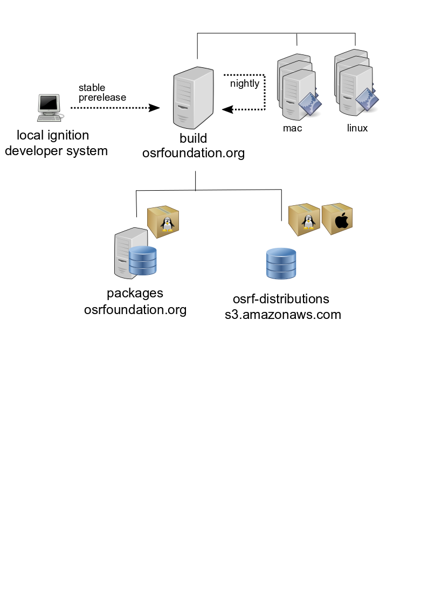

# Ignition Release Process

This documentation covers the releasing process done by the members of the
Ignition/Gazebo team. It offers a general overview and documentation of the
procedures and tools used and provide an step by step guide to do released.

#### Table of Contents

[General Overview](#general-overview)
  * [Platforms Supported](#releasing-platforms-supported)
  * [Infrastructure](#infrastructure)
  * [Type of Releases](#type-of-releases)
  * [Metadata for releasing](#metadata-for-releasing)
  * [Versioning](#versioning)

[Triggering a Release](#)

[FAQ](#faq)

## General overview

Ignition development supports different ways of installing the software in the
user system. This document covers the process of creating binaries for different
distributions starting from a local copy of source code together with
descriptions and explanations of the context of preparing, creating and releasing
new software versions.



### Releasing platforms supported

The Ignition software supports a large variety of platforms where it can be
built from source. A small subgroup of them are selected to be officially
supported for binary distribution:

 * **Linux:** .deb packages are being created for different Ubuntu and Debian
   releases. Ubuntu LTS and Debian stable are officially supported.
   Architectures supported are typically `amd64`, `arm64` and `armhf` but that
   combination may not be available for all Ubuntu/Debian/Ignition releases.

 * **macOS:** binaries for all active releases of macOS are usually created by
   the Ignition development team under the support of
   [Homebrew package manager](https://brew.sh/). Binary packages for Brew are
   called `bottles`.

 * **Windows:** currently *there is no binary distribution for Windows* that cover
   all Ignition libraries although there is an ongoing effort for getting
   binary packages inside
   [conda-forge](https://github.com/conda-forge/staged-recipes/issues/13551)

### Infrastructure

The Ignition team uses different pieces of infrastructure to execute the
releasing process:

 * **build.osrfoundation.org**: main Jenkins server to orchestrate the whole
   releasing process. It receives requests from Ignition developers to start
   release process, schedule nightly builds, build the binary packages,
   upload releasing artifacts to repositories, etc.

 * **packages.osrfoundation.org**: Debian/Ubuntu .deb repositories. The URLs
   are ready to be used by the APT packages system.

 * **osrf-distributions S3**: [cloud storage](https://osrf-distributions.s3.amazonaws.com/bottles-simulation)
   space to save the different artifacts produced during the release process. The
   S3 space is no more than archive of artifacts that need to be manually
   downloaded (i.e: to get an old version of a .deb package) or handled by other
   packaging systems (i.e: brew download the bottles from S3, the buildfarm uses
   the tarballs stored in S3 when building .deb packages)

### Type of releases

The Ignition development uses three different types of releases depending on the
stability of the software:

 * **stable**: stable releases are designed to be generally consumed by users
   that do not expect to solve severe issues or regressions.
   * Linux stable binaries:
     http://packages.osrfoundation.org/gazebo/{ubuntu/debian}-stable
   * macOS stable binaries:
     https://osrf-distributions.s3.amazonaws.com/

 * **prerelease**: prereleases are designed to be tested as candidates to
   stable.
   * Linux prerelease binaries:
     http://packages.osrfoundation.org/gazebo/{ubuntu/debian}-prerelease
   * macOS prerelease binaries (same than stable):
     https://osrf-distributions.s3.amazonaws.com/bottles-simulation

 * **nightly**: automatically generated releases used in continuous integration
   systems reflecting the latest changes in the repositories.
   * Linux nightly binaries:
     http://packages.osrfoundation.org/gazebo/{ubuntu/debian}-nightly
   * macOS nightly binaries:
     *Unsupported* (see [the homebrew-simulation issue](https://github.com/osrf/homebrew-simulation/issues/1314) 
     for more information)

### Metadata for Releasing

All package managers need to define different data fields in order to provide
the features needed to install and remove packages. In the case of Ignition
Libraries supported packages:

 * **deb packages**: debian packaging metadata for Debian/Ubuntu packages is
     stored in a custom way inside the `release`repositories. At the moment of
     building packages the metadata will be injected in the Jenkins server
     together with software sources.

     Ignition project stores the Debian/Ubuntu metadata in individual
     repositories hosted at: https://github.com/ignition-release/ There is a
     repository for each major version of every Ignition package.


 * **brew**: Brew uses custom ruby files to declare software metadata called
     `Formulas`. The Ignitions libraries Brew Formulas can be found at:
     https://github.com/osrf/homebrew-simulation/tree/master/Formula


### Versioning

A fundamental part of releasing software or binaries is tag an snapshot of code
with a given version. There are different types of versions, this section covers
the ones involved in the Ignition release process.

#### Versions in software code (upstream versions)

The development team of any software product usually declares a version each
team they want to make explicit for users that a product is somehow ready to be
used. This version is called `upstream version` (where upstream is the
development team or authors).

The current upstream version of Ignition libraries can be found in the library repository
`CMakeLists.txt` file following the CMake `project declaration`:

```cmake
  project(ignition-fooX VERSION X.Y.Z)
```

The Ignition version numbers follows the [Semantic
Versioning](https://semver.org/) scheme so versions are composed of
`MAJOR.MINOR.PATCH` numbers. The Ignition libraries also support the option of
creating prereleases. Using [ign-cmake is
trivial](https://github.com/ignitionrobotics/ign-cmake/blob/ign-cmake2/examples/prerelease/CMakeLists.txt#L4)
for the libraries to declare a prerelease number:

```cmake
ign_configure_project(VERSION_SUFFIX pre1)
```

#### Versions in binary packages

Binary packages should match exactly the Ignition code version `X.Y.Z`. All
package system append a new part to the version called the **release version**
which is designed to reflect changes in the packaging while keeping the same
code version `X.Y.Z`.

Debian/Ubuntu packaging use a hyphen to separate code version from the revision
number (starts with 1) `R`: `X.Y.Z-R`.

Brew bottles revisions are defined in the code of Brew formulas. If there is no
revision, assume 0. When defined start with 1.

```ruby
bottle do
  revision 1
  sha256 "41af286dc0b172ed2f1ca934fd2278de4a1192302ffa07087cea2682e7d372e3" => :blah
end
```

For *prereleases* and *nightly* binaries the versions are a bit special so the
package manager can handle precedence between all the flavours nicely. There is
[more information available on this topic for the Ignition
libraries](releasing/versioning_pre_nightly.md)
