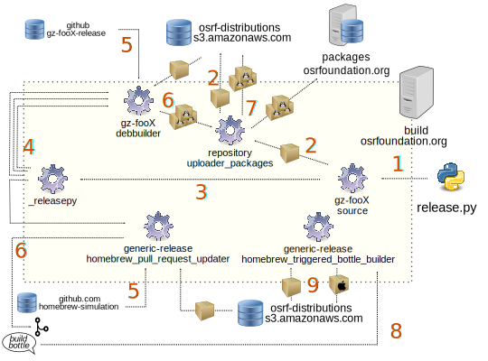

#### Table of Contents

[Triggering a Release]()
  * [Prerequisites]()
     - [Software and Configurations]()
     - [Credentials]()
  * [Preparing Ignition Software](
     - [Update version]()
     - [Update binary version]()
  * [Launch the release in the building server]()
    - [Executing release.py]()
      - [dry-run simulation mode]()
      - [release.py for prerelease or nightlies]()
      - [release.py for revision bumps]()


## Triggering a Release

### Understanding the releasing process

The following picture shows the interactions triggered when using the release
tool `release.py` explained in this guide:



Actions for releasing a new version of library `foo` with major version `X`:

 1. `release.py` will generate a local tarball with the source code of the new
    version and upload it to `osrf-distributions S3`.
 1. `release.py` will start the following jobs in the build server
    `build.osrfoundation.org`:
      1. `ignition-fooX-debbuilder` multiple calls for different Debian/Ubuntu releases
      1. `generic-release-homebrew_pull_request_updater` one call for Homebrew
         macOS release
 1. `build.osrfoundation.org` jobs starts the work of creating releases:
      1. `ignition-fooX-debbuilder` use tarball with release sources and metadata from `ign-fooX-release`
      1. `generic-release-homebrew_pull_request_updater` use
         `homebrew-simulation` repository metadata together with the release
         sources.
 1. The output of the first round of initial jobs triggered by `release.py` is
    different:
      1. `ign-fooX-debbuilder` job built the packages and pass them to the
    `repository_uploader_packages` job.
      1. `generic-release-homebrew_pull_request_updater` will open a
         new PR to coordinate the release process in `homebrew-simulation`.
 1. `repository_uploader_packages` import the packages created by the
    `ign-fooX-debbuilder` job (there will be one build of the job for each
    platform combination of Ubuntu/Debian release + architecture) and upload the
    .deb packages to `packages.osrfoundation.org` and `osrf-distributions S3`.
 1. For macOS the PR in `homebrew-simulation` waits for a comment from an
    Ignition developer with the order `build bottle` that will trigger the job
    `generic-release-homebrew_triggered_bottle_builder`.
 1. `generic-release-homebrew_triggered_bottle_builder`will use the tarball with
    release sources from `osrf-distributions S3` to generate the binary bottles.
    They will be uploaded to `osrf-distributions S3`.

### Prerequisites

To perform a new release a small number of configurations and credentials are
needed for the developer system that will trigger it. If a permanent operative
system is used for releasing these installation steps needs to be executed once.

#### Team and development checks

When creating a new release there are some guidelines to follow before starting
the process:

 * Asking the team if there are any concerns about making the release
 * Check if there are changes to previous versions that need to be forward-ported.
 * See if there are open PRs against that release branch (release branch is the
   one with the name `ign-fooX` where foo is the name of the Ignition library and
   X the major version of the version bump planned) that could go into the new
   release.

#### Software and configurations

The releasing process is only supported in Linux at this moment.

The tool designed to facilitate the process of releasing software for all
platforms is called `release.py` and is hosted in the
[release-tools](https://github.com/ignition-tooling/release-tools/blob/master/release.py)
repository. Installing a copy of the repository is required to perform a new
release:

```
git clone https://github.com/ignition-tooling/release-tools.git
```

The `release.py` tool will use `sc3md` software to interact with Amazon AWS
storage to host sources and binaries.

```
sudo apt-get install s3cmd
```

Some Debian tools require the following variables to be set:
```bash
export DEBEMAIL="<username>@openrobotics.org"
export DEBFULLNAME="<Your full name>"
```
**Note:** the two above exported variables can be added to `.bashrc` to have
them configured automatically on every run.


#### Credentials

There is a small number of credentials needed to interact with the release
process:

 * S3 access to open robotics:
  ```
  s3cmd --configure
  ```
  If you don't have AWS credentials please contact @j-rivero or @nuclearsandwich who will help set you up.

 * Release token: magic sequence of characters needed while running `release.py`
   to interact with `build.osrfoundation.org`:
   ```
   Check your company password manager for 'build.osrfoundation.org token'
   ```

### Preparing Ignition Code

## Update code version

First step to get a new release ready is to update the current code (upstream)
version to a new one (more information in the [versioning](#versioning)). This
bump could be in the major number (non compatible changes), minor number (new
features), patch number (patches and bugfixes).

**Bumping major number** of the version implies some work to have the
[metadata](#metadata-for-releasing) updated correctly. There is a [dedicated
document](releasing/bump_major.md) to do this before going further in this
document.

To update the upstream version a local checkout of the Ignition library is
needed. A new branch is required to submit changes:

```bash
# version X.Y.Z
git checkout -b bump_to_X_Y_Z
```

The current upstream version can be found in `CMakeLists.txt` file
following the CMake `project declaration`:

```cmake
# Ignition library named foo and version X.Y.Z
project(ignition-fooX VERSION X.Y.Z)
```

Stable releases can modify the X, Y or Z directly while prereleases will need to
include the preX (X number starts with 1) suffix in the `ign_configure_project`:


```cmake
# first prerelease of a serie, number 1
ign_configure_project(VERSION_SUFFIX pre1)
```

Together with bumping the version number **updating the Changelog and Migration
documents** is highly recommended. `Changelog.md` file and `Migration.md` files
are located at the top level of every Ignition library. Modify them as needed.

```bash
git commit CMakeList.xt
git commit Changelog.md
git commit Migration.md
git push orign ...
```

Open a pull request for reviewing ([example PR](https://github.com/ignitionrobotics/ign-physics/pull/132)).
Including a link is recommended comparing the current release branch to the
latest release. Releases are tagged in GitHub repositories with the scheme
`ignition-fooX_X.Y.Z` where foo is the name of the Ignition library and X.Y.Z
the code version. ([example of a branch comparison](https://github.com/ignitionrobotics/ign-gazebo/compare/ignition-gazebo3_3.5.0...ign-gazebo3)

Check that the CI job named `*-abichecker-*` is fine since its specially
important not to break API/ABI when bumping MINOR or PATCH versions.

## Update binary version

Once the PR is merged, they [binary version](#versions-in-binary-packages) needs
to be updated for the Debian/Ubuntu binary packages. Brew metadata will be
updated by the building server when creating the binary `bottles`.

There should be a repository matching the name and major version of Ignition
library that you want to bump in the
[ignition-release](https://github.com/ignition-release/) GitHub organization.
(see [release repositories document](releasing/release_repositories.md) for more
information about how they are used).

It is required to clone the corresponding release repository to update the
binary version:

```bash
# Ignition library named foo and major version X
git clone https://github.com/ignition-release/ign-fooX-release
```

To bump the package versions that will appear in Debian/Ubuntu binary packages
there is a helper script in `release-tools` (see
[prerequisites](#prerequisites)). The script is called `changelog_spawn.sh` and
require to be executed while the active directory is a `release repository`:

```bash
# Ignition library named foo and major version X
cd ign-fooX-release
~/release-tools/release-repo-scripts/changelog_spawn.sh X.Y.Z-R

# Example ign-cmake2 bumped from 2.0.0 to 2.0.1
cd ign-cmake2-release
~/release-tools/release-repo-scripts/changelog_spawn.sh 2.0.1-1
```

`changelog_spawn.sh` will display information about the Ubuntu/Debian versions
being updated as well as a `git diff` before uploading information to the GitHub
release repository.

## Launch the release in the building server

After updating the code and releasing metadata everything is ready to launch the
build in the server. Different actions needs to happen:

 1. Generate a tarball with the Ignition library sources corresponding to the new
    version in the Ignition developer local system. Upload the tarball to S3 cloud storage.
 1. Request `build.osrfoundation.org` server to start the jobs for:
   1. Debian/Ubuntu: use `ign-fooX-debbuilder` job names
   1. Brew: entry job is `generic-release-homebrew_pull_request_updater`

The `release.py` script perform with all these actions.

### Executing release.py

`release.py` works from Ignition library code where the new version has been
set. Be sure to run it from a clone of a permanent branch (`ign-fooX` typically)
since some git tags will be generated and uploaded.

From the source code directory execute the `release.py`. You will need the token
described in the [credentials section](#credentials).

```bash
# Ignition library named foo and major version X
cd ign-fooX
git checkout ign-fooX

# Example ign-cmake2 bumped to 2.0.1 with test_token credential
cd ign-cmake2
git checkout ign-cmake2
~/release-tools/release-repo-scripts/release.py ign-cmake2 2.0.1 test_token
```

#### dry-run simulation mode

`release.py` tool supports a `--dry-run` flag that allows to simulate releases
(nothing is modified) to help with safe checks done by the tool and providing
the user with the final calls that will be done to the server.

The script needs to be run from the library repository:

```bash
# Example of dry-run for ign-cmake2 bumped to 2.0.1
cd ign-cmake2
git checkout ign-cmake2
~/release-tools/release-repo-scripts/release.py ign-cmake2 2.0.1 test_token --dry-run
```

#### release.py for prereleases or nightly

When releasing prereleases or nightly releases there are some special flags to
be set. `--upload-to-repo` argument is mandatory when running `release.py` and
should indicate `prerelease` or `nightly`.

```bash
# Example ign-cmake2 bumped to prerelease 2.0.0~pre1 with test_token credential
cd ign-cmake2
git checkout ign-cmake2
~/release-tools/release-repo-scripts/release.py ign-cmake2 2.0.0~pre1 test_token --upload-to-repo prerelease
```
Nightly invocation is generally coded in the server. Version will be taken from
the last changelog entry and [modified during building](releasing/versioning_pre_nightly).
No source code will be uploaded but taken directly in the binary build from
`--nightly-src-branch`.

```bash
# Example ign-cmake2 nightly from main branch with test_token credential
cd ign-cmake2
git checkout ign-cmake2
~/release-tools/release-repo-scripts/release.py ign-cmake2 2.0.0~pre1 test_token --upload-to-repo nightly --nightly-src-branch main
```
#### release.py for revision bumps

Bump the [revision number for binary packages](#versioning) is a special case of releasing
since the original tarball with the source code will remain the same. Once the
release repository is ready with the new release version, `release.py` needs the
`--only-bump-revision-linux` flag:

```bash
# Example ign-cmake2 bumped from 2.0.1-1 to 2.0.1-2 with test_token credential
cd ign-cmake2
git checkout ign-cmake2
~/release-tools/release-repo-scripts/release.py ign-cmake2 2.0.1 test_token --only-bump-revision-linux -release-version 2
```
