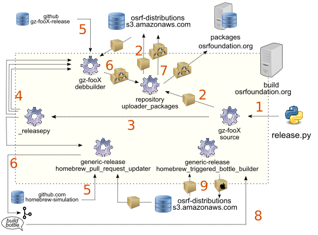

#### Table of Contents

[Triggering a Release]()
  * [Prerequisites]()
     - [Software and Configurations]()
     - [Credentials]()
  * [Preparing Gz Software]()
     - [Update version]()
     - [Update binary version]()
  * [Launch the release in the building server]()
    - [Executing release.py]()
      - [dry-run simulation mode]()
      - [release.py for stable releases]()
      - [release.py for prerelease or nightlies]()
      - [release.py for revision bumps]()


## Triggering a Release

### Understanding the releasing process

The following picture shows the interactions triggered when using the release
tool [`release.py`](https://github.com/gazebo-tooling/release-tools/blob/master/release.py) explained in this guide:



Actions for releasing a new version of library (note that it can starts with
ign or gz, ign/gz is used for this propose) `foo` with major version `X`:

 1. [`release.py`](https://github.com/gazebo-tooling/release-tools/blob/master/release.py)
    will generate a local tarball with the source code of the new version and
    upload it to `osrf-distributions S3`.
 1. `release.py` will start the following jobs in the build server
    `build.osrfoundation.org`:
      1. `ign/gz-fooX-debbuilder`: multiple calls for different Debian/Ubuntu releases
      1. [`generic-release-homebrew_pull_request_updater`](https://build.osrfoundation.org/job/generic-release-homebrew_pull_request_updater/):
      one call for Homebrew macOS release
 1. `build.osrfoundation.org` jobs start the work of creating releases:
      1. `ign/gz-fooX-debbuilder`: use tarball with release sources and metadata from `ign/gz-fooX-release`
      1. `generic-release-homebrew_pull_request_updater`: use
         [`homebrew-simulation`](https://github.com/osrf/homebrew-simulation/)
         repository metadata together with the release sources
 1. The output of the first round of initial jobs triggered by `release.py` is
    different:
      1. `ign/gz-fooX-debbuilder`: builds the Debian/Ubuntu .deb packages and
         passes them to the `repository_uploader_packages` job
      1. `generic-release-homebrew_pull_request_updater`: opens a
         new PR to coordinate the release process in `homebrew-simulation`
 1. [`repository_uploader_packages`](https://build.osrfoundation.org/job/repository_uploader_packages/)
    imports the packages created by the `ign/gz-fooX-debbuilder` job (there will be
    one build for each platform combination of Ubuntu/Debian release
    and architecture) and uploads the .deb packages to
    `packages.osrfoundation.org` and [`osrf-distributions S3`](http://gazebosim.org/distributions).
 1. For macOS, the PR in `homebrew-simulation` waits for a comment from an
    Gz developer with the order `build bottle` that will trigger the job
    [`generic-release-homebrew_triggered_bottle_builder`](https://build.osrfoundation.org/job/generic-release-homebrew_bottle_builder/).
 1. `generic-release-homebrew_triggered_bottle_builder`will use the tarball with
    release sources from `osrf-distributions S3` to generate the binary bottles.
    They will be uploaded to `osrf-distributions S3`.

### Prerequisites

To perform a new release, a small number of configurations and credentials need to be made on the developer's system before triggering the release.
If a permanent operating system is used for releasing, these installation steps only need to be executed once.

#### Team and development checks

When creating a new release, there are some guidelines to follow before starting
the process:

 * Ask the team if there are any concerns about making the release.
 * Check if there are changes to previous library versions that need to be forward-ported.
 * See if there are open PRs against the release branch (release branch is the
   one with the name `ign/gz-fooX` where foo is the name of the Gz library and
   X the major version of the version bump planned) that could go into the new
   release.

#### Software and configurations

Triggering the releasing process is only supported on Linux at this moment.

The tool designed to facilitate the process of releasing software for all
platforms is called [`release.py`](https://github.com/gazebo-tooling/release-tools/blob/master/release.py), and is hosted at https://github.com/gazebo-tooling/release-tools.
Cloning the `release-tools` repository is required to perform a new release:

```
cd ~/
git clone https://github.com/gazebo-tooling/release-tools.git
```

The `release.py` tool will use `sc3md` software to interact with Amazon AWS
storage to host sources and binaries, so make sure `sc3md` is installed:

```
sudo apt-get install s3cmd
```

Some Debian tools require the following variables to be set:
```bash
export DEBEMAIL="<username>@openrobotics.org"
export DEBFULLNAME="<Your full name>"
```
**Note:** the two above exported variables can be added to `.bashrc` to have
them configured automatically on every run.


#### Credentials

There are some credentials needed to interact with the release
process:

 * S3 access to Open Robotics:
  ```
  s3cmd --configure
  ```
  If you don't have AWS credentials, please contact @j-rivero or @nuclearsandwich who will help set you up.

 * Release token: magic sequence of characters needed while running `release.py`
   to interact with `build.osrfoundation.org`. This should be given to Gz releasers as a part of the AWS credentials set-up.

## Preparing Gz Code

### Update code version

The first step to get a new release ready is to update the current code (upstream)
version (view the [versioning](#versioning) section for more information). This
bump could be in the major number (non-compatible changes), minor number (new
features), patch number (patches and bugfixes).

1. **Bumping major number** of the version implies some work to have the
[metadata](#metadata-for-releasing) updated correctly. There is a [dedicated
document](releasing/bump_major.md) that you should go through before continuing to work through the steps in this
document.

   1. To update the upstream version a local checkout of the Gz library is
   needed. A new branch is required to submit changes:

  ```bash
  # version X.Y.Z
  git checkout -b bump_to_X_Y_Z
  ```

  2. The current upstream version can be found in `CMakeLists.txt` file
  following the CMake `project declaration`:

  ```cmake
  # Gz library named foo and version X.Y.Z
  project(gz-fooX VERSION X.Y.Z)
  ```

  Stable releases can modify the X, Y or Z directly while prereleases will need to
  include the preX (X number starts with 1) suffix in the `gz_configure_project`:
  ```cmake
  # first prerelease of a serie, number 1
  gz_configure_project(VERSION_SUFFIX pre1)
  ```

  3. Together with bumping the version number, **updating the Changelog and Migration
  documents** is required. The `Changelog.md` file and `Migration.md` files
  are located at the top level of every Gz library. Modify them as needed.

  ```bash
  git commit CMakeList.xt
  git commit Changelog.md
  git commit Migration.md
  git push origin ...
  ```

  4. Open a pull request for reviewing ([example PR](https://github.com/gazebosim/gz-physics/pull/132)).
  Include a link comparing the current release branch to the
  latest release ([example of a branch comparison](https://github.com/gazebosim/gz-sim/compare/ignition-gazebo3_3.5.0...ign-gazebo3)). Releases are tagged in GitHub repositories with the scheme
  `ignition/gz-fooX_X.Y.Z` where foo is the name of the Gz library and X.Y.Z
  the code version.

### Update binary version

Once the PR for bumping the code version is merged, the [binary version](#versions-in-binary-packages) needs
to be updated for the Debian/Ubuntu binary packages. Brew metadata will be
updated by the building server when creating the binary `bottles`.

There should be a repository matching the name and major version of Gz
library that you want to bump in the
[gz-release](https://github.com/gazebo-release/) GitHub organization.
(see [release repositories document](releasing/release_repositories.md) for more
information about how they are used).

  1. It is required to clone the corresponding release repository to update the
  binary version:

  ```bash
  # Gz library named foo and major version X
  git clone https://github.com/gazebo-release/gz-fooX-release
  ```

  2. To bump the package versions that will appear in Debian/Ubuntu binary packages
  there is a helper script in `release-tools` (see
  [prerequisites](#prerequisites)). The script is called `changelog_spawn.sh` and
  require to be executed while the active directory is a `release repository`:

  ```bash
  # Gz library named foo and major version X
  cd gz-fooX-release
  ~/release-tools/release-repo-scripts/changelog_spawn.sh X.Y.Z-R

  # Example gz-cmake3 bumped from 3.0.0 to 3.0.1
  cd gz-cmake3-release
  ~/release-tools/release-repo-scripts/changelog_spawn.sh 3.0.1-1
  ```

  `changelog_spawn.sh` will display information about the Ubuntu/Debian versions
  being updated as well as a `git diff` before uploading information to the GitHub
  release repository.

## Launch the release in the building server

After updating the code and releasing metadata everything is ready to launch the
build in the server. Now, the following needs to happen:

 1. Generate a tarball with the Gz library sources corresponding to the new
    version in the Gz developer local system. Upload the tarball to S3 cloud storage.
 1. Request `build.osrfoundation.org` server to start the jobs for:
     1. Debian/Ubuntu: use `ign/gz-fooX-debbuilder` job names
     1. Brew: entry job is `generic-release-homebrew_pull_request_updater`

The `release.py` script will perform all these actions.

### Executing release.py

Make sure you are in the source code repository before running `release.py`. You should be on the branch to be released, after the pull request bumping the version has been merged (run `git status` to check the branch, and `git log` to check that the version bump pull request has been included). Running `release.py` from the source code repository will generate and upload some Git tags ("release tags") to the source code repository.

You will also need the token described in the [credentials section](#credentials).

#### dry-run simulation mode

The `release.py` tool supports a `--dry-run` flag that allows users to simulate releases
(nothing is modified) in order to ensure that the correct arguments are being used to trigger a particular release.
Gz releasers should **always** call `release.py` with `--dry-run` first in order to ensure that proper commands are being used to trigger releases.

The script needs to be run from the repository with the source code (i.e., the repository where the Gz library version bump pull request took place):

```bash
# Example of dry-run for gz-cmake3 bumped to 3.0.1
cd gz-cmake3
git checkout gz-cmake3
~/release-tools/release.py gz-cmake3 3.0.1 dry-run-fake-token --dry-run
```

#### release.py for stable releases

```bash
# Gz library named foo and major version X
cd ign/gz-fooX
git checkout ign/gz-fooX

# Example gz-cmake3 bumped to 3.0.1 with jenkins_token credential
cd gz-cmake3
git checkout gz-cmake3
# please replace <jenkins_token> with real release token (check crendentials section)
~/release-tools/release-repo-scripts/release.py gz-cmake3 3.0.1 <jenkins_token>
```

#### release.py for prereleases or nightly

When releasing prereleases or nightly releases, there are some special flags to
be set. The `--upload-to-repo` argument is mandatory when running `release.py`, and
should be set to `prerelease` or `nightly`.

```bash
# Example gz-cmake3 bumped to prerelease 3.0.0~pre1 with jenkins_token credential
cd gz-cmake3
git checkout gz-cmake3
# please replace <jenkins_token> with real release token (check crendentials section)
~/release-tools/release-repo-scripts/release.py gz-cmake3 3.0.0~pre1 <jenkins_token> --upload-to-repo prerelease
```
Nightly invocation is generally coded in the server. The version will be taken from
the last changelog entry and [modified during building](releasing/versioning_pre_nightly).
No source code will be uploaded, but taken directly in the binary build from
`--nightly-src-branch`.

```bash
# Example gz-cmake3 nightly from main branch with jenkins_token credential
cd gz-cmake3
git checkout gz-cmake3
# please replace <jenkins_token> with real release token (check crendentials section)
~/release-tools/release-repo-scripts/release.py gz-cmake3 3.0.0~pre1 <jenkins_token> --upload-to-repo nightly --nightly-src-branch main
```
#### release.py for revision bumps

Bumping the [revision number for binary packages](#versioning) is a special case of releasing
since the original tarball with the source code will remain the same. Once the
release repository is ready with the new release version, `release.py` needs the
`--only-bump-revision-linux` flag:

```bash
# Example gz-cmake3 bumped from 3.0.1-1 to 3.0.1-2 with jenkins_token credential
cd gz-cmake3
git checkout gz-cmake3
# please replace <jenkins_token> with real release token (check crendentials section)
~/release-tools/release-repo-scripts/release.py gz-cmake3 3.0.1 <jenkins_token> --only-bump-revision-linux -release-version 2
```
