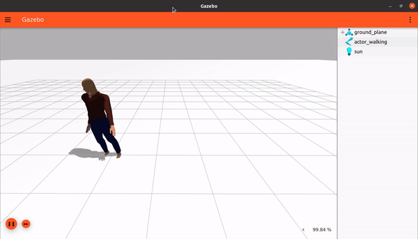
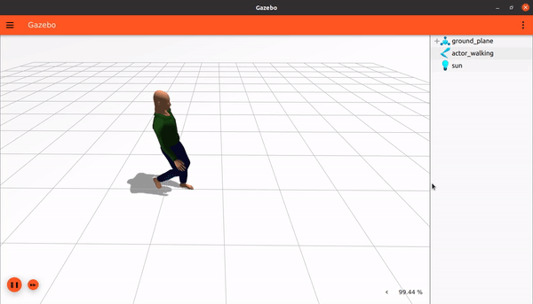

# Actors demo

In this tutorial we will learn how to add `actors` to our world and how to create a scripted animation. You can find the final world of this tutorial [here](actor_demo.sdf)

Animations are very useful if we want to have entities following a predefined path in simulation without being affected by the physics. This means that they won't fall due to gravity or collide with other objects. They will however, have a 3D visualization which can be seen by RGB cameras, and 3D meshes which can be detected by GPU based sensors. The tutorial explains how to create open-loop trajectories which don't interact with the rest of the simulation.

## Actors

In Ignition Gazebo, an animated model is called an `actor`.

There are two types of animations which can be used separately or combined together:

* Skeleton animation, which is relative motion between links in one model:


* Trajectory animation, which carries all of the actor's links around the world as one group along a trajectory:



* Combined, to achieve a skeleton animation which moves in the world:


Actors have the following properties:

* No forces are applied on them, be it from gravity or contact or anything else
* Actors support skeleton animation imported from COLLADA(.dae) and BVH(.bvh) files.
* Actors can have trajectories scripted directly in SDF.

You can check out the full specification for the `<actor>` SDF element [here](http://sdformat.org/spec?ver=1.7&elem=actor).

## Skeleton

Ignition gazebo supports two different skeleton animation file formats: COLLADA (.dae) and Biovision Hierarchy (.bvh).

Open any world `empty.sdf` world, for example and add an actor called `actor_walking` as follows:

```xml
<actor name="actor_walking">
    <skin>
        <filename>https://fuel.ignitionrobotics.org/1.0/Mingfei/models/actor/tip/files/meshes/walk.dae</filename>
        <scale>1.0</scale>
    </skin>
    <animation name="walk">
        <filename>https://fuel.ignitionrobotics.org/1.0/Mingfei/models/actor/tip/files/meshes/walk.dae</filename>
    </animation>
</actor>
```

### Skin

In the `<skin>` tag we just loaded a COLLADA file `walk.dae` which specify how our actor will look like. When a COLLADA file is used within the `<skin>` tags its animation is loaded. The `<scale>` scales the skin's size.



**Note**: You can find many actors and models on [ignition fuel](https://app.ignitionrobotics.org/fuel).

### Animation

In the `<animation>` tag we specify how our actor will move. We can combine different skin with different animation as long as they have compatible skeletons. Now run the world and we should see our model moving

## Scripted trajectory

This is the high level animation of actors, which consists of specifying a series of poses to be reached at specific times. Ignition Gazebo takes care of interpolating the motion between them so the movement is fluid.

Animations that have displacement on the X axis, like `walk.dae` will have the skeleton animated while following a trajectory. But for animations that don't, such as `talk_b.dae`, their skeletons won't move if there's a trajectory.

We can make our actor follow the specified trajectory forever and start playing as soon as the world is loaded as follows:

```xml
<script>
    <loop>true</loop>
    <delay_start>0.000000</delay_start>
    <auto_start>true</auto_start>
```

The script is defined between the `<actor>` `</actor>` tags.

Inside the `<script>` tag the following parameters are available:

* `loop`: Set this to true for the script to be repeated in a loop. For a fluid continuous motion, make sure the last waypoint matches the first one, as we will do.

* `delay_start`: This is the time in seconds to wait before starting the script. If running in a loop, this time will be waited before starting each cycle.

* `auto_start`: Set to true if the animation should start as soon as the simulation starts playing. It is useful to set this to false if the animation should start playing only when triggered by a plugin, for example.

Let's define the trajectory as a sequence of waypoints:

```xml
        <trajectory id="0" type="walk">
            <waypoint>
                <time>0</time>
                <pose>0 0 1.0 0 0 0</pose>
            </waypoint>
            <waypoint>
                <time>2</time>
                <pose>2.0 0 1.0 0 0 0</pose>
            </waypoint>
            <waypoint>
                <time>2.5</time>
                <pose>2 0 1.0 0 0 1.57</pose>
            </waypoint>
            <waypoint>
                <time>4</time>
                <pose>2 2 1.0 0 0 1.57</pose>
            </waypoint>
            <waypoint>
                <time>4.5</time>
                <pose>2 2 1.0 0 0 3.142</pose>
            </waypoint>
            <waypoint>
                <time>6</time>
                <pose>0 2 1 0 0 3.142</pose>
            </waypoint>
            <waypoint>
                <time>6.5</time>
                <pose>0 2 1 0 0 -1.57</pose>
            </waypoint>
            <waypoint>
                <time>8</time>
                <pose>0 0 1.0 0 0 -1.57</pose>
            </waypoint>
            <waypoint>
                <time>8.5</time>
                <pose>0 0 1.0 0 0 0</pose>
            </waypoint>
        </trajectory>
    </script>
```

Within the `<trajectory>` tag we define a series of waypoints which our actor will follow. The `<trajectory>` has two attributes: `id` and `type`. The `type` should have the same name as the animation `walk`. Under the `trajectory` tag we define the following.

* `waypoint`: There can be any number of waypoints in a trajectory. Each waypoint consists of a time and a pose:
    * `time`: The time in seconds, counted from the beginning of the script, when the pose should be reached.
    * `pose`: The pose which should be reached with respect to the initial actor pose.

Run the world and we should see our actor moving in a square following the waypoints.


**Notes**:

* The order in which waypoints are defined is not important, they will follow the given times.
* The trajectory is smoothed as a whole. This means that you'll get a fluid motion, but the exact poses contained in the waypoints might not be reached.

Now it's your turn! Try out different trajectory descriptions.
